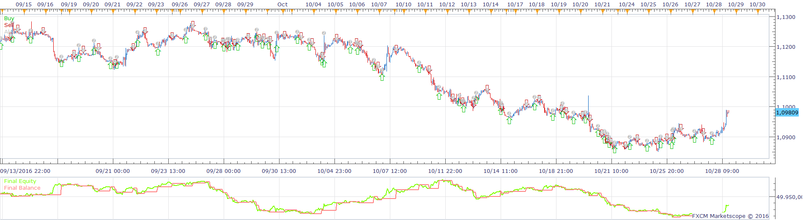
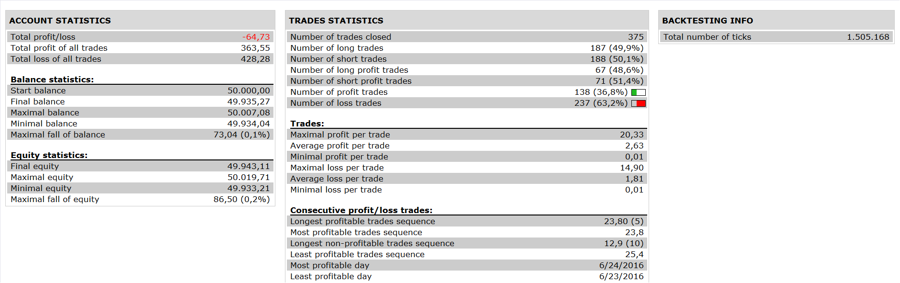

# 3_10 Strategy

> Source: https://fxcodebase.com/code/viewtopic.php?f=31&t=64089  
> Forum: 31 · Topic 64089 · 7 post(s)

---

## 3_10 Strategy

**Apprentice** · Fri Nov 11, 2016 1:37 pm

 

Open Long
TAO/Signal Line CrossOver
Open Short
TAO/Signal Line CrossUnder

 [3_10 Strategy.lua](files/109013/3_10%20Strategy.lua)

Install 20 in 1 Moving Average Indicator a.k.a. Averages
[viewtopic.php?f=17&t=2430](https://fxcodebase.com/code/viewtopic.php?f=17&t=2430)
3_10 is available here.
[viewtopic.php?f=17&t=13963](https://fxcodebase.com/code/viewtopic.php?f=17&t=13963)

The Strategy was revised and updated on January 19, 2019.

---

## Re: 3_10 Strategy

**Kilgharrah** · Fri Nov 18, 2016 5:30 am

Hi, this strategy like so many by design part of going alternating **buy**and **sell**. I have the theory that in some of the instruments that I work the first cross marks the trend of the rest of the session, is it possible to add a true/false field in which the first cross marks the trend for the rest of the session?. For example if the first cross is **buy**change to that the rest of operations are only **buy**(Allowed side=**Buy**) or opposite. I hope I have explained. Thank you so much.

---

## Re: 3_10 Strategy

**Apprentice** · Sat Nov 26, 2016 7:52 am

Such a switch is possible.

---

## Re: 3_10 Strategy

**Kilgharrah** · Mon Dec 12, 2016 8:32 pm

I would like to congratulate the development team for the excellent work on the difficult task of updating all the strategies they are carrying out.

Additionally another requirement for this strategy

**FIG1:**

Once the price reaches the price level of the **Sure Multiplier** (similar to the limit ) create a dynamic Stop or fixed (selectable) below or above (according to the case buy/sell) the number of pips defined in the **Ensure Delta** field and remove immediately the **Enry Order**associated with this **Market Order** if it existed. (see **FIG2**). Its purpose is to guarantee certain benefits .

**FIG2**

The idea is to create a sub-strategy that creates an **Enry Order**instead of a **Stop**(
every time the Main Strategy 3_10 strategy is triggered) with the following parameters:

**Account:** The Same from the Main Strategy (3_10 Strategy)
**Symbol:**The Same from the Main Strategy (3_10 Strategy)
**Sell/Buy:** Oposite from the Main Strategy (3_10 Strategy)
**Amaunt(K):** The Same from the Main Strategy (3_10 Strategy)
**Rate:** The price where the Stop was previously placed (Stop Value or ATR from the Main Strategy (3_10 Strategy)
**Order Type:** Entry
**Time in Force:** GTC
**Stop:** - Delta SS in pips *
**Limit:** No Limit

* If this stop is reached place a new **Enry Order**with the same previous parameters, doing this constantly, the idea is not to obtain benefits with this **Enry Order**but to minimize the losses of the order that comes from the Main Strategy (3_10 Strategy).

I hope I have understood and appreciate any comments, once again I hope that this sub strategy (method) can be applied and help other strategies

---

## Re: 3_10 Strategy

**Kilgharrah** · Wed Dec 21, 2016 4:41 pm

Hi, I would like to know if the above requirement is too complex or does it make sense?

Thanks in advance.

---

## Re: 3_10 Strategy

**Apprentice** · Thu Dec 22, 2016 1:42 pm

Your request is added to the development list, Under Id Number 3702
 If someone is interested to do this task, please contact me.

---

## Re: 3_10 Strategy

**Kilgharrah** · Sun Jan 15, 2017 5:29 am

Hi,

I'm wondering if there is an update to this request?

I appreciate your time with this.
