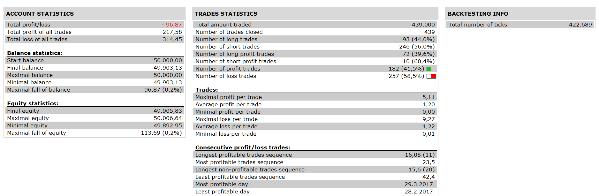

# 3MA ICH Strategy

> Source: https://fxcodebase.com/code/viewtopic.php?f=31&t=65144  
> Forum: 31 · Topic 65144 · 3 post(s)

---

## 3MA ICH Strategy

**Apprentice** · Tue Oct 03, 2017 7:06 am

 

Based on the request.
[viewtopic.php?f=27&t=65143](https://fxcodebase.com/code/viewtopic.php?f=27&t=65143)

Open Long
max( MA1, MA2, MA3, Close) < Cloud
Close > max( MA1, MA2, MA3)

Vice versa for Short

 [3MA ICH Strategy.lua](files/115237/3MA%20ICH%20Strategy.lua)

The Strategy was revised and updated on January 21, 2019.

---

## Re: 3MA ICH Strategy

**rippajohn** · Mon Oct 16, 2017 7:10 am

Thanks for doing that!

Time to work out the best settings.

Thanks

---

## Re: 3MA ICH Strategy

**Apprentice** · Tue Dec 19, 2017 8:54 am

The strategy was revised and updated.
