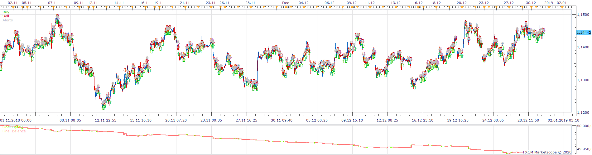
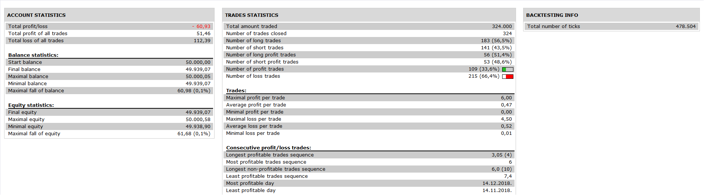

# 3TF MAs BB Strategy

> Source: https://fxcodebase.com/code/viewtopic.php?f=31&t=69979  
> Forum: 31 · Topic 69979 · 13 post(s)

---

## 3TF MAs BB Strategy

**Apprentice** · Mon Jun 08, 2020 5:54 am

 

Based on request.
[viewtopic.php?f=27&t=69939](https://fxcodebase.com/code/viewtopic.php?f=27&t=69939)

 [3TF MAs BB Strategy.lua](files/134667/3TF%20MAs%20BB%20Strategy.lua)

---

## Re: 3TF MAs BB Strategy

**terminator2410** · Mon Jun 08, 2020 6:25 am

Thank you Sir

Tried to test the strategy, I get following error after pressing OK in the dialogue's box:

".lua:74: Please download and install AVERAGES indicator"

Looking forward to your guidance

---

## Re: 3TF MAs BB Strategy

**terminator2410** · Mon Jun 08, 2020 7:06 am

Dear Sir

I found the indicator needed in the following thread:

[viewtopic.php?f=17&t=2430&hilit=averages+indicator](https://fxcodebase.com/code/viewtopic.php?f=17&t=2430&hilit=averages+indicator)

I tried to back test the strategy, I am getting the errors as per attached.

Also, please clarify what "Use HA as source" option refers to.

Thank you

---

## Re: 3TF MAs BB Strategy

**terminator2410** · Mon Jun 08, 2020 7:30 am

Dear Sir

I used following indicator and back tester works now:

[viewtopic.php?f=17&t=9568&p=103796&hilit=averages+indicator#p103796](https://fxcodebase.com/code/viewtopic.php?f=17&t=9568&p=103796&hilit=averages+indicator#p103796)

I will revert with testing results on demo account

Thank you

---

## Re: 3TF MAs BB Strategy

**terminator2410** · Mon Jun 08, 2020 7:33 am

Please excuse these many posts, just to let you know that errors #2 & #3 persist

---

## Re: 3TF MAs BB Strategy

**terminator2410** · Mon Jun 08, 2020 7:58 am

Error #1 persists also if Entry Time frame is set to m1

---

## Re: 3TF MAs BB Strategy

**terminator2410** · Mon Jun 08, 2020 8:40 am

Dear Sir

I created a demo account to test the strategy, it appears that strategy does not wait for the signaling candlestick to close in order to place order. Instead, once conditions are met (short entry in my testing) and a candlestick turns red real time, it creates an order, which is of course immediately filled.

Can you fix this please?

thank you

---

## Re: 3TF MAs BB Strategy

**terminator2410** · Mon Jun 08, 2020 12:56 pm

Dear Sir

Please forget all my previous posts, I am really sorry for this, I was so excited to see this working automated, let me test on the demo account on various times frames and I'll get back to you

Thank you

---

## Re: 3TF MAs BB Strategy

**terminator2410** · Mon Jun 08, 2020 2:08 pm

Dear Sir

I tested with m1 so far as trading time frame, and had set "Use HA as source" to "No". Long entry conditions were in place, however, strategy opened a long position at the close of the first candlestick that touched the lower Bollinger band (not as per strategy description). It did place some stop loss with some rule that I could not figure out (it did not place stop loss at any low of candlesticks as per strategy description). It tried to move the stop loss with the first candlestick closing above the Bollinger bands MA (not as per description) and straight afterwards cancelled it all together. It did not close half position when price touched the upper Bollinger band, it did not place stop loss at break even. I tried the strategy with "Use HA as source to "Yes". Strategy gave error "346: Specified index is out of range" and "330: Specified index is out of range.

Sir, please advise

---

## Re: 3TF MAs BB Strategy

**terminator2410** · Mon Jun 08, 2020 3:20 pm

Dear Sir

Same situation with m5 time frame as per m1. Regarding stop loss, strategy tries to place a stop loss at the close of every next candlestick and it usually fails as stop loss needs to be higher/lower than this price (not like the description of the strategy). I have the strategy active for twenty instruments, when failure to place stop loss occurs, it links the same alert with the other instances of the strategy.

---

## Re: 3TF MAs BB Strategy

**7200100470** · Mon Jun 08, 2020 3:51 pm

> **Apprentice wrote:**
>
>
> 1.png
>
>
>
>
> 2.png
>
>
> Based on request.
> [viewtopic.php?f=27&t=69939](https://fxcodebase.com/code/viewtopic.php?f=27&t=69939)
>
>
> 3TF MAs BB Strategy.lua

Dear Apprentice,

It requires an indicator named "AVERAGES" to be backtested.

Could you please post the link of this indicator?

Thanks
Stefano

---

## Re: 3TF MAs BB Strategy

**7200100470** · Mon Jun 08, 2020 3:59 pm

Use this indicator,
view post : [viewtopic.php?f=17&t=2430](https://fxcodebase.com/code/viewtopic.php?f=17&t=2430)

---

## Re: 3TF MAs BB Strategy

**terminator2410** · Tue Jun 30, 2020 9:24 am

Dear Sirs

I was wondering if you are planing to fix this in order to work as per strategy description

Thank you
