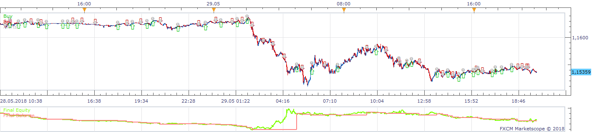
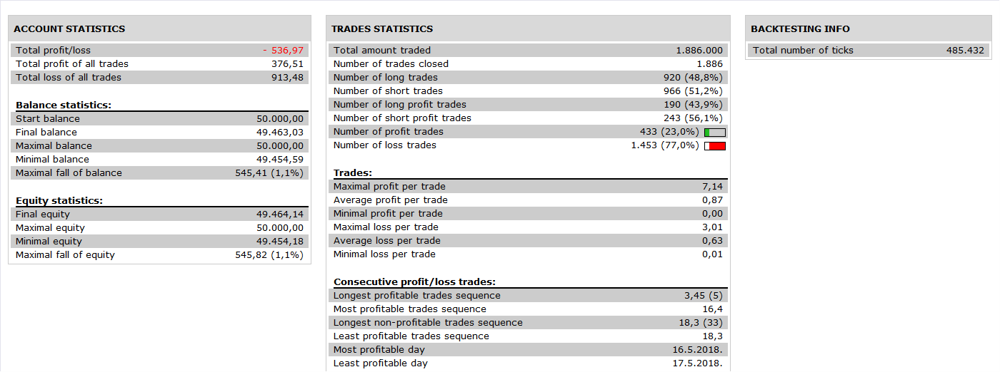

# 4 Stripes Strategy

> Source: https://fxcodebase.com/code/viewtopic.php?f=31&t=3691  
> Forum: 31 · Topic 3691 · 5 post(s)

---

## 4 Stripes Strategy

**Apprentice** · Mon Mar 21, 2011 5:04 pm

 

 

 

Short
When the fast MVA crosses the 3 slow MVA from above
Long
When the fast MVA crosses the 3 Slow MVA from below

To execute the sell/buy, the fast MVA must cross the HIGH or LOW.

Exit the position when the reverse happens and enter a new position in the new direction.

 [4 Stripes Strategy.lua](files/8938/4%20Stripes%20Strategy.lua)

This Strategy is Based on 4 Stripes Strategy Indicator
[viewtopic.php?f=17&t=3690&p=8937#p8937](https://fxcodebase.com/code/viewtopic.php?f=17&t=3690&p=8937#p8937)

---

## Re: 4 Stripes Strategy

**sabrumea** · Tue Mar 22, 2011 5:38 am

also is it possible to make it for EMAs?

---

## Re: 4 Stripes Strategy

**Apprentice** · Tue Mar 22, 2011 1:58 pm

This version uses Averages indicator.
Allows you to use 20 of various moving averages.

 [Averages 4 Stripes Strategy.lua](files/8968/Averages%204%20Stripes%20Strategy.lua)

To this Strategy to work, you need to install Averages Indicator.
You can find it here.
[viewtopic.php?f=17&t=2430&p=5268&hilit=averages#p5268](https://fxcodebase.com/code/viewtopic.php?f=17&t=2430&p=5268&hilit=averages#p5268)

---

## Re: 4 Stripes Strategy

**Apprentice** · Wed Nov 30, 2016 5:57 am

Bump up.

---

## Re: 4 Stripes Strategy

**Apprentice** · Sat Nov 17, 2018 9:48 am

The Strategy was revised and updated on November 17. 2018.
