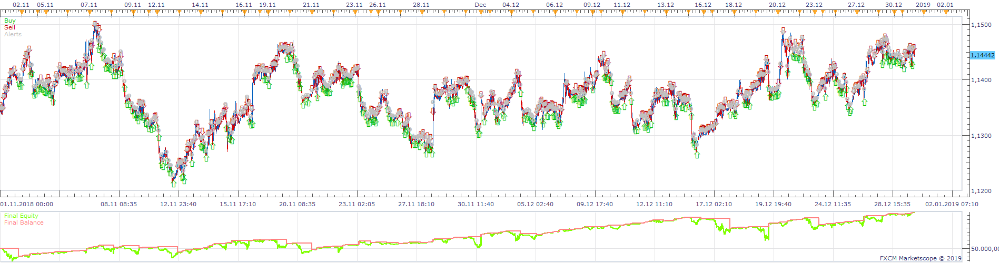
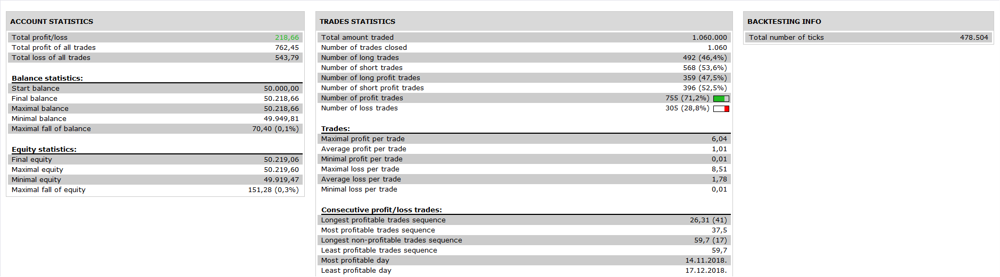

# 4ma_strategy

> Source: https://fxcodebase.com/code/viewtopic.php?f=31&t=69284  
> Forum: 31 · Topic 69284 · 13 post(s)

---

## 4ma_strategy

**Apprentice** · Mon Dec 30, 2019 7:44 am

 

Based on request.
[viewtopic.php?f=27&t=69280](https://fxcodebase.com/code/viewtopic.php?f=27&t=69280)

 [4ma_strategy.lua](files/130529/4ma_strategy.lua)

Volume Price Change.lua
[viewtopic.php?f=17&t=65729](https://fxcodebase.com/code/viewtopic.php?f=17&t=65729)

MT4/MQ4 version.
[viewtopic.php?f=38&t=69810](https://fxcodebase.com/code/viewtopic.php?f=38&t=69810)

---

## Re: 4ma_strategy

**willcsk** · Fri Jan 10, 2020 3:50 am

hi Apprentice,

thank you for this great strategy, love it.

Wondering, if not too difficult, add a custom id to it.

thx

-willie-

---

## Re: 4ma_strategy

**arfs9090** · Mon Jan 13, 2020 9:21 am

Apprentice,
Can you add a filter in the way of volume price change lua. to it would just be needed on one of the 4 timeframes have a separate timeframe for the VPC (Volume Price Change) Condition for strategy are;
Price to close below all MA’a on all timeframes and for the VPC to be below the signal line on the VPC timeframe for Shorts
Price to close above all MA’a on all timeframes and for the VPC to be above the signal line on the VPC timeframe for Longs
Thanks Arf

---

## Re: 4ma_strategy

**Apprentice** · Sun Jan 19, 2020 5:17 am

Your request is added to the development list.
Development reference 566.

---

## Re: 4ma_strategy

**Apprentice** · Mon Jan 20, 2020 9:56 am

[4ma_strategy.lua](files/130817/4ma_strategy.lua)

Try this version.

---

## Re: 4ma_strategy

**arfs9090** · Mon Jan 20, 2020 10:34 am

Apprentice,
Great Job thank you
Arfs

---

## Re: 4ma_strategy

**marcoleghorn1972** · Tue May 05, 2020 1:40 am

Good morning, is possible to have this strategy for mt4?
thanks.

---

## Re: 4ma_strategy

**Apprentice** · Tue May 05, 2020 4:45 am

Your request is added to the development list.
Development reference 1225.

---

## Re: 4ma_strategy

**Apprentice** · Wed May 06, 2020 6:34 am

MT4/MQ4 version.
[viewtopic.php?f=38&t=69810](https://fxcodebase.com/code/viewtopic.php?f=38&t=69810)

---

## Re: 4ma_strategy

**marcoleghorn1972** · Wed May 06, 2020 5:56 pm

Good evening apprentice. I uploaded the ea on mt4 but unfortunately it doesn't work. I also tried to compile and some errors come up.
Thank you very much. I am attaching the file.

---

## Re: 4ma_strategy

**Apprentice** · Thu May 07, 2020 4:39 am

Have you tried to load it to the MT4?

---

## Re: 4ma_strategy

**marcoleghorn1972** · Thu May 07, 2020 12:21 pm

Hi apprentice, I copied and pasted the file in the Expert folder of mt4. I have already tested many ea with this method.
Thanks.

---

## Re: 4ma_strategy

**clavez** · Fri May 22, 2020 3:46 pm

> **marcoleghorn1972 wrote:**
> Hi apprentice, I copied and pasted the file in the Expert folder of mt4. I have already tested many ea with this method.
> Thanks.

Did you try this one?

[viewtopic.php?f=38&t=69810#p133628](https://fxcodebase.com/code/viewtopic.php?f=38&t=69810#p133628)
