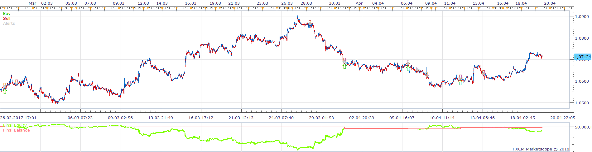
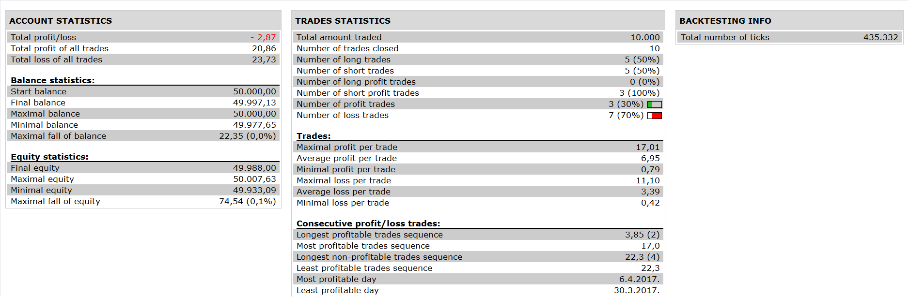

# 6 moving average strategy

> Source: https://fxcodebase.com/code/viewtopic.php?f=31&t=65727  
> Forum: 31 · Topic 65727 · 2 post(s)

---

## 6 moving average strategy

**Apprentice** · Mon Feb 12, 2018 7:53 am

 

Based on the request.
[viewtopic.php?f=27&t=65725](https://fxcodebase.com/code/viewtopic.php?f=27&t=65725)

Long:MVA1<=MVA2<=MVA3<=MVA4<=MVA5<=MVA6 and all slopes are flat or positive,
Close Long: close price of the last bar is lower than MVA

Vice versa for Short

Close all positions before 17:00 EST on Friday.

 [6 moving average strategy.lua](files/117727/6%20moving%20average%20strategy.lua)

---

## Re: 6 moving average strategy

**davidxiao** · Tue Feb 13, 2018 10:05 pm

Thank you very much,Apprentice.
