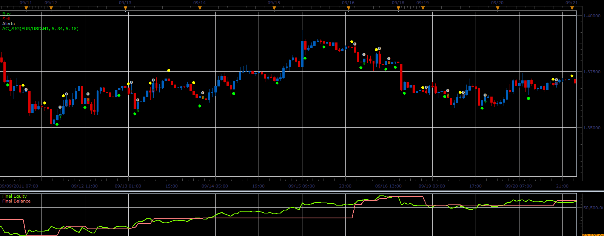

# AC_Sig strategy

> Source: https://fxcodebase.com/code/viewtopic.php?f=31&t=10687  
> Forum: 31 · Topic 10687 · 2 post(s)

---

## AC_Sig strategy

**Alexander.Gettinger** · Fri Dec 30, 2011 2:12 am

This strategy based on AC_Sig indicator: [viewtopic.php?f=17&t=10494](https://fxcodebase.com/code/viewtopic.php?f=17&t=10494)

 

Download strategy:

 [AC_Sig_Strategy.lua](files/22018/AC_Sig_Strategy.lua)

For this strategy must be installed AC_Sig indicator ([viewtopic.php?f=17&t=10494](https://fxcodebase.com/code/viewtopic.php?f=17&t=10494)).

The Strategy was revised and updated on November 21, 2018.

---

## Re: AC_Sig strategy

**Apprentice** · Sun Dec 04, 2016 6:15 am

Bump up.
