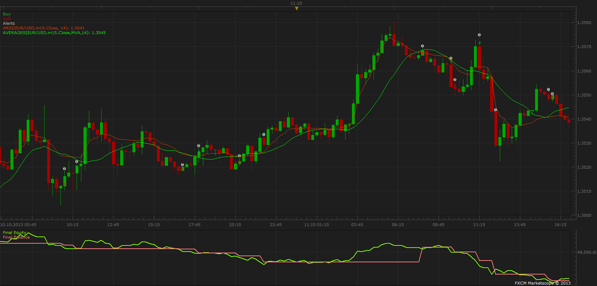

# Adaptive Relative Strength Index, Dynamic Trend Strategy

> Source: https://fxcodebase.com/code/viewtopic.php?f=31&t=5119  
> Forum: 31 · Topic 5119 · 14 post(s)

---

## Adaptive Relative Strength Index, Dynamic Trend Strategy

**Apprentice** · Fri Jul 08, 2011 4:08 am

Signals are generated by a simple Adaptive Relative Strength Index / Dynamic Trend Crossover.

 [ARSI DT Strategy.lua](files/12506/ARSI%20DT%20Strategy.lua)

To make this strategy could work, please download and install DynamicTrend indicator.
[viewtopic.php?f=17&t=1839&p=4639&hilit=Dynamic+Trend#p4639](https://fxcodebase.com/code/viewtopic.php?f=17&t=1839&p=4639&hilit=Dynamic+Trend#p4639)

The Strategy was revised and updated on December 11, 2018.

---

## Re: Adaptive Relative Strength Index, Dynamic Trend Strategy

**Gregopat** · Thu Jul 14, 2011 10:10 pm

apprentice thank you very much for your work and speed, I would like to automate the order management: direct, reverse and allow side: both, long-short by the crossing of a third indicteur but I can not find the command in the library, you can m Integrative ppma indicator and make sure that when the dynamic trend indicator goes above or below the Arsi ppma and moving from direct to reverse a long and short and vice versa.
 thank you in advance ...

---

## Re: Adaptive Relative Strength Index, Dynamic Trend Strategy

**Gregopat** · Tue Aug 16, 2011 4:23 am

bonjour aprentice
pouvez vous m integré l indicteur dinamic trend a la strategie regression super trend et faire de sorte que quand le regression super trend croise ou passe au dessus du dinamic trend la strategie est buy ou long,
et quand le regression super trend croise ou passe en desous du dinamic la strategie est sell ou short, il faudrait que les ordres ce cloture a chaque changement de sens.
si vous ne pouvez ou n avez pas le temps pouvez vous me transmetre la ligne de commande pour le changement de sens au croisement du regression super trend et dinamic trend car je bloque dessus.
par avance merci de votre travail considérable.
greg

---

## Re: Adaptive Relative Strength Index, Dynamic Trend Strategy

**xpertizetrading** · Fri Nov 22, 2013 12:37 pm

Hi,

Is it possible to code a strategy for a cross between ARSI and Averages.

Regards,
Xpertizetrading

---

## Adaptive Relative Strength Index, Averages Strategy

**Apprentice** · Sat Nov 23, 2013 7:13 am

Open Long
Adaptive Relative Strength Index / Averages CrossOver
Open Short
Adaptive Relative Strength Index / Averages CrossUnder

 [ARSI Averages Strategy.lua](files/91024/ARSI%20Averages%20Strategy.lua)

 [ARSI Averages Strategy With Shift.lua](files/91024/ARSI%20Averages%20Strategy%20With%20Shift.lua)

---

## Re: Adaptive Relative Strength Index, Dynamic Trend Strategy

**xpertizetrading** · Sat Nov 23, 2013 10:35 pm

Many thanks. It was so quick.

Regards.
xpertizetrading

---

## Re: Adaptive Relative Strength Index, Dynamic Trend Strategy

**Meringue** · Mon Nov 25, 2013 2:19 pm

after running a test this is the message i get. where will i find this strategy ...

s\FXTS2\Strategies\Custom\ARSI Averages Strategy.lua:168: Please, download and install AVERAGES.LUA indicator;11/25/2013 14:18:00

---

## Re: Adaptive Relative Strength Index, Dynamic Trend Strategy

**Apprentice** · Tue Nov 26, 2013 5:08 am

Averages indicator can be found here.
You have to install it for this strategy.
[viewtopic.php?f=17&t=2430](https://fxcodebase.com/code/viewtopic.php?f=17&t=2430)

---

## Re: Adaptive Relative Strength Index, Dynamic Trend Strategy

**xpertizetrading** · Wed Nov 05, 2014 12:46 am

Request : I will be very grateful if Fxcodebase team could provide another variation of the above studied strategies

----

Arsi Shift Strategy

Price: ...
Time Frame: ...

Adaptive Relative Strength Index Parameters: ...

Shift Parameters: ...

Strategy Parameters:
Type of Signal: ... (Direct)

Trading Parameters:
Allowed Side:... etc
...
...

Alerts: ..

------------

The idea is to take advantage of Arsi and Shift crossovers. Shift is most probably applied to Averages.

Thanks a lot.
Regards,
xpertizetrading

---

## Re: Adaptive Relative Strength Index, Dynamic Trend Strategy

**Apprentice** · Wed Nov 05, 2014 4:08 am

Both strategy, were revised.
To recap, you want to add the Shift option to ARSI and Averages?

---

## Re: Adaptive Relative Strength Index, Dynamic Trend Strategy

**xpertizetrading** · Wed Nov 05, 2014 11:00 pm

Yes,

Shift option applied to averages and arsi.

Regards,

---

## Re: Adaptive Relative Strength Index, Dynamic Trend Strategy

**Apprentice** · Mon Nov 10, 2014 4:14 am

ARSI Averages Strategy With Shift.lua Added

---

## Re: Adaptive Relative Strength Index, Dynamic Trend Strategy

**xpertizetrading** · Tue Nov 11, 2014 10:55 am

Thank You very much. Works fine

---

## Re: Adaptive Relative Strength Index, Dynamic Trend Strategy

**Apprentice** · Sun Dec 11, 2016 8:54 am

Strategy was revised and updated.
