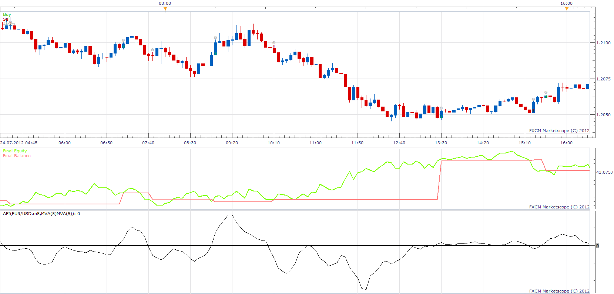

# Advanced Force Index Strategy

> Source: https://fxcodebase.com/code/viewtopic.php?f=31&t=27335  
> Forum: 31 · Topic 27335 · 3 post(s)

---

## Advanced Force Index Strategy

**Apprentice** · Mon Dec 03, 2012 2:46 pm

Long
AFI Cross Over Buy Level
Short
AFI Cross Under Sell Level

Exit (Optinal)
Exit Long
AFI Cross Under Buy Exit Level
Exit Short
AFI Cross Over Sell Exit Level

 [Advanced Force Index Strategy.lua](files/47777/Advanced%20Force%20Index%20Strategy.lua)

Please install AFI Indicator.
[viewtopic.php?f=17&t=1966](https://fxcodebase.com/code/viewtopic.php?f=17&t=1966)

The Strategy was revised and updated on December 10, 2018.

---

## Re: Advanced Force Index Strategy

**swingtrader** · Mon Dec 03, 2012 8:24 pm

thank you.

---

## Re: Advanced Force Index Strategy

**Apprentice** · Thu Dec 08, 2016 3:38 pm

Strategy has been revised and updated.
