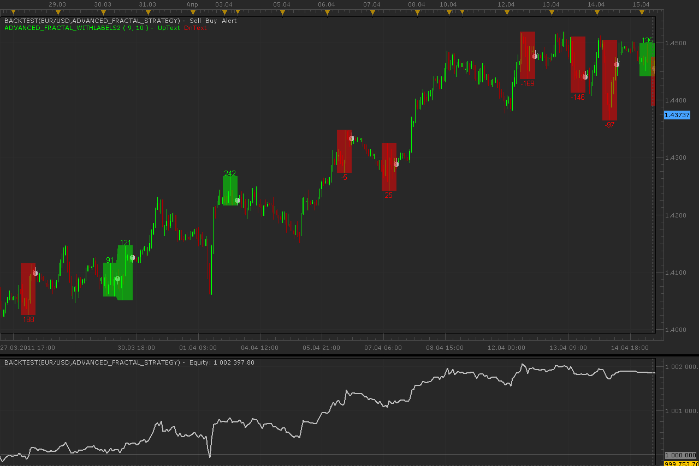
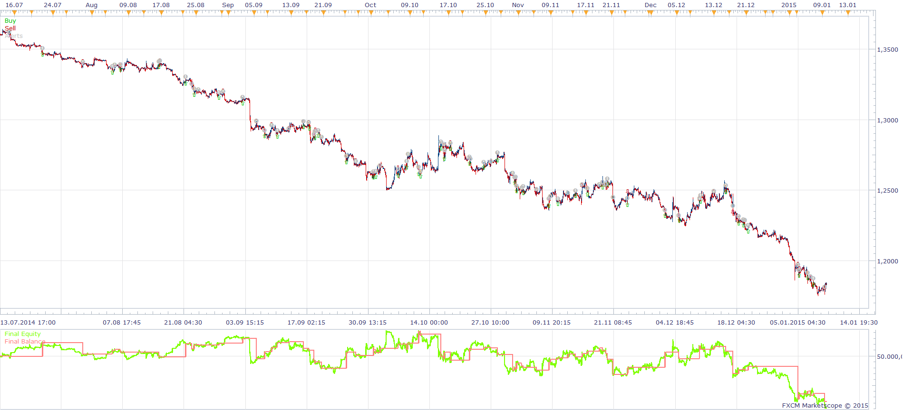

# Advanced fractal strategy

> Source: https://fxcodebase.com/code/viewtopic.php?f=31&t=4196  
> Forum: 31 · Topic 4196 · 46 post(s)

---

## Advanced fractal strategy

**Alexander.Gettinger** · Wed May 11, 2011 3:27 am

Strategy based on Advance fractal indicator ([viewtopic.php?f=17&t=724](https://fxcodebase.com/code/viewtopic.php?f=17&t=724)).

BUY order is opened at DN fractal and SELL order at UP fractal.
Strategy supports direct and reverse signals and multiple positions.

 

Download:

 [Advanced_Fractal_Strategy.lua](files/10524/Advanced_Fractal_Strategy.lua)

The Strategy was revised and updated on January 21, 2019.

---

## Re: Advanced fractal strategy

**lisa_baby_xx** · Wed May 11, 2011 4:33 am

Hi Alex and Apprentice,

 Many thanks to you and much love for this stratagy! XX

lisa_baby_xx

---

## Re: Advanced fractal strategy

**arindam89** · Mon Dec 26, 2011 11:00 pm

> **Alexander.Gettinger wrote:**
> Strategy based on Advance fractal indicator ([viewtopic.php?f=17&t=724](https://fxcodebase.com/code/viewtopic.php?f=17&t=724)).
>
> BUY order is opened at DN fractal and SELL order at UP fractal.
> Strategy supports direct and reverse signals and multiple positions.
>
>
>
> Advanced_Fractal_Strategy.png
>
>
>
> Download:
>
>
> Advanced_Fractal_Strategy.lua

hi
what does minimum distance from central bar mean?
thanks
by
arindam

---

## Re: Advanced fractal strategy

**flem_wad** · Thu Jan 12, 2012 6:32 am

Hi,

I have tried to use the signals/notifications given by this strategy, but they do not seem to work with current version of Marketscope.

My parameter settings
Allow strategy to trade = NO.
Show alert = YES

When/if you have time, could you correct this?
Thanks.

flem_wad

---

## Re: Advanced fractal strategy

**flem_wad** · Sat Jan 21, 2012 11:39 am

Hi,

Can you add "Maximum number of positions" parameter to this strategy?
I am trying to avoid the dreaded margin-call.

Cheers.
flem_wad

---

## Re: Advanced fractal strategy

**flem_wad** · Sun Jan 22, 2012 4:30 pm

Hi,

This strategy is not working on current version of Marketscope, can you help?

Thanks.
flem_wad

---

## Re: Advanced fractal strategy

**Apprentice** · Sun Jan 22, 2012 5:40 pm

I confirm this.
I have sent a message to Alex

---

## Re: Advanced fractal strategy

**flem_wad** · Thu Jan 26, 2012 6:56 am

Hi,

The trailing stop does not work either.

flem_wad

---

## Re: Advanced fractal strategy

**Alexander.Gettinger** · Fri Jan 27, 2012 3:23 am

Problem fixed, strategy updated.

---

## Re: Advanced fractal strategy

**macogi37** · Sat Feb 25, 2012 6:27 pm

Hi Alexander,
Is possible to combine two strategies, Advanced Fractal for entry and Fractal trailing stop for the exit? It would be a formidable solution, because i have tested manually on so many pairs the indicator AFBSR and how to stop i used the strategy Fractal trailing stop getting excellent results ..
Thanks in advance

---

## Re: Advanced fractal strategy

**Apprentice** · Sun Feb 26, 2012 4:41 am

Requested can be found here.

---

## Re: Advanced fractal strategy

**rahulmalik** · Thu Mar 01, 2012 12:00 pm

> **Alexander.Gettinger wrote:**
> Problem fixed, strategy updated.

Dear Alex. From where can I download the updated strategy, which is compatible with current version of Marketscope ? Thank you

---

## Re: Advanced fractal strategy

**rahulmalik** · Thu Mar 01, 2012 1:05 pm

> **Apprentice wrote:**
> Requested can be found here.

Dear Apprentice, I am trying to back test the strategy, with the attached parameters(please see the attached image). Please let me know where I am going wrong. I am testing data for US Dollar, from 27 Feb to 29 Feb. If I am trying to use adv fractal indicator, its showing me lot of signals.

Also, please advice, in addition to above, how can I close my trades, if I use this strategy to auto trade ? Would you help me to correct the parameters ?

Appreciate your help in advance.

Thank you

---

## Re: Advanced fractal strategy

**rahulmalik** · Thu Mar 01, 2012 1:19 pm

> **Apprentice wrote:**
> Requested can be found here.

Dear Apprentice, also let me know how can I book profit on every order placed through automated strategy, say for example at a profit of 5 pips and an equal SL. Please advice. Thank you.

---

## Re: Advanced fractal strategy

**poriyavt** · Sun May 26, 2013 5:25 pm

Hi Sir Just Can u just Inform me what Which Number of fractal (odd) You are using and what a Min> distance for central bar you r using and which is a good Time Frame I can use I waiting your reply

---

## Re: Advanced fractal strategy

**Apprentice** · Sun Jun 02, 2013 12:34 pm

Your request is added to the development list.

---

## Re: Advanced fractal strategy

**DaniLibo** · Fri Jun 14, 2013 5:14 pm

Hi Alex, excellent job.
Please, can you add the use of a Moving Average (ie EMA 55)?
To determine the trend and enter or alert only with a BUY (price over the MA) or SELL (under the MA) in that direction.
Thank you.

---

## Re: Advanced fractal strategy

**Apprentice** · Mon Jun 17, 2013 5:33 am

Your request is added to the developmental list.

---

## Re: Advanced fractal strategy

**pksingh** · Wed Jul 17, 2013 1:28 am

Hi

I was trying to slightly modify this strategy but am stuck at a code where I do a getHistory in a specified from-to period, but somehow all except this one getHistory works. Is there any limitations on getHistory after init block

Thanks
Cant paste code here, as it says spam,so can send the file by email.

---

## Re: Advanced fractal strategy

**Apprentice** · Wed Jul 17, 2013 3:50 am

Yes, You can send it as a private message or email.

---

## Re: Advanced fractal strategy

**chimpy** · Fri Jan 31, 2014 8:06 am

Can the standard BOTH, BUY, SELL dropdown box be added to this strategy similar to the others so that we can choose if it will take long, short or both types of trades?

thank you in advance

Chimpy

---

## Re: Advanced fractal strategy

**Apprentice** · Sat Feb 01, 2014 2:33 pm

Your request is added to the development list.

---

## Re: Advanced fractal strategy

**chimpy** · Sun Feb 02, 2014 2:39 pm

Apprentice,

I just tried to use the advanced fractal indicator with the Strategy Builder but the dialog said I'd not compatible, and to contact you??
I though I could get by using that until the advanced fractal strategy is updated because, the strategy builder has the Both, Sell, Buy option available.

If you cant update it anytime soon then can I see the code and if its straght forward perhaps I can update it

---

## Re: Advanced fractal strategy

**Apprentice** · Mon Feb 03, 2014 5:46 am

Your request is added to the development list.

---

## Re: Advanced fractal strategy

**amunir203** · Tue Feb 25, 2014 9:55 am

Hi

I have installed and use in Marketscope. I configure according to one of ur post (Pic). On Marketscope Strategy Dashboard it does not display Allow Trading "Yes "

what to do?

Thanks.

---

## Re: Advanced fractal strategy

**Apprentice** · Wed Feb 26, 2014 4:42 pm

U have probably try to test it within Backtester?
If so, by default, it should be set to yes.

---

## Re: Advanced fractal strategy

**refresc0** · Sun Apr 27, 2014 11:32 pm

What an awesome strategy i am trying to understand the code, is the position opening at the end of the Shift or in the middle of it?

---

## Re: Advanced fractal strategy

**Apprentice** · Mon Apr 28, 2014 2:50 am

You have to understand how Fractal Indicator is calculated.
[viewtopic.php?f=17&t=724&hilit=Advanced+fractal](https://fxcodebase.com/code/viewtopic.php?f=17&t=724&hilit=Advanced+fractal)
Fractal is calculated for ((Number of fractals -1) / 2) periods ago.
Therefore signal is delayed by this period.
Shift is only an internal loop limit.
Fractal + / - 1,2,3 ...

---

## Re: Advanced fractal strategy

**moomoofx** · Thu May 15, 2014 6:02 am

> **chimpy wrote:**
> Can the standard BOTH, BUY, SELL dropdown box be added to this strategy similar to the others so that we can choose if it will take long, short or both types of trades?

> **DaniLibo wrote:**
> Hi Alex, excellent job.
> Please, can you add the use of a Moving Average (ie EMA 55)?
> To determine the trend and enter or alert only with a BUY (price over the MA) or SELL (under the MA) in that direction.

Strategy has been updated to meet the above two requested enhancements.

Please redownload from the first post in this thread.

Cheers,
MooMooFX

---

## Re: Advanced fractal strategy

**GregScuderia** · Sat Jun 13, 2015 6:21 am

Can you add stop order at the last opposite fractal mark?

---

## Re: Advanced fractal strategy

**Apprentice** · Mon Jun 15, 2015 3:35 am

Your request is added to the development list.

---

## Re: Advanced fractal strategy

**Stance** · Wed Jun 24, 2015 12:09 am

Hi,

Is this working with the latest version of Trading Station?

I'm testing this and it looks like I'm not getting any alerts or trades triggering.

---

## Re: Advanced fractal strategy

**Apprentice** · Wed Jun 24, 2015 6:56 am

Works in Backtester, which instrument, time frame, settings you are using.
For Real / Demo trading, be sure to set "Allow strategy to trade" to yes.

---

## Re: Advanced fractal strategy

**Stance** · Wed Jun 24, 2015 8:52 pm

Sorry my bad I think there was a problem with my trading station app.

I've re-installed it and it's working now.

Would it be possible to add ATR to the strategy and only enter a trade if pip count between fractals is greater than 2x ATR?

---

## Re: Advanced fractal strategy

**doanthedung** · Thu Dec 15, 2016 5:27 am

I have a problem. I test this strategy with TF m1 then error

How can repair it?

---

## Re: Advanced fractal strategy

**Sergey.Konovalov** · Fri Dec 16, 2016 6:23 am

Hello doanthedung,

Development team analyzes your situation.
I will inform you of the results as soon as possible.

---

## Re: Advanced fractal strategy

**Avignon** · Fri Apr 07, 2017 4:46 pm

Hello,

Is it possible that with different updates the strategy no longer works?

They worked before.

---

## Re: Advanced fractal strategy

**Avignon** · Mon Apr 10, 2017 5:06 pm

> **Avignon wrote:**
> Hello,
>
> Is it possible that with different updates the strategy no longer works?
>
> They worked before.

PEBKAC, I was mistaken about strategy.

---

## Re: Advanced fractal strategy

**Avignon** · Wed Apr 12, 2017 5:42 pm

Hello,

Why the message "Trading no allowed" ?

 

 

---

## Re: Advanced fractal strategy

**Stance** · Tue Aug 15, 2017 9:36 pm

Hi,

I ran a backtest on this and it doesn't seem to be closing trades? Is this how the strategy is supposed to work or should it close trades on an opposite signal?

---

## Re: Advanced fractal strategy

**Avignon** · Wed Aug 16, 2017 3:37 am

> **Stance wrote:**
> Hi,
>
> I ran a backtest on this and it doesn't seem to be closing trades? Is this how the strategy is supposed to work or should it close trades on an opposite signal?

The strategy is buggy.

---

## Re: Advanced fractal strategy

**Alexander.Gettinger** · Wed Aug 16, 2017 5:00 pm

> **Stance wrote:**
> Hi,
>
> I ran a backtest on this and it doesn't seem to be closing trades? Is this how the strategy is supposed to work or should it close trades on an opposite signal?

What type of account are you using (FIFO, non-FIFO)?

---

## Re: Advanced fractal strategy

**Stance** · Wed Aug 16, 2017 5:12 pm

> **Alexander.Gettinger wrote:**
>
>
> > **Stance wrote:**
> > Hi,
> >
> > I ran a backtest on this and it doesn't seem to be closing trades? Is this how the strategy is supposed to work or should it close trades on an opposite signal?
>
>
>
> What type of account are you using (FIFO, non-FIFO)?

My account is non-fifo.

---

## Re: Advanced fractal strategy

**Apprentice** · Thu Aug 17, 2017 2:57 am

Have forwarded this case to the development team.

---

## Re: Advanced fractal strategy

**Alexander.Gettinger** · Fri Aug 18, 2017 10:03 am

> **Stance wrote:**
>
>
> > **Alexander.Gettinger wrote:**
> >
> >
> > > **Stance wrote:**
> > > Hi,
> > >
> > > I ran a backtest on this and it doesn't seem to be closing trades? Is this how the strategy is supposed to work or should it close trades on an opposite signal?
> >
> >
> >
> > What type of account are you using (FIFO, non-FIFO)?
>
>
>
> My account is non-fifo.

Can you send me the file with the backtester project?

---

## Re: Advanced fractal strategy

**Stance** · Mon Aug 21, 2017 5:16 pm

Is this what you are after?

[Advanced Fractal Strategy Project](https://www.dropbox.com/s/opboi0l6zi50g68/Advanced%20Fractal%20Strategy.bpj?dl=0)
