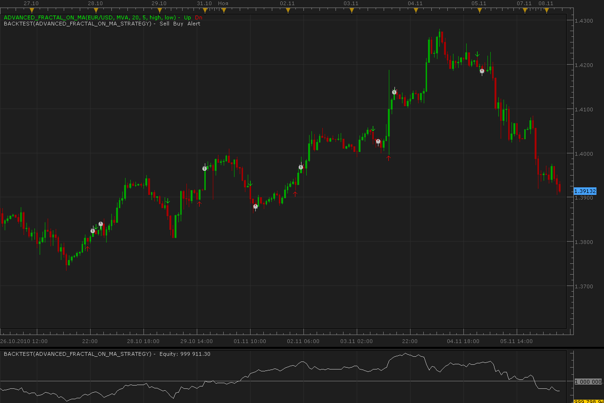
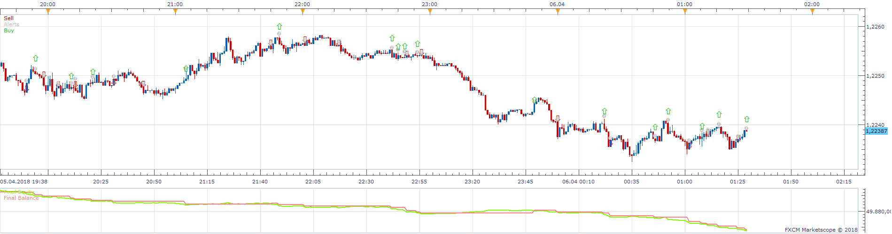
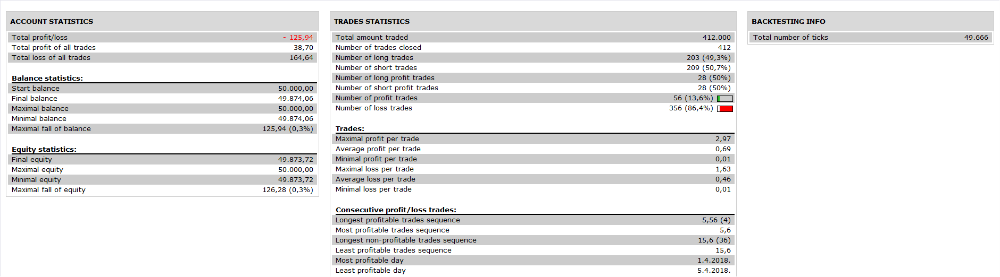

# Advanced fractals on MA strategy

> Source: https://fxcodebase.com/code/viewtopic.php?f=31&t=2624  
> Forum: 31 · Topic 2624 · 13 post(s)

---

## Advanced fractals on MA strategy

**Alexander.Gettinger** · Mon Nov 08, 2010 5:55 am

The strategy based on Advanced fractals on MA ([viewtopic.php?f=17&t=2617](https://fxcodebase.com/code/viewtopic.php?f=17&t=2617))

 

 

 

 [Advanced_Fractal_On_MA_Strategy.lua](files/5908/Advanced_Fractal_On_MA_Strategy.lua)

For this strategy must be installed Averages indicator: [viewtopic.php?f=17&t=2430](https://fxcodebase.com/code/viewtopic.php?f=17&t=2430)

---

## Re: Advanced fractals on MA strategy

**ak_nomiss** · Mon Nov 08, 2010 8:25 pm

there is a problem in the strategy, when I apply this strategy it pop up a message "the indicator with ID AVERAGES IS NOT FOUND"

---

## Re: Advanced fractals on MA strategy

**thetruth** · Tue Nov 09, 2010 12:57 pm

read [viewtopic.php?f=17&t=2617](https://fxcodebase.com/code/viewtopic.php?f=17&t=2617)
and download averages.lua
[viewtopic.php?f=17&t=2430](https://fxcodebase.com/code/viewtopic.php?f=17&t=2430)

---

## Re: Advanced fractals on MA strategy

**thetruth** · Thu Nov 11, 2010 9:21 am

Alexander,
Can you put, in the settings indicator, the option for BF_AdvancedFractal.lua, and
one option for MA, on/off.
thanks, and great work!!

---

## Re: Advanced fractals on MA strategy

**Apprentice** · Thu Nov 11, 2010 12:39 pm

Added to developmental cue.

---

## Re: Advanced fractals on MA strategy

**Alexander.Gettinger** · Fri Nov 12, 2010 12:27 am

BF_AdvancedFractal.lua is not used in this strategy.
Please, explain me your question.

---

## Re: Advanced fractals on MA strategy

**thetruth** · Fri Nov 12, 2010 7:51 am

my question is, if is possible use the advanced fractal in other time frame, than the time frame of the strategy? for example if the strategy works in H1 but advanced fractal is calculated on H4.
thanks!!

---

## Re: Advanced fractals on MA strategy

**DS0167** · Mon Nov 15, 2010 8:07 am

Apprentice,

The arrow does not appear automatically... if you do not refresh the chart... is it possible to fix that? (I noticed this issue while trading on a 5min with the EMA 30, close, close, 5).

Thanks in advance for you answer.

Kind regards,
Danielle

---

## Re: Advanced fractals on MA strategy

**Alexander.Gettinger** · Mon Nov 22, 2010 2:48 am

> **DS0167 wrote:**
> Apprentice,
>
> The arrow does not appear automatically... if you do not refresh the chart... is it possible to fix that? (I noticed this issue while trading on a 5min with the EMA 30, close, close, 5).
>
> Thanks in advance for you answer.
>
> Kind regards,
> Danielle

Thank you for found error.
Indicator updated: [download/file.php?id=2400](https://fxcodebase.com/code/download/file.php?id=2400)

---

## Re: Advanced fractals on MA strategy

**Alexander.Gettinger** · Mon Nov 22, 2010 2:53 am

> **thetruth wrote:**
> my question is, if is possible use the advanced fractal in other time frame, than the time frame of the strategy? for example if the strategy works in H1 but advanced fractal is calculated on H4.
> thanks!!

Yes, it is possible.
Use parameter "Time frame" in "Strategy parameters".

---

## Re: Advanced fractals on MA strategy

**DS0167** · Mon Nov 22, 2010 12:18 pm

> **Alexander.Gettinger wrote:**
>
> Thank you for found error.
> Indicator updated: [download/file.php?id=2400](https://fxcodebase.com/code/download/file.php?id=2400)

Thank you very much Alexander.
FXCodeBase men are a great team and and we are lucky to have you
Kind regards,
DS0167

---

## Re: Advanced fractals on MA strategy

**Apprentice** · Wed Nov 30, 2016 5:20 am

Bump up.

---

## Re: Advanced fractals on MA strategy

**Apprentice** · Thu Nov 15, 2018 12:14 pm

The Strategy was revised and updated on November 15. 2018.
