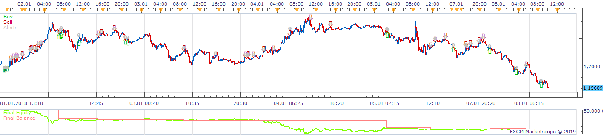
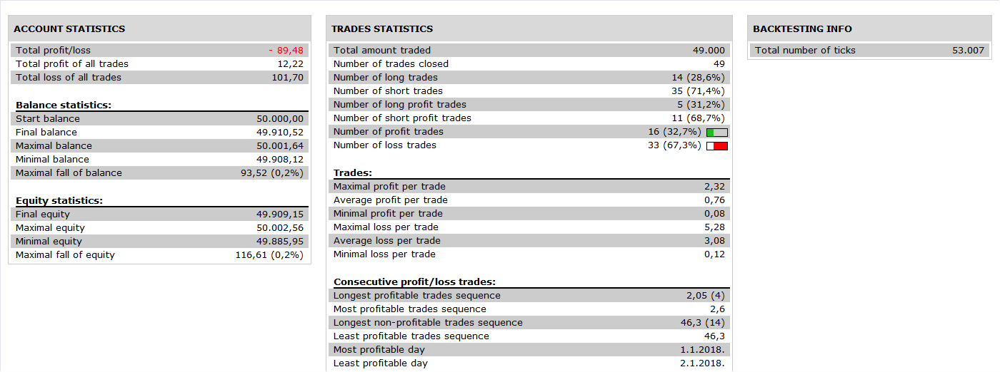

# Advanced Support Resistance Strategy

> Source: https://fxcodebase.com/code/viewtopic.php?f=31&t=68704  
> Forum: 31 · Topic 68704 · 5 post(s)

---

## Advanced Support Resistance Strategy

**Apprentice** · Wed Jul 24, 2019 4:11 am

 

Based on Advanced Support Resistance.lua
[viewtopic.php?f=17&t=59367](https://fxcodebase.com/code/viewtopic.php?f=17&t=59367)

 [Advanced Support Resistance Strategy.lua](files/127512/Advanced%20Support%20Resistance%20Strategy.lua)

---

## Re: Advanced Support Resistance Strategy

**enotikos** · Wed Jul 24, 2019 6:43 am

Hi,

Does not work
and the following message appears…

---

## Re: Advanced Support Resistance Strategy

**Apprentice** · Thu Jul 25, 2019 1:33 am

Please re-download the Advanced Support Resistance indicator.

---

## Re: Advanced Support Resistance Strategy

**robeen** · Thu Jul 25, 2019 4:59 am

Hi Apprentice,

The same message appears for me "lua114 attempt to index field Down a nil value.

Thanks

---

## Re: Advanced Support Resistance Strategy

**Apprentice** · Mon Jul 29, 2019 6:40 am

You need to install the latest version of the indicator.
