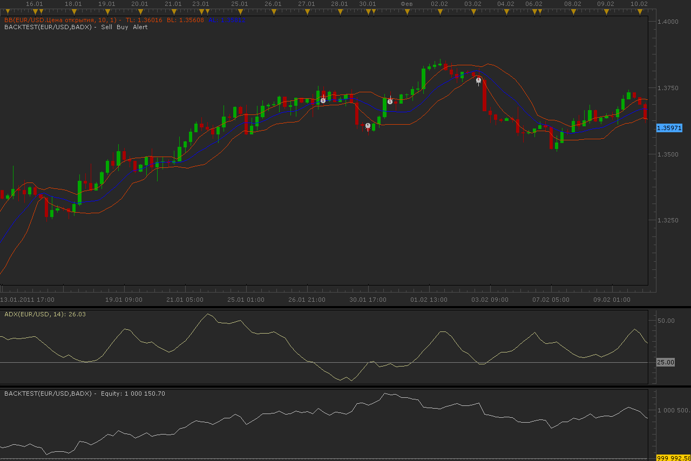

# ADX and Bolinger Bands strategy

> Source: https://fxcodebase.com/code/viewtopic.php?f=31&t=3438  
> Forum: 31 · Topic 3438 · 11 post(s)

---

## ADX and Bolinger Bands strategy

**Alexander.Gettinger** · Fri Feb 18, 2011 1:27 am

Strategy based on 2 indicators: ADX and Bolinger Bands (BB).

BUY conditions:
ADX<[Level ADX] and Price<BB bottom line

SELL conditions:
ADX<[Level ADX] and Price>BB top line

 

Download:

 [BADX.lua](files/8220/BADX.lua)

The Strategy was revised and updated on December 18, 2018.

---

## Re: ADX and Bolinger Bands strategy

**rose123** · Sat Oct 22, 2011 1:25 pm

can you modify the strategy as follows
buy when:ADX >[Level ADX] and price >ema200 price cross over bottom line
exit buy when: price cross under top line or price cross under ema 200
sell when :ADX >[Level ADX] and price < ema 200 price cross under top line
exit sell when: price cross over bottom line or price cross over ema 200

---

## Re: ADX and Bolinger Bands strategy

**Apprentice** · Sat Oct 22, 2011 4:41 pm

Your request is added to the developmental cue.

---

## Re: ADX and Bolinger Bands strategy

**Apprentice** · Mon Apr 09, 2012 3:52 am

buy
ADX >[Level ADX] and price >ema200
price cross over B.B. bottom line
exit buy
price cross under B.B. top line
or price cross under ema 200
sell
ADX >[Level ADX] and price < ema 200
price cross under B.B. top line
exit sell
 price cross over B.B. bottom line
or price cross over ema 200

 [BB MA ADX Strategy.lua](files/29584/BB%20MA%20ADX%20Strategy.lua)

---

## Re: ADX and Bolinger Bands strategy

**LordTwig** · Mon May 13, 2013 5:00 am

Hi Apprentice, or others,

I have a problem where this strategy set on timeframe(TF) of 15min is closing out opened trades of the same strategy but opened using different TF conditions. ie;

Same Strategy is used but....
1 x trade is opened by conditions relevant and set to 15min periods
1 x trade is opened by conditions relevant and set to 1min periods

Exit/closing conditions of 15min strategy opened trade is signaling to close the trade that was opened by the 1min TF......and vice versa.

My question is....
How can I make the strategy only exit/close a opened trade from the same timeframe conditions it was opened in/from?

Can you modifiy and post this strategy to do that so we can see how you do it....

---

## Re: ADX and Bolinger Bands strategy

**Apprentice** · Wed May 15, 2013 2:55 am

In the current implementation, this is not possible.
We need to write a new trading trading functions for this purpose.
Whose scope will be limited to its own position.

---

## Re: ADX and Bolinger Bands strategy

**jaricarr** · Thu Jul 07, 2016 11:37 pm

Hi Apprentice,

Can we have a secondary strategy with alternate entry conditions ?

Long:
Price is above EMA (adjustable period)
DMI > adjustable level
Price crosses-over upper BB

Exit:
Price crosses-under upper BB

Short:
Price is below EMA (adjustable period)
DMI > adjustable level
Price crosses-under lower BB

Exit:
Price crosses-over lower BB

Thanks,
JC

---

## Re: ADX and Bolinger Bands strategy

**jaricarr** · Fri Jul 08, 2016 10:37 am

Sorry I meant ADX > adjustable level

---

## Re: ADX and Bolinger Bands strategy

**jaricarr** · Wed Jul 20, 2016 3:52 pm

Hi,

Any updates for this request ?

Thanks,
JC

---

## Re: ADX and Bolinger Bands strategy

**Apprentice** · Tue Aug 09, 2016 4:00 am

try this version.
[viewtopic.php?f=31&t=63743&p=107540#p107540](https://fxcodebase.com/code/viewtopic.php?f=31&t=63743&p=107540#p107540)

---

## Re: ADX and Bolinger Bands strategy

**Apprentice** · Sat Dec 17, 2016 9:07 am

Strategy was revised and updated.
