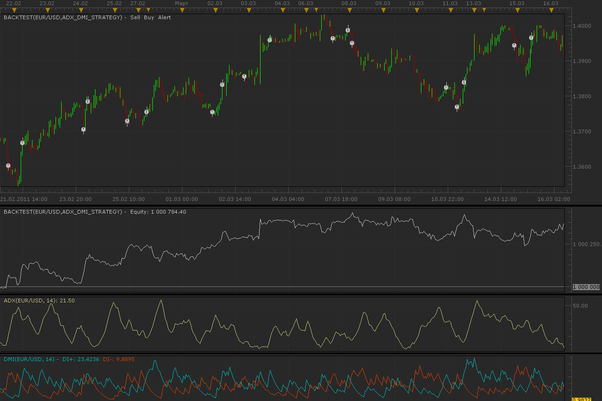
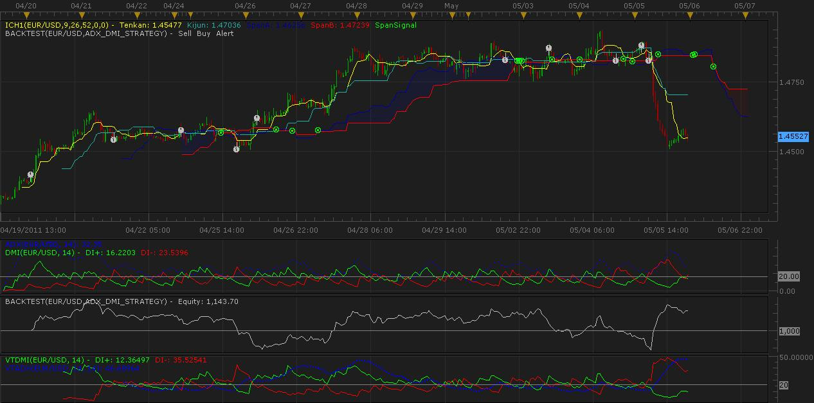
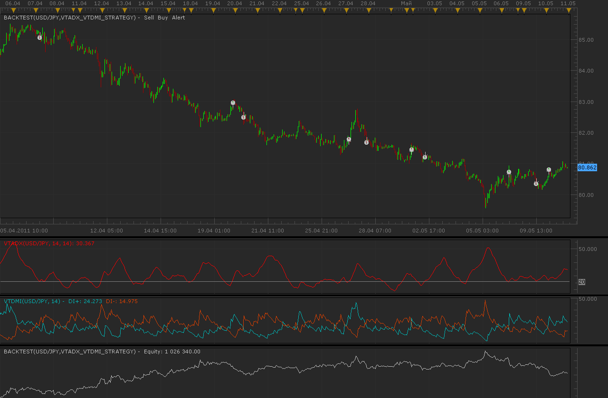
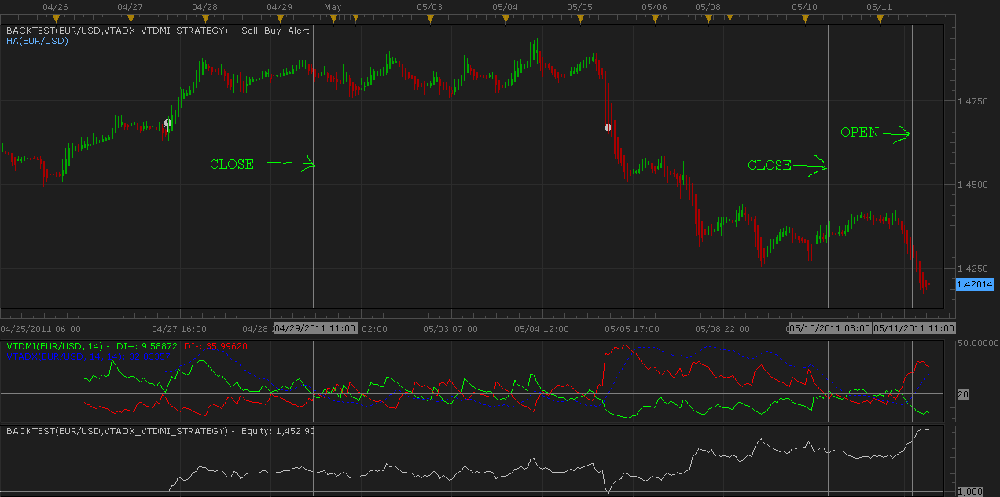

# ADX and DMI strategy

> Source: https://fxcodebase.com/code/viewtopic.php?f=31&t=4107  
> Forum: 31 · Topic 4107 · 15 post(s)

---

## ADX and DMI strategy

**Alexander.Gettinger** · Wed May 04, 2011 2:14 am

Strategy based on 2 oscillators: ADX and DMI.

BUY conditions:
ADX>[ADX_Level], DMI+>=[DMI_P_Level_BUY], DMI-<[DMI_M_Level_BUY].

SELL conditions:
ADX>[ADX_Level], DMI+<[DMI_P_Level_SELL], DMI->=[DMI_M_Level_SELL].

 

Download:

 [ADX_DMI_Strategy.lua](files/10295/ADX_DMI_Strategy.lua)

The Strategy was revised and updated on December 11, 2018.

---

## Re: ADX and DMI strategy

**luigipg** · Wed May 04, 2011 7:20 am

Hi and thanks a lot! Anyway what mean "type of signal" direct or reverse? Luigi!!!

---

## Re: ADX and DMI strategy

**kgsmith69** · Thu May 05, 2011 10:46 pm

The VTADX seems to filter out the sideways movement (ranging) better than the ADX, just an observation.

 

---

## Re: ADX and DMI strategy

**Apprentice** · Fri May 06, 2011 2:10 am

Your request has been added to developmental cue.

---

## Re: ADX and DMI strategy

**kgsmith69** · Fri May 06, 2011 10:06 am

Thanks! That would be great. Exactly what I've been looking for, I'm just not very good at programming. THANKS AGAIN!

P.S. I would like it to exit on dmi cross. Thanks agian!

---

## Re: ADX and DMI strategy

**Alexander.Gettinger** · Tue May 10, 2011 10:42 pm

Strategy with VTADX and VTDMI indicators.

 

Download:

 [VTADX_VTDMI_Strategy.lua](files/10514/VTADX_VTDMI_Strategy.lua)

For strategy must be installed VTADX ([viewtopic.php?f=17&t=511](https://fxcodebase.com/code/viewtopic.php?f=17&t=511)) and VTDMI ([viewtopic.php?f=17&t=950](https://fxcodebase.com/code/viewtopic.php?f=17&t=950)) indicators.

---

## Re: ADX and DMI strategy

**kgsmith69** · Wed May 11, 2011 4:23 pm

Thanks Alexander,
That was fast. You do great work by the way. Correct me if I'm wrong but it appears this strategy is always in a position? This would be a very reliable strategy in my opinion if it would exit (close position) on DMI CROSS.

P.S. Excellent Work, Your Work Is Appreciated!

 

---

## Re: ADX and DMI strategy

**kgsmith69** · Thu May 12, 2011 4:47 am

Having a problem with the sound. I have Play Sound set to (yes) and RecurrentSound set to (yes) but still doesn't work. Not sure what the problem is?

---

## Re: ADX and DMI strategy

**nookie** · Mon Jul 11, 2011 5:03 am

Hi Alexander,

Can you please add an option for this strategy to have "allowed side" for trading in the trading parameters section so it can have an option to go only short, long or both directions ?

Thanks

Nookie

---

## Re: ADX and DMI strategy

**Alexander.Gettinger** · Mon Jul 11, 2011 9:58 pm

In strategy added parameter "AllowDirection".

Download:

 [VTADX_VTDMI_Strategy2.lua](files/12613/VTADX_VTDMI_Strategy2.lua)

---

## Re: ADX and DMI strategy

**PipGrabber** · Mon Nov 21, 2011 1:24 am

> **Alexander.Gettinger wrote:**
> Strategy based on 2 oscillators: ADX and DMI.
>
> BUY conditions:
> ADX>[ADX_Level], DMI+>=[DMI_P_Level_BUY], DMI-<[DMI_M_Level_BUY].
>
> SELL conditions:
> ADX>[ADX_Level], DMI+<[DMI_P_Level_SELL], DMI->=[DMI_M_Level_SELL].
>
>
>
> ADX_DMI_Strategy.png
>
>
>
> Download:
>
>
> ADX_DMI_Strategy.lua

Greetings! How can we filter the crosses made? Cause in 1min charts. There are times that the DMI crosses twice in a minute. And it trades twice too. Thanks

---

## Re: ADX and DMI strategy

**david627** · Thu Apr 19, 2012 8:36 am

Alexander when using this strategey Im getting the following error in regards to stops and limits. I have no idea why this is happening as I can't find any error in the code.
Failed Net Position Stop/Limit Order (1.31323, EUR/USD, 3800043736) 4/19/2012 07:08 4/19/2012 07:08 No position open
Failed Net Position Stop/Limit Order (1.30923, EUR/USD, 3800043736) 4/19/2012 07:08 4/19/2012 07:08 No position open
Completed Market Order (1.31223, EUR/USD, Bought 1K, 3800043736) 4/19/2012 07:08 4/19/2012 07:08
Completed Market Order (1.31223, EUR/USD, Bought 1K, 3800043736) 4/19/2012 07:08 4/19/2012 07:08

---

## Re: ADX and DMI strategy

**Avignon** · Wed Jan 28, 2015 2:50 am

Hello,

Is it possible to have a single signal and adding an optional ema ?

Thanks.

---

## Re: ADX and DMI strategy

**Apprentice** · Thu Jan 29, 2015 4:11 am

Can you explain in more detail.
1) single signal of what,
2) adding an optional ema
EMA is associated with?
if ??? is greater than ??? then ....
elseif ??? and with less than ??? then ...

Or something like that.

---

## Re: ADX and DMI strategy

**Apprentice** · Sun Dec 11, 2016 12:52 pm

Strategy was revised and updated.
