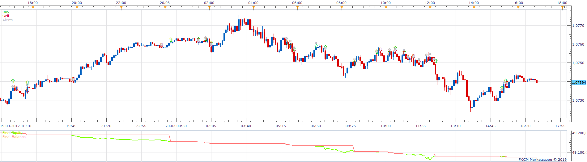
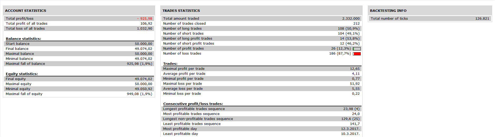

# AE Triple Screen Trading System

> Source: https://fxcodebase.com/code/viewtopic.php?f=31&t=68549  
> Forum: 31 · Topic 68549 · 15 post(s)

---

## AE Triple Screen Trading System

**Apprentice** · Sat Jun 08, 2019 2:24 am

 

Based on request.
[viewtopic.php?f=27&t=68540](https://fxcodebase.com/code/viewtopic.php?f=27&t=68540)
Based on the indicator.
[viewtopic.php?f=17&t=1966](https://fxcodebase.com/code/viewtopic.php?f=17&t=1966)

 [AE Triple Screen Trading System.lua](files/126783/AE%20Triple%20Screen%20Trading%20System.lua)

---

## Re: AE Triple Screen Trading System

**foreveryoung** · Mon Jun 10, 2019 10:44 am

Hi Apprentice

This is great with all these features, thank you so much!

I did some testing, the thing I noticed so far is the "close on opposite" function operating in a funny way.

It looks as if it takes into account the histogram value compared to null, i.e.

when long, close if

1. Current bar Histogram value on long time frame>0
2. Previous bar Force Index value on short time frame>0
3. Current bar Force Index value on short time frame<0

, and VICE VERSA for short.

While it should be operating as follows:

when long, close if

1. Current bar Histogram value on long time frame<Previous bar Histogram value on long time frame
2. Previous bar Force Index value on short time frame>0
3. Current bar Force Index value on short time frame<0

, and VICE VERSA for short.

Regards
Nik

---

## Re: AE Triple Screen Trading System

**foreveryoung** · Mon Jun 10, 2019 3:33 pm

Dear Apprentice

After more testing, and turning the "close on opposite" function off, it appears that strategy is closing the position when histogram value in long term frame crosses zero.

Regards
Nik

---

## Re: AE Triple Screen Trading System

**foreveryoung** · Mon Jun 10, 2019 3:49 pm

Dear Apprentice

When long, it closes position if histogram value at current bar close is > 0.

I guess it must be operating vice versa when short.

Regards
Nik

---

## Re: AE Triple Screen Trading System

**Apprentice** · Tue Jul 02, 2019 4:50 am

1. Current bar Histogram value on long time frame<Previous bar Histogram value on a long time frame
2. Previous bar Force Index value on short time frame>0
3. Current bar Force Index value on short time frame<0
1 and 2+3?
1 or 2+3?
When closed on opposite is turned on the long position will be closed on short entry rules as well

---

## Re: AE Triple Screen Trading System

**foreveryoung** · Sun Mar 01, 2020 8:11 am

Dear Apprentice

I am sorry for taking so long to reply back, I have been away for a while.

Going through the forum, I have found out that automated trading has features that I did not think of, therefore, I am going to present the strategy here exactly as Alexander Elder described it.It would be great should you turn it in an automated trading system. Strategy goes as follows:

When at the end of the turn "of the lower time frame"

1. In higher time frame MACD histogram current bar > previous bar

AND in lower time frame

2. Force Index < 0

, then, in lower time frame, create *a long* entry order at the top of the signal candle (i.e. the candle that gave force index < 0).

If order is not triggered till the end of the next turn, cancel it, and create a new *long* entry order at the top of this new candle. Keep doing this till an entry order is triggered or at higher time frame MACD histogram current bar < previous bar, where strategy must reverse.

If an order is triggered, wait for the end of the turn and place a stop loss at the bottom of this candle, or the previous candle (whichever is lower).

Take profit at the end of the turn in the lower time frame where Force index becomes again < 0.

OR

Take profit when in higher time frame MACD histogram current bar < previous bar

Vice versa for short.

Regards
Nik

---

## Re: AE Triple Screen Trading System

**Apprentice** · Sun Mar 01, 2020 4:18 pm

Your request is added to the development list.
Development reference 800.

---

## Re: AE Triple Screen Trading System

**foreveryoung** · Mon Mar 02, 2020 6:08 am

I would like to make clear, when using the force index for taking profit in long positions, index must first turn positive, and strategy close position once index becomes negative. Vice versa for short positions.

Regards
Nik

---

## Re: AE Triple Screen Trading System

**Apprentice** · Wed Mar 04, 2020 6:14 am

[MACD Force Index Strategy.lua](files/131695/MACD%20Force%20Index%20Strategy.lua)

Aefi.lua
[viewtopic.php?f=17&t=1966](https://fxcodebase.com/code/viewtopic.php?f=17&t=1966)

---

## Re: AE Triple Screen Trading System

**foreveryoung** · Wed Mar 04, 2020 12:15 pm

Dear Apprentice

First of all I would like to thank you for your effort & time, it is so hassle free to have an algorithm to create the orders and the stop losses.

Created a demo account and watched strategy's behavior. So far, I have noticed following issues:

1. When long, strategy closes the position once signaled again & creates a new entry order
2. When short, strategy keeps creating entry orders, no matter Use Position Limit being activated and set to 2

I manage to check the Close On Opposite with short positions only, strategy closed all positions when Current Bar MACD Histogram Value > Previous Bar MACD Histogram Value, which worked exactly as it should.

Regarding AEFI calculation, can you please advise whether smoothing is prior or post calculation, and the method for the average period?

Thanks

Regards
Nik

---

## Re: AE Triple Screen Trading System

**Apprentice** · Fri Mar 06, 2020 7:03 am

[MACD_Force_Index_Strategy.lua](files/131777/MACD_Force_Index_Strategy.lua)

Entry and exit logic conflicting with each other. Entry logic includes exit logic

---

## Re: AE Triple Screen Trading System

**foreveryoung** · Fri Mar 06, 2020 7:50 am

Alexander Elder suggests two take profit methods. One is, when long, close position once force index in the lower time frame turns from positive negative. Should this method be coded, please include a Yes/No option in the strategy dialogue.

The second method, which makes more sense, is, when long, close position once current bar MACD histogram value < previous bar MACD histogram value, which is The Close On Opposite function.

Regards Nik

---

## Re: AE Triple Screen Trading System

**foreveryoung** · Fri Mar 06, 2020 9:27 am

Dear Apprentice

Nothing changed, algorithm keeps behaving as before, i.e.

1. When long, strategy closes the position once signaled again (without waiting for force index to turn positive first)
2. When short, strategy keeps creating entry orders, no matter Use Position Limit being activated and set to 1 (it does not closes the positions when signaled again like it does with longs)

Regards
Nik

---

## Re: AE Triple Screen Trading System

**Apprentice** · Mon Mar 09, 2020 7:10 am

Your request is added to the development list.
Development reference 845.

---

## Re: AE Triple Screen Trading System

**Apprentice** · Tue Mar 10, 2020 6:26 am

Optional exit parameter added.

 [MACD_Force_Index_Strategy.lua](files/131839/MACD_Force_Index_Strategy.lua)
