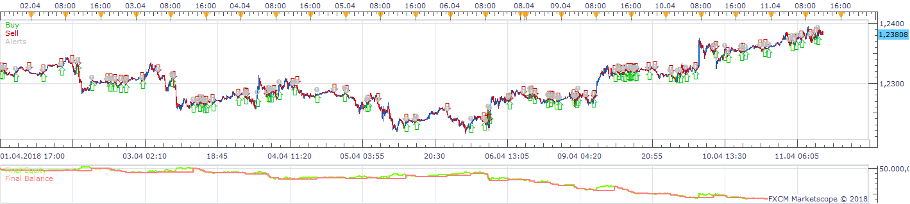
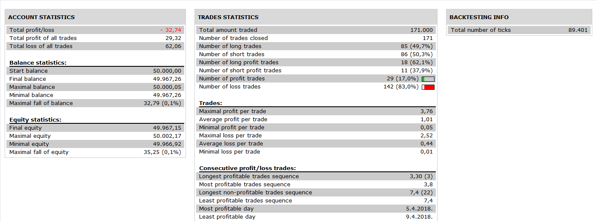

# AlgoWizar1540218343269

> Source: https://fxcodebase.com/code/viewtopic.php?f=31&t=66858  
> Forum: 31 · Topic 66858 · 2 post(s)

---

## AlgoWizar1540218343269

**Apprentice** · Thu Oct 25, 2018 2:06 pm

 

Based on request.
[viewtopic.php?f=27&t=66479](https://fxcodebase.com/code/viewtopic.php?f=27&t=66479)

 [AlgoWizar1540218343269.lua](files/121750/AlgoWizar1540218343269.lua)

---

## Re: AlgoWizar1540218343269

**MC. Trend Trader** · Fri Oct 26, 2018 8:28 am

Hello,
I request of opening multi positions at the same time with different lot sizes, stops & limits for the AlgoWizar1540218343269 Strategy.

paramaters should be jncluded:

Open trade 1: Yes/No
Trade 1: lot size
Set Limit for Trade 1: Yes/No’
Limit for Trade1, in pips 30
Set Stop for Trade 1 ‘Yes/No’
Stop for Trade 1: 30
Trailing Stop order for Trade 1: ‘Yes/No’
Trailing for Trade 1, in pips 10
Breakeaven for Trade 1: ‘Yes/No’
Min Profit for Trade1 10

The Trade 1 Logic be repeated for a total of 5 positions
