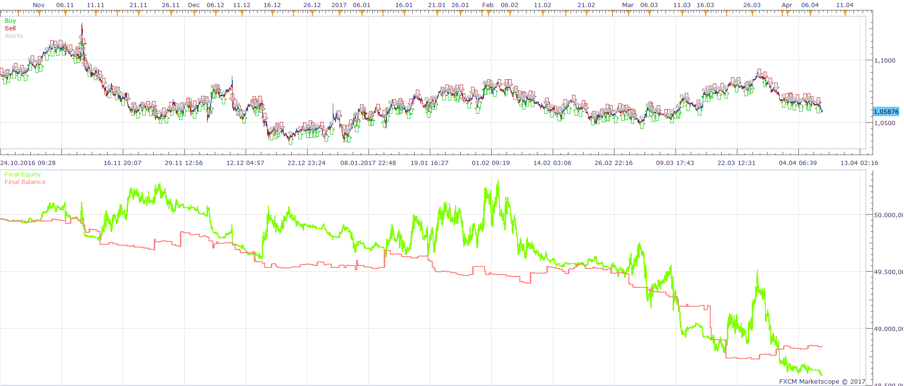
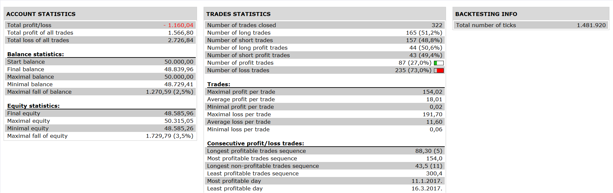

# All Time Frames MA Cross Strategy

> Source: https://fxcodebase.com/code/viewtopic.php?f=31&t=64622  
> Forum: 31 · Topic 64622 · 1 post(s)

---

## All Time Frames MA Cross Strategy

**Apprentice** · Wed Apr 26, 2017 10:04 am

 

Open Long
Short MA Cross Over Long MA
Open Short
Short MA Cross Under Long MA

Strategy will check this condition on all time frames,
And trade accordingly.
Position size, will differ from time frame to time frame.
m1 - 1 lots
m2 - 2 lots
m 5- 5 lots
....
M1= 12 lots

 [All Time Frames MA Cross Strategy.lua](files/112161/All%20Time%20Frames%20MA%20Cross%20Strategy.lua)

The Strategy was revised and updated on January 19, 2019.
