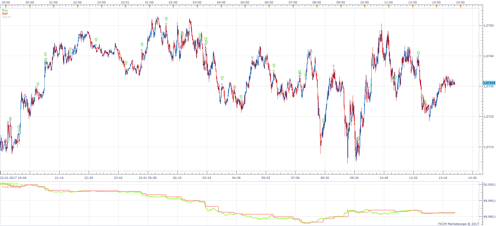
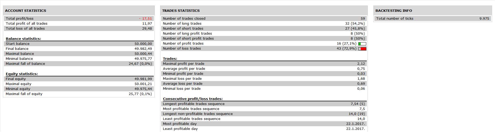

# Alligator MA Cross Strategy

> Source: https://fxcodebase.com/code/viewtopic.php?f=31&t=64958  
> Forum: 31 · Topic 64958 · 5 post(s)

---

## Alligator MA Cross Strategy

**Apprentice** · Wed Aug 02, 2017 6:08 am

 

Indicator based.
[viewtopic.php?f=17&t=64616](https://fxcodebase.com/code/viewtopic.php?f=17&t=64616)

Open Long
MA selected Alligators line cross Over.
Open Short
MA selected Alligators line cross Under.

 [Alligator MA Cross Strategy.lua](files/113926/Alligator%20MA%20Cross%20Strategy.lua)

The Strategy was revised and updated on January 21, 2019.

---

## Re: Alligator MA Cross Strategy

**Fafountrader** · Wed Aug 02, 2017 6:16 am

hi,

Thanks a lot apprentice !
I test immediately.

good day,

Fafountrader.

---

## Re: Alligator MA Cross Strategy

**Fafountrader** · Fri Aug 04, 2017 5:56 am

Hi, Apprentice

I tested this strategy and it is very good but I have a problem when alligator is sleeping.
Can add a filter ?

A filter with a deviation to determine the power of the cross over/under ma and jaw of alligator!
If the deviation is low, don't open or close position.
The strategy will be perfect !

I hope this is possible for you to add this parameter.

thanks for all,

Fafountrader

---

## Re: Alligator MA Cross Strategy

**Apprentice** · Tue Aug 08, 2017 3:27 am

Deviation Filter added.

Will NOT trade if ( Deviation of MA or Deviation or Close ) < Deviation Minimum

---

## Re: Alligator MA Cross Strategy

**Fafountrader** · Tue Aug 08, 2017 12:48 pm

OK,
Perfect !
Thanks for your attention, Apprentice
and your speed !
Best regards,

Fafountrader
