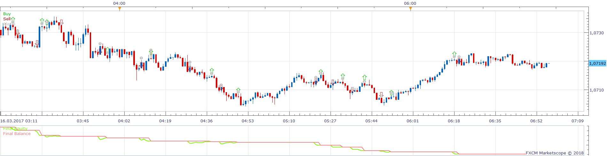
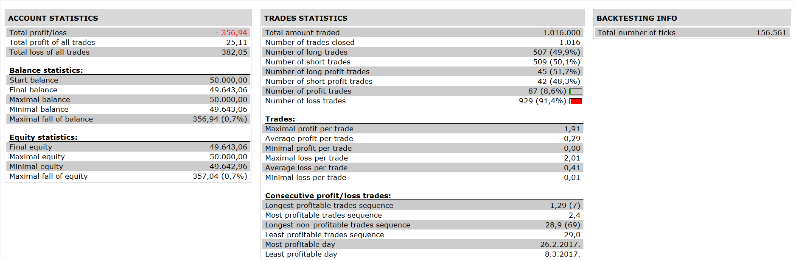

# Alligator MACD AO Strategy

> Source: https://fxcodebase.com/code/viewtopic.php?f=31&t=65743  
> Forum: 31 · Topic 65743 · 2 post(s)

---

## Alligator MACD AO Strategy

**Apprentice** · Fri Feb 16, 2018 10:24 am

 

Open Long

1. Jaw of Alligator> 2. Jaw of Alligator
MACD> Signal

AO in green bar AND if 2 green bars in front (possibility of modifying this condition)

Stop: when one of these conditions ceases

Vice Versa for Short

 [Alligator MACD AO Strategy.lua](files/117784/Alligator%20MACD%20AO%20Strategy.lua)

---

## Re: Alligator MACD AO Strategy

**Utawafr** · Fri Feb 16, 2018 12:18 pm

Hello,
Thank you for this coding.
Can you modify this one with this parameters please :

Purchase order when the following 2 conditions are met:
Jaw of Alligator 13 (8), 5 (8), 5 (3)> Jaw of Alligator 65 (8), 40 (5), 25 (3) SMMA
AO >0

Stop: when one of these conditions ceases

Sales order when the following 2 conditions are met:
Jaw of Alligator 13 (8), 5 (8), 5 (3) <Jaw of Alligator 65 (8), 40 (5), 25 (3) SMMA
AO <0

Stop: when one of these conditions ceases

Thank you by advance
