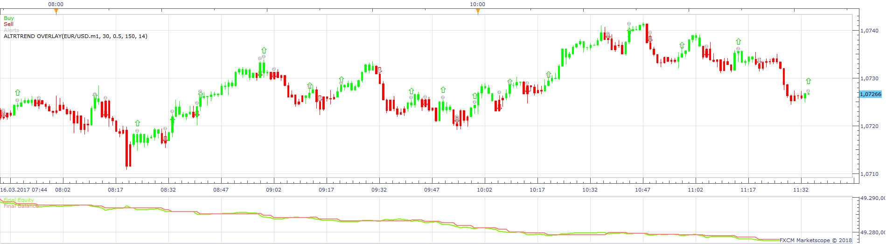
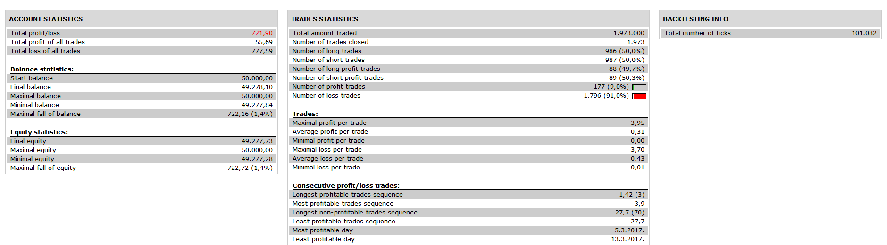

# AltrTrend Overlay Strategy

> Source: https://fxcodebase.com/code/viewtopic.php?f=31&t=66618  
> Forum: 31 · Topic 66618 · 2 post(s)

---

## AltrTrend Overlay Strategy

**Apprentice** · Sun Sep 02, 2018 3:25 pm

 

AltrTrend Overlay is available here.
[viewtopic.php?f=17&t=1123](https://fxcodebase.com/code/viewtopic.php?f=17&t=1123)

 [AltrTrend Overlay Strategy.lua](files/120923/AltrTrend%20Overlay%20Strategy.lua)

---

## Re: AltrTrend Overlay Strategy

**Reymondpolanco** · Mon Sep 03, 2018 1:18 pm

In trend the strategy works great but when the market is moving sideways the strategy make a lot of fake signals, let's see if we can improve it to make the indicator to ignore the sideways movements.
