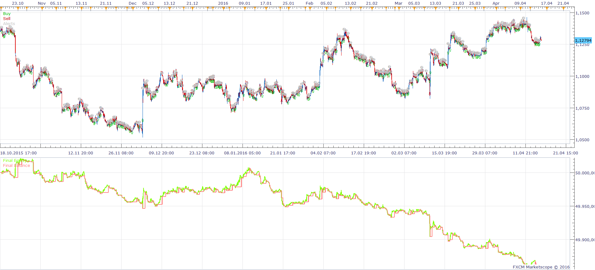
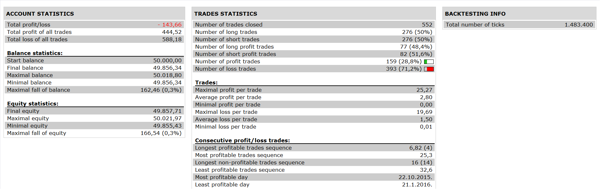

# Always an open position Strategy

> Source: https://fxcodebase.com/code/viewtopic.php?f=31&t=63396  
> Forum: 31 · Topic 63396 · 6 post(s)

---

## Always an open position Strategy

**Apprentice** · Wed Apr 20, 2016 5:15 am

 

Based on request.
[viewtopic.php?f=27&t=63394](https://fxcodebase.com/code/viewtopic.php?f=27&t=63394)
Open Long
MA of Close CrossOver MA of Open
Open Short
MA of Close CrossUnder MA of Open

 [Always an open position Strategy.lua](files/105877/Always%20an%20open%20position%20Strategy.lua)

The Strategy was revised and updated on December 18, 2018.

---

## Re: Always an open position Strategy

**painkiller** · Wed Apr 20, 2016 6:54 pm

sorry, could you please remove short positions and long, so that only opens and closes at intersections without short or long only openings and closings. short positions are usually closed with losses almost always, and also sometimes in some crosses instead of buying a sell position is opened, and skews much backtesting, finishing with terrible losses, sometimes no open positions at other crossings of lines. please check that part of the strategy.

Thank you so much for your time.

Best regards.

---

## Re: Always an open position Strategy

**Apprentice** · Thu Apr 21, 2016 3:34 am

If I understand you, you want only Long positions?

---

## Re: Always an open position Strategy

**painkiller** · Thu Apr 21, 2016 9:06 am

yes please, just long positions.... and Apprentice sometimes in some crosses instead of buying a sell position is opened, when manually operate this strategy gives excellent results. but when I use the lua file it gives me bad results. from that notice that sometimes instead of buying the lua file sells and ends with terrible losses ...
Thanks again Apprentice

---

## Re: Always an open position Strategy

**Apprentice** · Fri Apr 22, 2016 12:44 am

Set "Allowed side" to Buy.

---

## Re: Always an open position Strategy

**Apprentice** · Fri Dec 16, 2016 7:40 am

Strategy was revised and updated.
