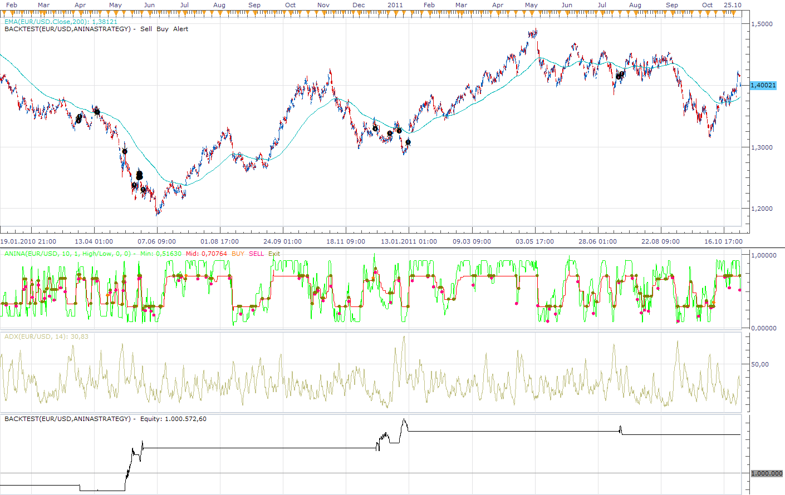

# Anina Strategy

> Source: https://fxcodebase.com/code/viewtopic.php?f=31&t=7714  
> Forum: 31 · Topic 7714 · 4 post(s)

---

## Anina Strategy

**Apprentice** · Mon Oct 31, 2011 6:42 am

buying condition :
price> ema200,
 adx>entry level,
min line cross over mid line,
min line< 0.4 (buy level)

selling condition :
price <ema 200 ,
adx>entry level,
min line cross under mid line ,
min line> 0.6 (sell level)

exit buy : min cross under mid line,price crossunder ema 200

exit sell : min cross over mid line, price crosss over ema 200

 [AninaStrategy.lua](files/17170/AninaStrategy.lua)

Install Anina indicator from this Post.
[viewtopic.php?f=17&t=6493&p=14833&hilit=anina#p14833](https://fxcodebase.com/code/viewtopic.php?f=17&t=6493&p=14833&hilit=anina#p14833)

The Strategy was revised and updated on November 21, 2018.

---

## Re: Anina Strategy

**rose123** · Tue Dec 27, 2011 7:08 am

when we are using this strategy in m15 time frame strategy gives alert once in 15 minute. is it possible to refreshing alert every minute when we are using strategy in higher time frame.

---

## Re: Anina Strategy

**Apprentice** · Mon Jan 02, 2012 4:55 am

Trade is possible, as soon as the given conditions, have been achieved.
(New implementation)

---

## Re: Anina Strategy

**Apprentice** · Sun Dec 04, 2016 6:38 am

Bump up.
