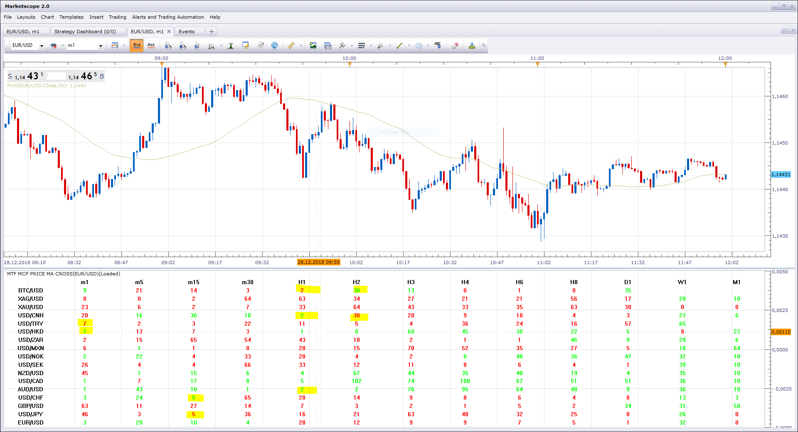

# Arbitrary Strategy

> Source: https://fxcodebase.com/code/viewtopic.php?f=31&t=68750  
> Forum: 31 · Topic 68750 · 1 post(s)

---

## Arbitrary Strategy

**Apprentice** · Tue Aug 06, 2019 8:58 am

 [MTF_MCP_Price_MA_Cross.lua](files/127745/MTF_MCP_Price_MA_Cross.lua)

MTF_MCP_Price_MA_Cross is used as helper indicator.
Calculate how far the last price / MA cross is in candles.
Was written only to test if the simultaneous Price/ma crosses exist,
and will not be used in the strategy.

If simultaneous Price/ma is detected (USD/TRY and USD/HKD)
and cross direction is opposite we will enter the trade.

Example 1
USD Cross Over MA we will open Long in USD/HKD
USD Cross Under MA we will open Short position in USD/TRY

In this example, we have one Long and one Short trade
(USD is Base currency for both, no need for trade direction reversal)

Obviously, the strategy should be aware of the currency pair of inner dynamics.

Example 2
BTC/USD or USD/BTC
Open Long
USD/CNH Cross Over
Open Long

In example 2. we have two Long trades
(USD is quote currency for BTC/USD, hence trade is reversed for the BTC/USD to USD/BTC, Long trade in BTC/USD is in effect Short trade for USD/BTC)

In short, to simplify.
Example
For USD on any other currency, the strategy will try to find opposite Price/MA crosses, mine the curency pair orientation.
For tested currency (USD)
USD-xxx
USD-xxx
we will have long and two short trades(opposite)

and vice-versa for the opposite
USD-xxx
xxx-USD
we will have two trades in the same direction,
two long or two short trades.

if possible as an option, or for stage two
On Price/MA Cross The strategy will try to find instruments with the highest gain against a counterpart at the same time highest loss against the other.
without this option, the strategy will open any trade opportunity.
For example, at the same time USD can have simultaneous Price/ma crosses will more than one currency pair.
With this option, the strategy will open most profitable.
Simple logic can be used, the highest price difference from last price/ma cross going forward.

 [MTF_MCP_Price_MA_Cross.lua](files/127745/MTF_MCP_Price_MA_Cross%20%282%29.lua)
