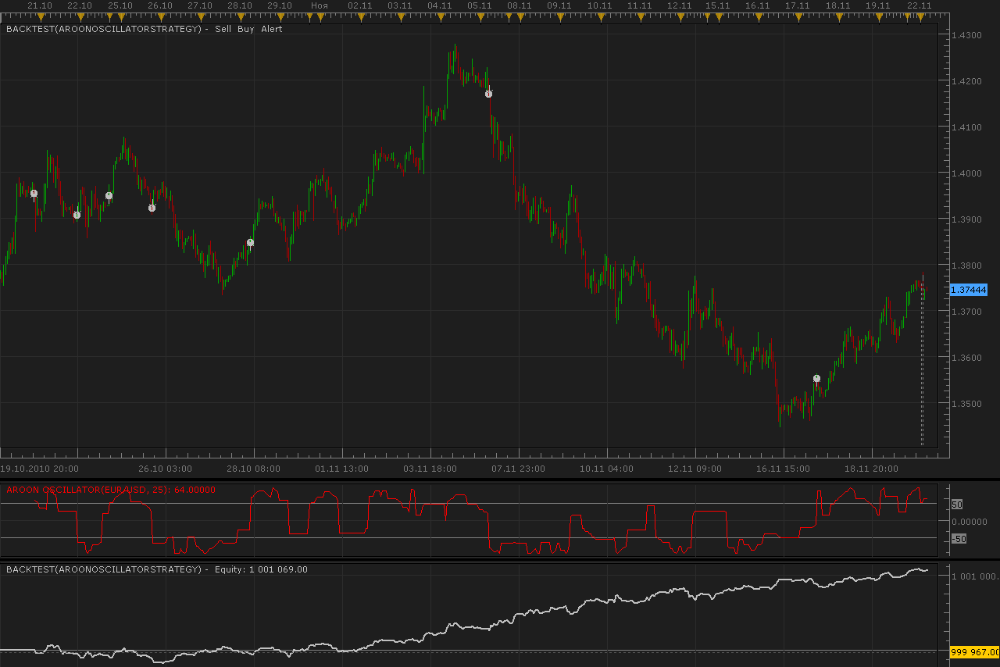

# Aroon oscillator strategy

> Source: https://fxcodebase.com/code/viewtopic.php?f=31&t=2760  
> Forum: 31 · Topic 2760 · 8 post(s)

---

## Aroon oscillator strategy

**Alexander.Gettinger** · Mon Nov 22, 2010 4:26 am

Strategy based on Aroon oscillator ([viewtopic.php?f=17&t=671&p=5503#p5503](https://fxcodebase.com/code/viewtopic.php?f=17&t=671&p=5503#p5503)).

If oscillator crosses upward [level] strategy close SELL order (if open) and open BUY order.
If oscillator crosses down [-level] strategy close BUY order (if open) and open SELL order.

 

 [AroonOscillatorStrategy.lua](files/6282/AroonOscillatorStrategy.lua)

The Strategy was revised and updated on November 21, 2018.

---

## Re: Aroon oscillator strategy

**difrach** · Wed Dec 01, 2010 8:04 am

First, thank you for your work.
Excuse my English but is not my mother language.

I try to test this new strategy.
To do so, would it be possible to change certain elements?
A) Open L when the oscillator crosses the line -50 down (so coming from a higher);
B) Close S at the same time then A;
C) Open S when the oscillator crosses the line +50 down (so coming from a higher);
D) Close L at the same time then C.

Moreover, the alert sound does not work because in the settings when you want to choose a sound file, are only found in the menu the pairs!)
In advance thank you.

---

## Re: Aroon oscillator strategy

**Apprentice** · Wed Dec 01, 2010 10:00 am

It is possible.
I'll try I can finish in the shortest possible time.

---

## Re: Aroon oscillator strategy

**Alexander.Gettinger** · Thu Dec 02, 2010 12:14 am

> **difrach wrote:**
> First, thank you for your work.
> Excuse my English but is not my mother language.
>
> I try to test this new strategy.
> To do so, would it be possible to change certain elements?
> A) Open L when the oscillator crosses the line -50 down (so coming from a higher);
> B) Close S at the same time then A;
> C) Open S when the oscillator crosses the line +50 down (so coming from a higher);
> D) Close L at the same time then C.
>
> Moreover, the alert sound does not work because in the settings when you want to choose a sound file, are only found in the menu the pairs!)
> In advance thank you.

For reverse strategy I added new parameter "TypeSignal".

Download:

 [AroonOscillatorStrategy.lua](files/6488/AroonOscillatorStrategy.lua)

---

## Re: Aroon oscillator strategy

**difrach** · Mon Dec 06, 2010 2:10 pm

Hello, and thank you for your help.
I tested your oscillator in "reverse" mode and I can tell you it is quite efficient for OPEN BUY and CLOSE SELL in uptrend.
By cons, it should be improved for the CLOSE BUY and OPEN SELL.
Would it be possible to program in the same strategy, the CLOSE BUY and OPEN SELL when the oscillator touch +100 or when it crosses the line +50 coming from the top to the down after cutting this line + 50 before from the bottom to the top (after a summit of the oscillator)?

In advance thank you.
Jacques

---

## Re: Aroon oscillator strategy

**hallgreen1234** · Tue Jan 03, 2012 1:19 pm

I want to use aroon as a strategy but keep getting indicater string not recognised

---

## Re: Aroon oscillator strategy

**Apprentice** · Wed Jan 04, 2012 6:56 am

I believe that is the cause is known TS bug.

---

## Re: Aroon oscillator strategy

**Apprentice** · Sun Dec 04, 2016 6:20 am

Bump up.
