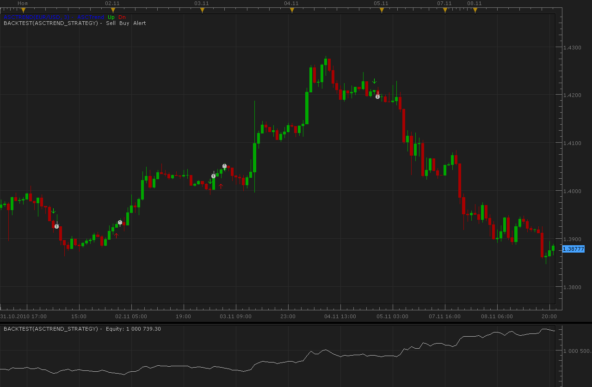

# ASCTrend strategy

> Source: https://fxcodebase.com/code/viewtopic.php?f=31&t=2633  
> Forum: 31 · Topic 2633 · 6 post(s)

---

## ASCTrend strategy

**Alexander.Gettinger** · Tue Nov 09, 2010 2:25 am

Strategy based on ASCTrend indicator ([viewtopic.php?f=17&t=1169&p=5933#p5933](https://fxcodebase.com/code/viewtopic.php?f=17&t=1169&p=5933#p5933))

 

For this strategy must be installed indicator ASCTrend2 from [viewtopic.php?f=17&t=1169&p=5933#p5933](https://fxcodebase.com/code/viewtopic.php?f=17&t=1169&p=5933#p5933)

 [ASCTrend_Strategy.lua](files/5934/ASCTrend_Strategy.lua)

 [ASCTrend_Strategy Old.lua](files/5934/ASCTrend_Strategy%20Old.lua)

The Strategy was revised and updated on December 17, 2018.

---

## Re: ASCTrend strategy

**Kyriakos** · Tue Aug 18, 2015 4:29 pm

Hi,
'Can you add the trading hours and custom id parameters to the strategy? Thanks

---

## Re: ASCTrend strategy

**WardStradlater** · Tue Aug 25, 2015 8:04 am

Hi,
Is that possible to have this kind of parameters for this strategy?

 [14704](files/101957/Capture.JPG)

Thanks in advance

---

## Re: ASCTrend strategy

**Apprentice** · Wed Aug 26, 2015 6:44 am

Try updated version.

---

## Re: ASCTrend strategy

**WardStradlater** · Wed Aug 26, 2015 7:06 am

Thanks a lot

---

## Re: ASCTrend strategy

**Apprentice** · Tue Dec 13, 2016 4:28 pm

Strategy was revised and updated.
