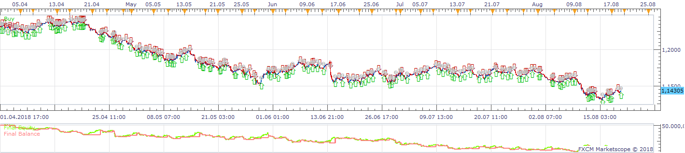
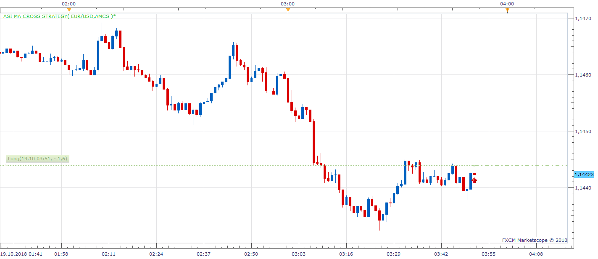

# ASI MA Cross Strategy

> Source: https://fxcodebase.com/code/viewtopic.php?f=31&t=63439  
> Forum: 31 · Topic 63439 · 6 post(s)

---

## ASI MA Cross Strategy

**Apprentice** · Wed May 04, 2016 3:33 am

Open Long
ASI / MA of ASI CrossOver
Open Short
ASI / MA of ASI CrossUnder

 [ASI MA Cross Strategy.lua](files/106082/ASI%20MA%20Cross%20Strategy.lua)

---

## Re: ASI MA Cross Strategy

**BudFox** · Wed May 04, 2016 9:39 am

Cheers mate - much appreciated.

---

## Re: ASI MA Cross Strategy

**Apprentice** · Fri Dec 16, 2016 7:30 am

Strategy was revised and updated.

---

## Re: ASI MA Cross Strategy

**AEKARAOLE** · Thu Oct 18, 2018 9:22 am

Hi apprentice,
The strategy should have a problem because it doesn’t open trades.

Thank you

---

## Re: ASI MA Cross Strategy

**Apprentice** · Fri Oct 19, 2018 4:50 am

BackTester

 

Simulation Mode

 

Demo
Make sure to set your "Allow strategy to trade" to Yes.

---

## Re: ASI MA Cross Strategy

**AEKARAOLE** · Fri Oct 19, 2018 5:44 am

Ok it works.
Thank you
