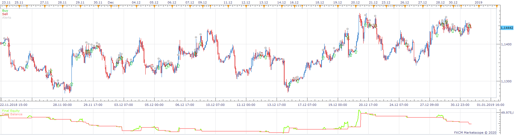
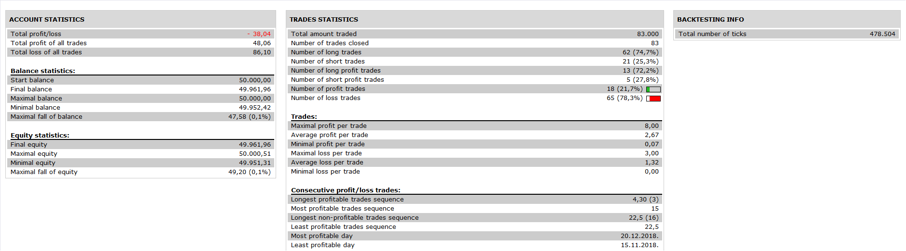

# Asymmetric Ease of move Strategy

> Source: https://fxcodebase.com/code/viewtopic.php?f=31&t=69605  
> Forum: 31 · Topic 69605 · 1 post(s)

---

## Asymmetric Ease of move Strategy

**Apprentice** · Wed Apr 01, 2020 3:13 pm

 

Based on Asymmetric Ease of move.lua
[viewtopic.php?f=17&t=69595](https://fxcodebase.com/code/viewtopic.php?f=17&t=69595)

Open Long
H1 Time Frame Asymmetric Ease of move is Up
D1 Time Frame Asymmetric Ease of move is Up

Viceversa for Short

 [Asymmetric Ease of move Strategy.lua](files/132481/Asymmetric%20Ease%20of%20move%20Strategy.lua)
