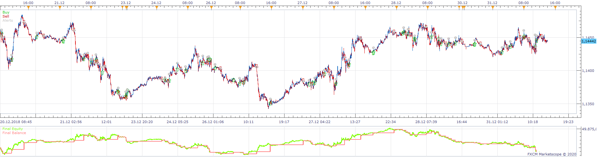
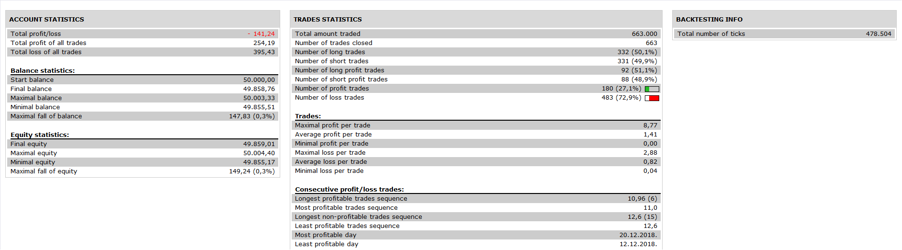

# ATR Based SAR Strategy

> Source: https://fxcodebase.com/code/viewtopic.php?f=31&t=70068  
> Forum: 31 · Topic 70068 · 12 post(s)

---

## ATR Based SAR Strategy

**Apprentice** · Wed Jun 24, 2020 3:13 pm

 

Based on ATR Based SAR.lua
[viewtopic.php?f=17&p=135216](https://fxcodebase.com/code/viewtopic.php?f=17&p=135216)

 [ATR Based SAR Strategy.lua](files/135243/ATR%20Based%20SAR%20Strategy.lua)

---

## Re: Stratégie sar basée sur l’ATR

**bruno2017** · Thu Jun 25, 2020 5:40 am

Hello,
this is how i would like the strategy to work.
Once the order is ok, the reverse order and the stop am the point "sar"

---

## Re: Stratégie sar basée sur l’ATR

**bruno2017** · Thu Jun 25, 2020 5:51 am

here is the exit from trade

---

## Re: ATR Based SAR Strategy

**Apprentice** · Thu Jun 25, 2020 1:42 pm

Your request is added to the development list.
Development reference 1563.

---

## Re: ATR Based SAR Strategy

**Apprentice** · Fri Jun 26, 2020 3:20 am

You want to use trailing entry, instead of marker orders?

---

## Re: Stratégie sar basée sur l’ATR

**bruno2017** · Fri Jun 26, 2020 3:52 am

yes

---

## Re: Stratégie sar basée sur l’ATR

**bruno2017** · Fri Jun 26, 2020 6:14 am

Hello,
the stop is defined by the last point "sar" but it does not follow the reverse entry, it is dynamic

---

## Re: Stratégie sar basée sur l’ATR

**bruno2017** · Wed Jul 01, 2020 2:48 am

hello
is anyone interested in this task?

---

## Re: ATR Based SAR Strategy

**Apprentice** · Wed Jul 01, 2020 4:07 am

[SAR Strategy bruno2017.lua](files/135494/SAR%20Strategy%20bruno2017.lua)

Try this version.

---

## Re: Stratégie sar basée sur l’ATR

**bruno2017** · Wed Jul 01, 2020 6:44 am

There is no stop for the sale action

---

## Re: ATR Based SAR Strategy

**Apprentice** · Thu Jul 02, 2020 3:11 am

Your request is added to the development list.
Development reference 1612.

---

## Re: ATR Based SAR Strategy

**Apprentice** · Thu Jul 02, 2020 4:46 am

[29572](files/135542/image.png)

I don't have any issues. Do not forget to turn them on in the parameters
