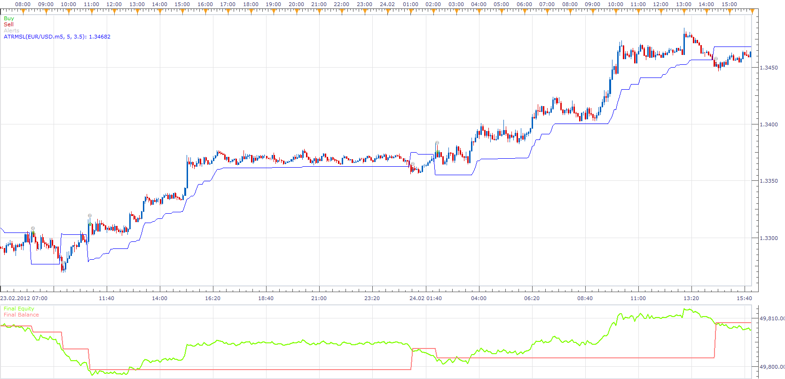

# ATR Modified Stop/Loss Strategy

> Source: https://fxcodebase.com/code/viewtopic.php?f=31&t=31596  
> Forum: 31 · Topic 31596 · 2 post(s)

---

## ATR Modified Stop/Loss Strategy

**Apprentice** · Thu Jan 31, 2013 7:42 am

Open Long
Price / ATRMSL Crossover
Open Short
Price / ATRMSL Crossunder

 [ATR Modified StopLoss Strategy.lua](files/53893/ATR%20Modified%20StopLoss%20Strategy.lua)

Please install ATRMSL indicator. U can be found it here.
[http://www.fxcodebase.com/code/viewtopi ... 891#p53891](http://www.fxcodebase.com/code/viewtopic.php?f=17&t=514&p=53891#p53891)

The Strategy was revised and updated on December 10, 2018.

---

## Re: ATR Modified Stop/Loss Strategy

**Apprentice** · Fri Dec 09, 2016 5:21 am

Strategy was revised and updated.
