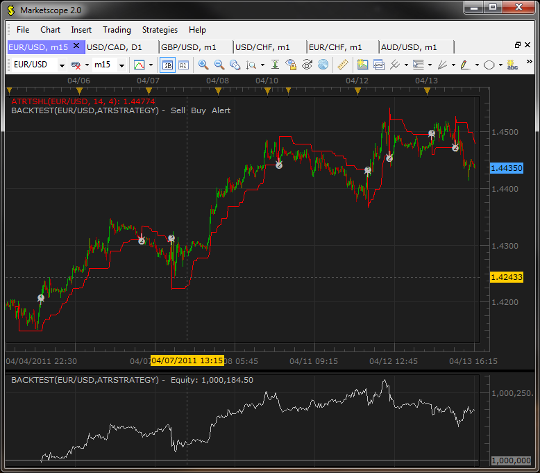
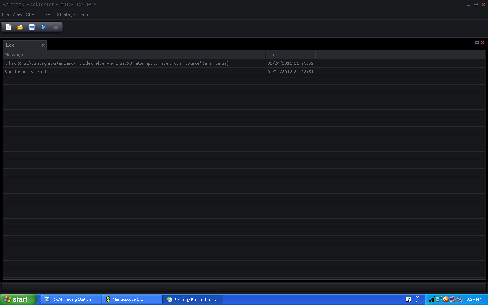

# ATR Strategy

> Source: https://fxcodebase.com/code/viewtopic.php?f=31&t=3861  
> Forum: 31 · Topic 3861 · 8 post(s)

---

## ATR Strategy

**vstrelnikov** · Thu Apr 07, 2011 10:02 am

The strategy based on modified version of [ATRTS.lua](https://fxcodebase.com/code/viewtopic.php?f=17&t=1434&start=10) indicator attached below. The only difference of ATRTSHL, is that line is flipped over/under price when High/Low value touched the line (instead of Close value in plain ATRTS).

The strategy opens short/long positions when ATRTSHL indicator crosses the price.

You don't have to install ATRTSHL indicator to run Strategy, but you can use it for visual representation of stratgey entry/exit points.

 

 [ATRTSHL.lua](files/9463/ATRTSHL.lua)

 [ATRStrategy.lua](files/9463/ATRStrategy.lua)

The Strategy was revised and updated on November 22, 2018.

---

## Re: ATR Strategy

**vstrelnikov** · Tue Apr 12, 2011 8:27 pm

Updated.

Option "Act on Close/Break Out" added. The option determines should the strategy opens new position after candle closing or immediately after ATRTS indicator breakout.

---

## Re: ATR Strategy

**kgsmith69** · Tue Jan 24, 2012 9:25 pm

I get this while backtesting.

 

---

## Re: ATR Strategy

**sunshine** · Wed Jan 25, 2012 7:14 am

Please tell me the parameters you set in Wizard. I have no issues with backtesting of this strategy.

---

## Re: ATR Strategy

**kgsmith69** · Wed Jan 25, 2012 1:31 pm

I've restarted the platform a few times and I can't seem to reproduce the error. Still having same issue back testing STRATEGY 5 though.
[url]http://fxcodebase.com/code/search.php?fid[]=31[/url]

---

## Re: ATR Strategy

**robmsan** · Tue Mar 13, 2012 4:36 pm

can u add "allowed side (both.buy,sell)" to this strategy thank you

---

## Re: ATR Strategy

**Apprentice** · Wed Mar 14, 2012 2:24 am

Your request is added to the development list.

---

## Re: ATR Strategy

**Apprentice** · Sun Dec 04, 2016 8:05 am

Bump up.
