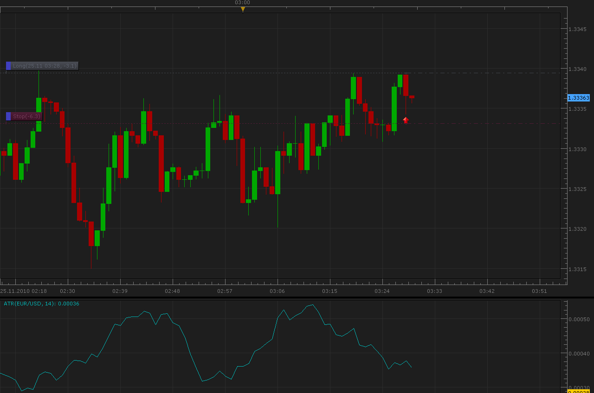
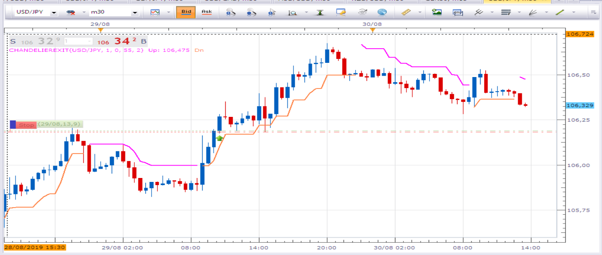
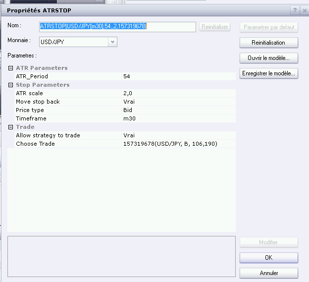

# ATR trailing stop

> Source: https://fxcodebase.com/code/viewtopic.php?f=31&t=2795  
> Forum: 31 · Topic 2795 · 8 post(s)

---

## ATR trailing stop

**Alexander.Gettinger** · Thu Nov 25, 2010 3:36 am

The strategy sets stop value for the chosen trade using ATR oscillator.
Strategy parameters:
MoveBack - if false then for BUY stop moves up only and for SELL stop moves down only.

For BUY orders strategy put stop to (Bid-ATR*Coeff) level and for SELL orders to (Ask+ATR*Coeff) level.

 

Download:

 [ATRStop.lua](files/6365/ATRStop.lua)

---

## Re: ATR trailing stop

**robmsan** · Tue Mar 27, 2012 10:26 pm

please make this into a full blown strategy with( "allowed side" both, buy, sell) functionality thank you

---

## Re: ATR trailing stop

**Apprentice** · Wed Mar 28, 2012 6:25 am

Your request is added to the developmental cue.

---

## Re: ATR trailing stop

**LuckyPanda** · Thu Apr 05, 2012 10:53 pm

I tried using it and got message:
Failed create stop The command is disabled.

Could you fix it.

---

## Re: ATR trailing stop

**robmsan** · Thu May 03, 2012 12:25 am

I posted a request some time a go to have this indicator turned into a fully functional strategy with allowed side(both,buy,sell) stop ,limit orders. If possible please start on this ASAP as Ive worked with this indicator before an feel it will help my trading thank you very much.

---

## Re: ATR trailing stop

**b0chatma** · Sun May 20, 2012 8:42 am

All,

Can you provide a status on setting up the ATR trailing stop as a functional strategy? This is a very popular trailing stop method. It should be part of the trading platform. Thank you

---

## Re: ATR trailing stop

**Apprentice** · Mon Dec 05, 2016 5:15 am

Bump up.

---

## Re: ATR trailing stop

**Avignon** · Fri Aug 30, 2019 8:59 am

Hello,

I not understand the difference.

Yesterday I placed the stop manually and then launched the strategy: the trailing stop don't move. There I stopped and restarted, the stop is placed directly here.

 

 

Thanks.
