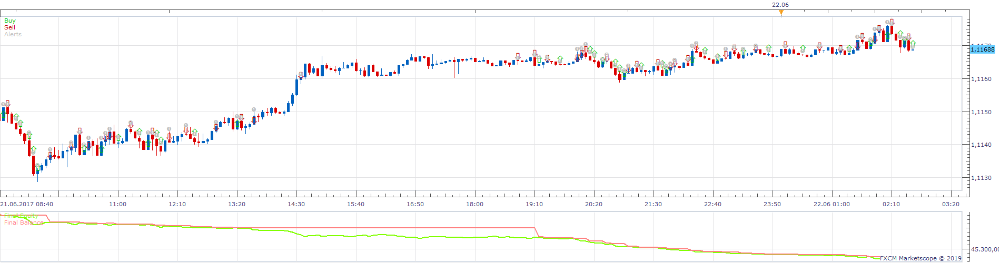
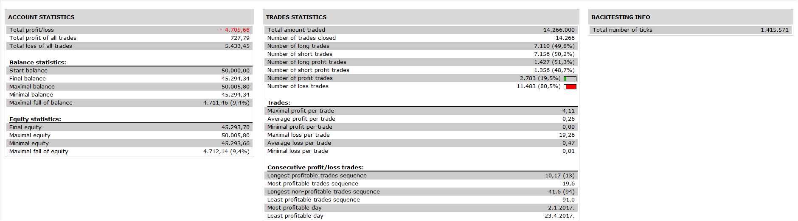

# AUTOLEV Strategy

> Source: https://fxcodebase.com/code/viewtopic.php?f=31&t=68339  
> Forum: 31 · Topic 68339 · 4 post(s)

---

## AUTOLEV Strategy

**Apprentice** · Mon Apr 15, 2019 5:22 am

 

Based on request.
[viewtopic.php?f=17&t=659&start=50](https://fxcodebase.com/code/viewtopic.php?f=17&t=659&start=50)

 [AUTOLEV Strategy.lua](files/125754/AUTOLEV%20Strategy.lua)

---

## Re: AUTOLEV Strategy

**MC. Trend Trader** · Thu Jun 20, 2019 9:42 am

Hello
Could you please add the following:
AUTOLEV indicator timeframe: H4
Trading Timeframe: m5

I would like to use the AUTOLEV indicator in H4 and trading timeframe 5 min

Thanks in advance

---

## Re: AUTOLEV Strategy

**Apprentice** · Sun Jun 30, 2019 6:22 pm

Your request is added to the development list under Id Number 4764

---

## Re: AUTOLEV Strategy

**Apprentice** · Wed Jul 03, 2019 1:30 pm

[AUTOLEV Strategy.lua](files/127209/AUTOLEV%20Strategy.lua)

Try this version.
