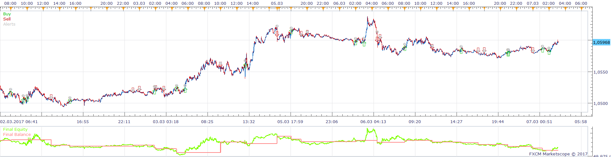
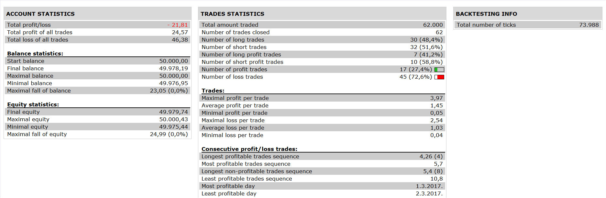

# Average Multiple Stochastic

> Source: https://fxcodebase.com/code/viewtopic.php?f=31&t=65454  
> Forum: 31 · Topic 65454 · 1 post(s)

---

## Average Multiple Stochastic

**Apprentice** · Fri Dec 15, 2017 7:00 am

 

Open Long
Average K / Average D Cross Over
Open Short
Average K / Average D Cross Under

 [Average Multiple Stochastic Strategy.lua](files/116476/Average%20Multiple%20Stochastic%20Strategy.lua)

Average Multiple Stochastic.lua is available here.
[viewtopic.php?f=17&t=65415](https://fxcodebase.com/code/viewtopic.php?f=17&t=65415)

The Strategy was revised and updated on January 21, 2019.
