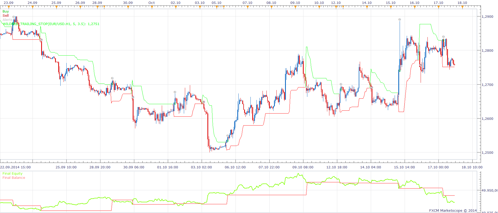

# Average True Range Trailing Stop Strategy

> Source: https://fxcodebase.com/code/viewtopic.php?f=31&t=61404  
> Forum: 31 · Topic 61404 · 5 post(s)

---

## Average True Range Trailing Stop Strategy

**Apprentice** · Mon Nov 03, 2014 5:46 am

A.K.A. Wilders_Trailing_Stop Strategy
Based on Wilders_Trailing_Stop indicator
[viewtopic.php?f=17&t=60028&p=96857#p96857](https://fxcodebase.com/code/viewtopic.php?f=17&t=60028&p=96857#p96857)
Open Long - Price Wilders_Trailing_Stop CrosUnder
Open Short - Price Wilders_Trailing_Stop CrosOver

 [Average True Range Trailing Stop Strategy.lua](files/96858/Average%20True%20Range%20Trailing%20Stop%20Strategy.lua)

The Strategy was revised and updated on January 18, 2019.

---

## Re: Average True Range Trailing Stop Strategy

**Jroddius** · Tue Oct 11, 2016 10:31 pm

Hello I would like to use this this strategy as a trailing stop but I can't figure out how to configure it to just do this. I don't need it to enter trades just want it as a trailing stop. what perameters need to be set for this?

---

## Re: Average True Range Trailing Stop Strategy

**Apprentice** · Wed Oct 12, 2016 3:55 am

1)Closing another strategy positions
2)Or close the specific / selected positions
3)Close all positions for instrument

---

## Re: Average True Range Trailing Stop Strategy

**Jroddius** · Wed Oct 12, 2016 6:44 pm

Thank you apprentice I appreciate all you do

---

## Re: Average True Range Trailing Stop Strategy

**Apprentice** · Sun Dec 18, 2016 5:30 am

Strategy was revised and updated.
