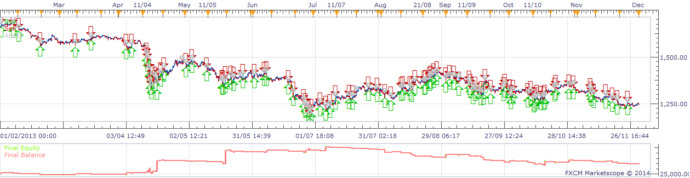

# BarSize Strategy

> Source: https://fxcodebase.com/code/viewtopic.php?f=31&t=60229  
> Forum: 31 · Topic 60229 · 5 post(s)

---

## BarSize Strategy

**moomoofx** · Wed Jan 22, 2014 7:02 am

A simple momentum strategy that enters depending on the size of the bar just closed. Requested by Rose123 on [viewtopic.php?f=27&t=60224&p=92175](https://fxcodebase.com/code/viewtopic.php?f=27&t=60224&p=92175)

 

Works on any instrument, any timeframe except ticks.

A time range can be specified for you to control when the strategy is operational. Times are in EST (NY Time).

The strategy places market orders.

The requester didn't specify exit conditions so standard stops and limit support has been implemented along with closing of opposite signals if required, or close on weekend. All functionality is configurable.

Entry pips parameter is provided, must be specified in pips.

Also contains functionality to control the amount of open positions.

Enjoy,
MooMooFX.

The Strategy was revised and updated on December 11, 2018.

---

## Re: BarSize Strategy

**rose123** · Thu Jan 23, 2014 2:07 am

thank you moomoofx

---

## Re: BarSize Strategy

**Apprentice** · Sun Dec 11, 2016 5:32 am

Strategy was revised and updated.

---

## Re: BarSize Strategy

**Gambit** · Mon Dec 06, 2021 7:51 am

Hi

I downloaded this EA to test but it dosen´t compile as there are certain errors in it.
You can see in the picture description what´s wrong.

Thanks in advance

---

## Re: BarSize Strategy

**Apprentice** · Fri Dec 10, 2021 7:24 am

This is NOT MT4 EA.
Will only work as Strategy on FXCM TS2 trading station.
