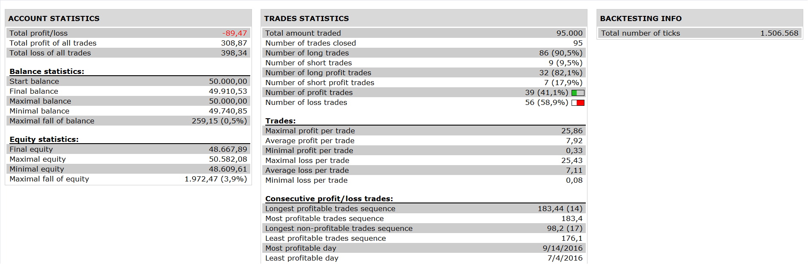

# BB ATR Oscillator Strategy

> Source: https://fxcodebase.com/code/viewtopic.php?f=31&t=64127  
> Forum: 31 · Topic 64127 · 2 post(s)

---

## BB ATR Oscillator Strategy

**Apprentice** · Tue Nov 22, 2016 5:14 pm

 

Open Long
BAO>BAO LEVEL1 IN H4
AND BAO CROSS OVER BAO LEVEL1IN M15

Open Short
BAO< BAO LEVEL2 IN H4
AND BAO CROSS UNDER BAO LEVEL IN M15

 [BB ATR Oscillator Strategy.lua](files/109169/BB%20ATR%20Oscillator%20Strategy.lua)

BB ATR Oscillator is available here.
[viewtopic.php?f=17&t=64126&p=109167#p109167](https://fxcodebase.com/code/viewtopic.php?f=17&t=64126&p=109167#p109167)

The Strategy was revised and updated on January 18, 2019.

---

## Re: BB ATR Oscillator Strategy

**Apprentice** · Sun Dec 18, 2016 10:09 am

Strategy was revised and updated.
