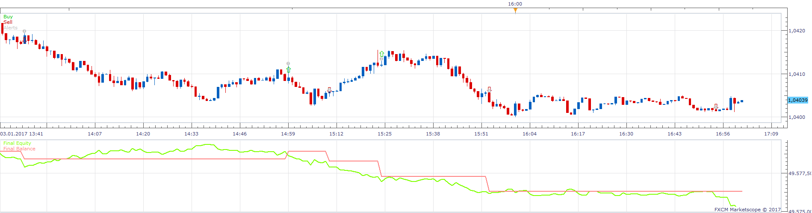
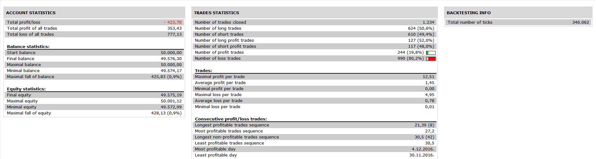

# BB_MACD oscillator Strategy

> Source: https://fxcodebase.com/code/viewtopic.php?f=31&t=64684  
> Forum: 31 · Topic 64684 · 1 post(s)

---

## BB_MACD oscillator Strategy

**Apprentice** · Sat May 27, 2017 5:49 am

 

Based on BB_MACD oscillator.
[viewtopic.php?f=17&t=9559&p=20501#p20501](https://fxcodebase.com/code/viewtopic.php?f=17&t=9559&p=20501#p20501)
buy: lower band cross over buy level
sell : upper band cross under sell level

 [BB_MACD oscillator Strategy.lua](files/112563/BB_MACD%20oscillator%20Strategy.lua)

 StdDev2 indicator is available here.
[viewtopic.php?f=17&t=870&p=1577](https://fxcodebase.com/code/viewtopic.php?f=17&t=870&p=1577)

The Strategy was revised and updated on January 19, 2019.
