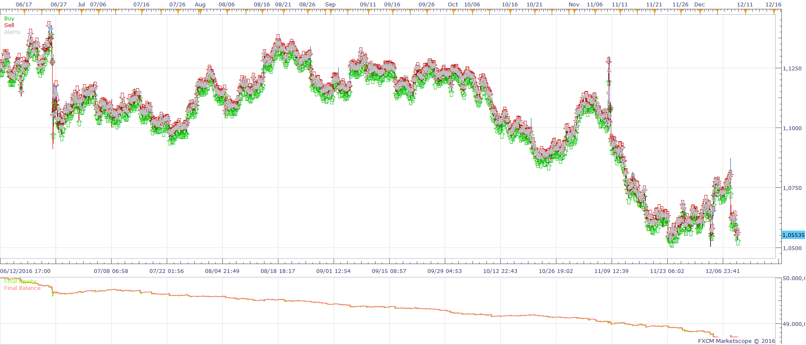
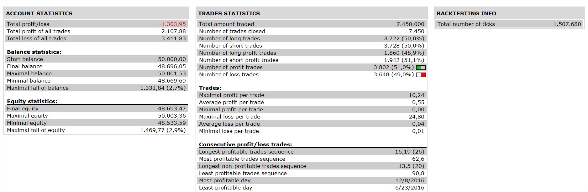

# BB-Percentages-Bandwidth STRATEGY

> Source: https://fxcodebase.com/code/viewtopic.php?f=31&t=64228  
> Forum: 31 · Topic 64228 · 1 post(s)

---

## BB-Percentages-Bandwidth STRATEGY

**Apprentice** · Mon Dec 19, 2016 10:31 am

 

Open Long
BB BAND WIDTH [PERIOD] > BB BAND WIDTH [PERIOD-1]
AND BB PERCENTAGE CROSS OVER BUY LEVEL

Open Short
BB BAND WIDTH [PERIOD] > BB BAND WIDTH [PERIOD-1]
AND BB PERCENTAGE CROSS UNDER SELL LEVEL

 [BB-Percentages-Bandwidth STRATEGY.lua](files/110163/BB-Percentages-Bandwidth%20STRATEGY.lua)

 BB-Percentages.lua / BB-Bandwidth.lua are available here.
[viewtopic.php?f=17&t=226&hilit=BANDWIDTH](https://fxcodebase.com/code/viewtopic.php?f=17&t=226&hilit=BANDWIDTH)

The Strategy was revised and updated on January 18, 2019.
