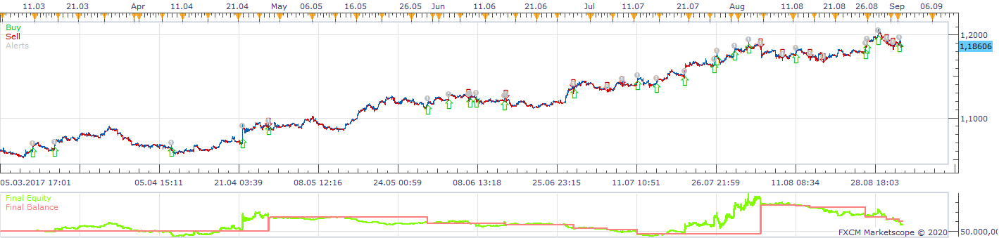
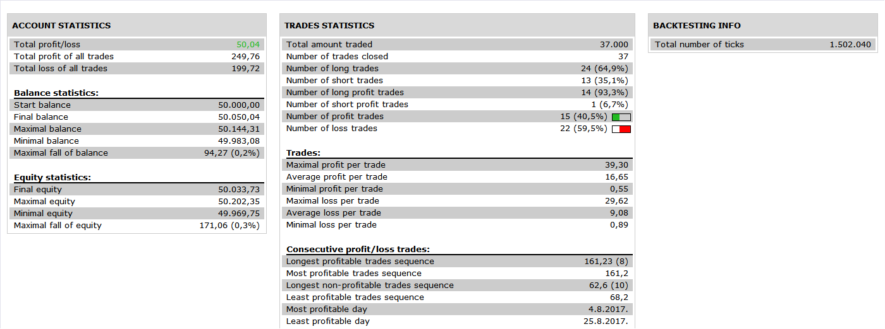

# BB Threshold Strategy

> Source: https://fxcodebase.com/code/viewtopic.php?f=31&t=69928  
> Forum: 31 · Topic 69928 · 30 post(s)

---

## BB Threshold Strategy

**Apprentice** · Wed May 27, 2020 7:13 am

 

Based on request.
[viewtopic.php?f=27&t=69916](https://fxcodebase.com/code/viewtopic.php?f=27&t=69916)

 [BB Threshold Strategy.lua](files/134364/BB%20Threshold%20Strategy.lua)

---

## Re: BB Threshold Strategy

**PAULUC02** · Wed May 27, 2020 8:45 am

thank you so much apprenti i try it now

---

## Re: BB Threshold Strategy

**PAULUC02** · Sun Jul 12, 2020 6:37 am

hello apprentice
I would like to make a modification to the strategy in order to optimize it a little.
you will be able to add the following condition for example to authorize the taking of the trade if the opening of the bollinger bands is less than 30%, the maximum opening of the bb being 100%.
However, I would like to be able to change the number of% on the interface.
You will also be able to create an indicator allowing you to see the number of pips when a candle exceeds the lower or higher bollinger band by excess so that you can use this strategy manually.
thank you.

---

## Re: BB Threshold Strategy

**Apprentice** · Sun Jul 12, 2020 7:32 am

> opening of the bollinger bands is less than 30%, the maximum opening of the bb being 100%.

For example,
if the price is less then 30% of BB then open Long trades
if the price is greater then 70% of BB then open Short trades

Can you confirm?

---

## Re: BB Threshold Strategy

**PAULUC02** · Mon Jul 13, 2020 5:07 am

ot for example if the opening of the bollinger bands are greater than 30% the program does not authorize a position to buy or sell.
On the other hand, if the opening is less than 30%, the purchase or sale is authorized according to the direction of the output of the price in relation to the BBs.

---

## Re: BB Threshold Strategy

**Apprentice** · Wed Jul 15, 2020 10:08 am

Your request is added to the development list.
Development reference 1700.

---

## Re: BB Threshold Strategy

**Apprentice** · Thu Jul 16, 2020 4:47 am

I don't understand what 30% means

---

## Re: BB Threshold Strategy

**PAULUC02** · Thu Jul 16, 2020 6:22 am

This represents the opening angle of the bollinger bands.

---

## Re: BB Threshold Strategy

**Apprentice** · Fri Jul 17, 2020 4:40 am

opening angle?
top/bottom/central?
How we will calculate it?
We can only use pips per candle.
Angle will depend on chart pan/zoom.

---

## Re: BB Threshold Strategy

**PAULUC02** · Fri Jul 17, 2020 6:09 am

Hello
I think we can use this bb with color indicator.
I want to authorize only when the bb is black.
see graph I also attach the indicator bb with color

---

## Re: BB Threshold Strategy

**PAULUC02** · Sat Jul 18, 2020 6:26 am

hello apprentice could you add a break even to the strategy thank you.

---

## Re: BB Threshold Strategy

**Apprentice** · Sun Jul 19, 2020 6:07 pm

Your request is added to the development list.
Development reference 1738.

---

## Re: BB Threshold Strategy

**Apprentice** · Mon Jul 20, 2020 10:17 am

[BB Threshold Strategy.lua](files/136126/BB%20Threshold%20Strategy.lua)

Try this version.

---

## Re: BB Threshold Strategy

**PAULUC02** · Mon Jul 20, 2020 11:59 am

thank you

---

## Re: BB Threshold Strategy

**PAULUC02** · Tue Jul 21, 2020 5:11 am

Hi Apprenti,
could You create an indicator to see the number of pips when a candle breaks the upper or lower bollinger band by excess so that you can use this strategy manually.
Thank you.

---

## Re: BB Threshold Strategy

**Apprentice** · Tue Jul 21, 2020 8:10 am

A number of pips above the top line and bellow bottom line else zero?

---

## Re: BB Threshold Strategy

**PAULUC02** · Tue Jul 21, 2020 8:41 am

yes exactly that

---

## Re: BB Threshold Strategy

**Apprentice** · Wed Jul 22, 2020 8:16 am

Your request is added to the development list.
Development reference 1752.

---

## Re: BB Threshold Strategy

**PAULUC02** · Fri Jul 31, 2020 4:11 pm

hello apprentice no news of my 1752 request?

---

## Re: BB Threshold Strategy

**Apprentice** · Sun Aug 02, 2020 9:19 am

Try this version.
[viewtopic.php?f=17&t=70255](https://fxcodebase.com/code/viewtopic.php?f=17&t=70255)

---

## Re: BB Threshold Strategy

**chai88888** · Wed Sep 23, 2020 1:48 am

hi there can you add a simple Moving average filter for these

buy only if above MA
short only if below MA

thanks

---

## Re: BB Threshold Strategy

**Apprentice** · Wed Sep 23, 2020 2:11 am

Your request is added to the development list.
Development reference 2083.

---

## Re: BB Threshold Strategy

**Apprentice** · Sat Sep 26, 2020 2:20 am

[BB Threshold Strategy.lua](files/137920/BB%20Threshold%20Strategy.lua)

Try this version.

---

## Re: BB Threshold Strategy

**chai88888** · Thu Nov 19, 2020 4:45 am

great work can you add adx filter which only trade below the specific line on the adx

can you add it here [download/file.php?id=29823](https://fxcodebase.com/code/download/file.php?id=29823)

thanks

---

## Re: BB Threshold Strategy

**chai88888** · Fri Nov 20, 2020 4:35 am

another thing if the trade get stop out the next position should be opposite

example
my buy trade got stop out the next position should be sell position

thanks

---

## Re: BB Threshold Strategy

**omgepe** · Sat Nov 21, 2020 7:07 am

> **PAULUC02 wrote:**
> thank you

hi pauluc,
if you don't mind, what parameter and timeframe did you use in backtest this strategy? could you sharing with us?

thanks

gp

---

## Re: BB Threshold Strategy

**Apprentice** · Tue Nov 24, 2020 6:03 am

Your request is added to the development list.
Development reference 2359.

---

## Re: BB Threshold Strategy

**PAULUC02** · Tue Nov 24, 2020 8:58 am

Hello
for this strategy which works very well in range I am running it in demo at the moment.
I have attached 2 screenshots with my settings that still need to be refined.

---

## Re: BB Threshold Strategy

**Apprentice** · Sun Nov 29, 2020 3:42 am

Task 2359

 [BB Threshold Strategy.lua](files/139173/BB%20Threshold%20Strategy.lua)

Try this version.

---

## Re: BB Threshold Strategy

**omgepe** · Sun Dec 06, 2020 8:52 pm

thanks pauluc,

i will try it..

thanks
gp
