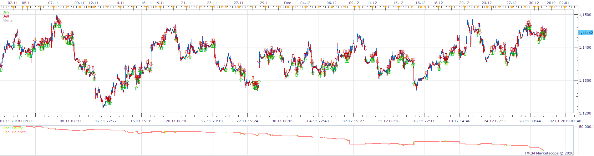
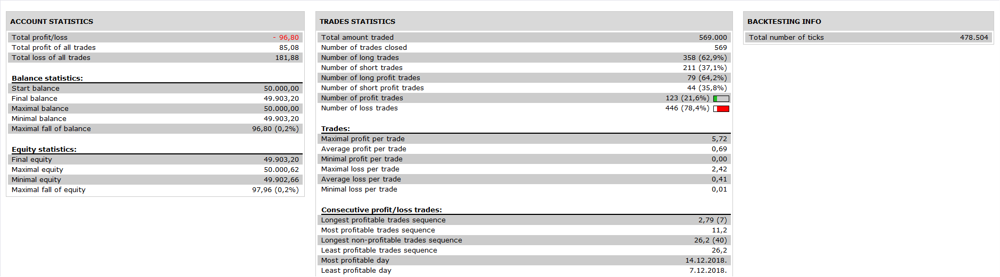

# BBOnMACD Breakout Strategy

> Source: https://fxcodebase.com/code/viewtopic.php?f=31&t=69506  
> Forum: 31 · Topic 69506 · 10 post(s)

---

## BBOnMACD Breakout Strategy

**Apprentice** · Fri Mar 06, 2020 6:48 am

 

Open a long position :
1) When the top line of the breakout indicator is breaking by the current course who is going up.
2) And when the current course of the BBonMACD indicator is crossing or is upper the banda superior.
Close position when the current course of the BBonMACD is crossing the banda superior who is going down or in the end of the day.
Open a short position :
1) When the bot line of the breakout indicator is breaking by the current course who is going down.
2) And when the current course of the BBonMACD indicator is crossing or is under the banda inferior.
Close position when the current course of the BBonMACD is crossing the banda inferior who is going up or in the end of the day.

BBonMACD.lua
[viewtopic.php?f=17&t=69303](https://fxcodebase.com/code/viewtopic.php?f=17&t=69303)

breakout.lua
[viewtopic.php?f=17&t=966](https://fxcodebase.com/code/viewtopic.php?f=17&t=966)

 [BBOnMACD Breakout Strategy.lua](files/131769/BBOnMACD%20Breakout%20Strategy.lua)

---

## Re: BBOnMACD Breakout Strategy

**Infime** · Thu Jul 02, 2020 5:26 am

Hi Apprentice,

I tried all of possibilities and it doesn't work.
So can you create a new strategy always based on the breakout indicator + 2 MVA :

Long position :
Open when the first MVA is crossing the upper line of the breakout indicator and if the second MVA is positive.
Short position :
Open when the first MVA is crossing the lower line of the breakout indicator and if the second MVA is negative.
Close positions when the first MVA is crossing the second MVA.

Options :
- Enable time frame for entry/exit positions.
- Enable paramaters for the MVA's.

---

## Re: BBOnMACD Breakout Strategy

**Apprentice** · Thu Jul 02, 2020 7:24 am

Your request is added to the development list.
Development reference 1616.

---

## Re: BBOnMACD Breakout Strategy

**Apprentice** · Fri Jul 03, 2020 4:57 am

[Breakout 2 MA Strategy.lua](files/135602/Breakout%202%20MA%20Strategy.lua)

Try this version.

---

## Re: BBOnMACD Breakout Strategy

**Infime** · Fri Jul 03, 2020 5:21 am

Thanks it's this but can you add the "exit time frame" ? Conditions are the same but just a different time frame to exit.
And add a filter : the BBONACD indicator. ([viewtopic.php?f=17&t=69303&p=131770&hilit=BBONMACD#p131770](https://fxcodebase.com/code/viewtopic.php?f=17&t=69303&p=131770&hilit=BBONMACD#p131770))
If it's green : Open only long position.
If it's red : Open only short position.

Thanks.

---

## Re: BBOnMACD Breakout Strategy

**Apprentice** · Sat Jul 04, 2020 4:37 am

Your request is added to the development list.
Development reference 1627.

---

## Re: BBOnMACD Breakout Strategy

**Apprentice** · Mon Jul 06, 2020 2:11 pm

[Breakout 2 MA Strategy v2.lua](files/135687/Breakout%202%20MA%20Strategy%20v2.lua)

Try this version.

---

## Re: BBOnMACD Breakout Strategy

**Infime** · Mon Jul 06, 2020 5:28 pm

Hi,

Thanks for your work but something is missing... The "exit time frame". Can you add the exit time frame option please ? Look at the picture attached.

Thank you.

---

## Re: BBOnMACD Breakout Strategy

**Apprentice** · Tue Jul 07, 2020 8:04 am

Your request is added to the development list.
Development reference 1645.

---

## Re: BBOnMACD Breakout Strategy

**Apprentice** · Wed Jul 08, 2020 4:41 am

[Breakout 2 MA Strategy v3.lua](files/135739/Breakout%202%20MA%20Strategy%20v3.lua)

Try this version.
