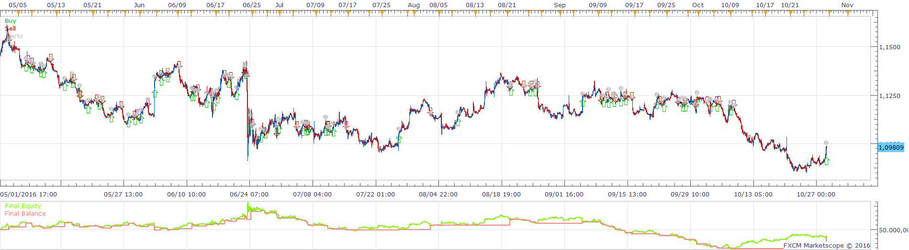
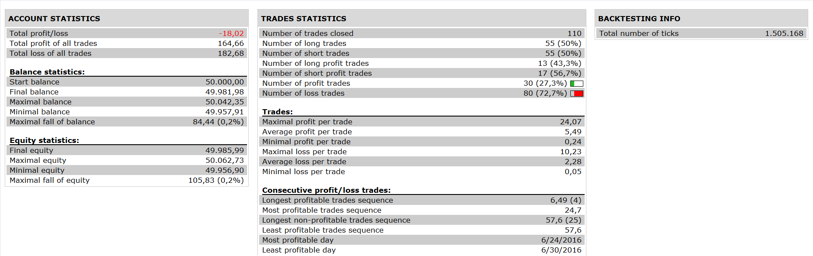

# BFS Signal Strategy

> Source: https://fxcodebase.com/code/viewtopic.php?f=31&t=64097  
> Forum: 31 · Topic 64097 · 5 post(s)

---

## BFS Signal Strategy

**Apprentice** · Tue Nov 15, 2016 3:17 am

 

Open Long
bfs line 1 > bfs line 2
close > corrected averages

Vice versa for Short.

 [BFS Signal Strategy.lua](files/109076/BFS%20Signal%20Strategy.lua)

Corrected Average is available here.
[viewtopic.php?f=17&t=64009&p=108740&hilit=Corrected+Average#p108740](https://fxcodebase.com/code/viewtopic.php?f=17&t=64009&p=108740&hilit=Corrected+Average#p108740)
BFS Signal is available here.
[viewtopic.php?f=17&t=64002](https://fxcodebase.com/code/viewtopic.php?f=17&t=64002)

The Strategy was revised and updated on January 18, 2019.

---

## Re: BFS Signal Strategy

**jupiter ange** · Tue Nov 15, 2016 4:00 am

i mario
i cant instal this strategy because he tel me this

C:program files/candleworks/FXTS2/strategies/custom/BFS signal strategy.lua:192: please download and install CORRECTED AVERAGE.LUA indicator
 but this indicator is install on my TS, i download again and ainstall again but is not good.
can tou look this problem please
many thanks

---

## Re: BFS Signal Strategy

**Apprentice** · Tue Nov 15, 2016 7:03 am

I can not reproduce this.
Can you attach a chart with aforementioned Average on it.

---

## Re: BFS Signal Strategy

**jupiter ange** · Tue Nov 15, 2016 9:18 am

> **Apprentice wrote:**
>
>
> The attachment **EURUSD H1 (11-15-2016 1217).png** is no longer available
>
>
> I can not reproduce this.
> Can you attach a chart with aforementioned Average on it.

---

## Re: BFS Signal Strategy

**Apprentice** · Sun Dec 18, 2016 10:23 am

Strategy was revised and updated.
