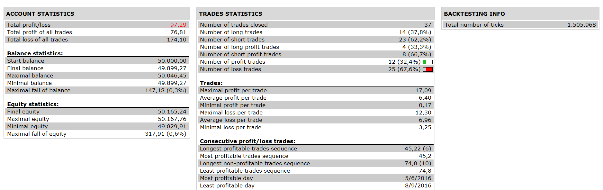

# BFS Strategy

> Source: https://fxcodebase.com/code/viewtopic.php?f=31&t=64022  
> Forum: 31 · Topic 64022 · 7 post(s)

---

## BFS Strategy

**Apprentice** · Mon Oct 24, 2016 3:58 am

 

Open Long
LINE 2> BUY LEVEL
AND LINE 1< BUY EXIT LEVEL
AND LINE 1 CROSS OVER LINE 2

Open Short
LINE 2< SELL LEVEL
AND LINE1> SELL EXIT LEVEL
AND LINE 1 CROSS UNDER LINE 2

 [BFS Strategy.lua](files/108773/BFS%20Strategy.lua)

BFS Signal is available here.
[viewtopic.php?f=17&t=64002](https://fxcodebase.com/code/viewtopic.php?f=17&t=64002)
The Strategy was revised and updated on January 18, 2019.

---

## Re: BFS Strategy

**panos59** · Tue Oct 25, 2016 4:17 am

There is a small error I guess..the strategy keeps asking for an email adress..can you check it ?
Thanks !

---

## Re: BFS Strategy

**Apprentice** · Tue Oct 25, 2016 6:38 am

Can you share your screen/ exact error message.

---

## Re: BFS Strategy

**panos59** · Tue Oct 25, 2016 6:53 am

even if I specify my email adress still getting this error..

---

## Re: BFS Strategy

**Apprentice** · Fri Oct 28, 2016 6:11 am

Try it now.

---

## Re: BFS Strategy

**panos59** · Fri Oct 28, 2016 7:58 am

Lokks good ..Thanks !!

---

## Re: BFS Strategy

**Apprentice** · Sun Dec 18, 2016 9:13 am

Strategy was revised and updated.
