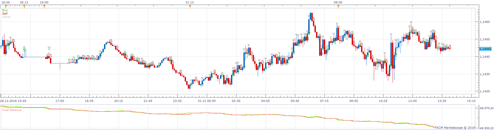
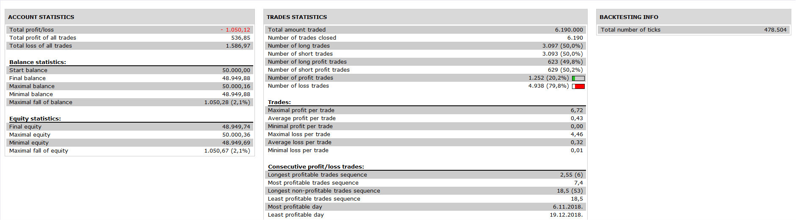

# Bid_Ask_Volume_Strategy

> Source: https://fxcodebase.com/code/viewtopic.php?f=31&t=69042  
> Forum: 31 · Topic 69042 · 7 post(s)

---

## Bid_Ask_Volume_Strategy

**Apprentice** · Tue Oct 22, 2019 4:32 am

 

Based on Bid_Ask_Volume.lua
[viewtopic.php?f=17&t=68869](https://fxcodebase.com/code/viewtopic.php?f=17&t=68869)

 [Bid_Ask_Volume_Strategy.lua](files/129367/Bid_Ask_Volume_Strategy.lua)

---

## Re: Bid_Ask_Volume_Strategy

**ASTERIA** · Tue Oct 22, 2019 6:45 am

Hi apprentice,
THE STRATEGY OPENS TRADES, BUT ONLY IN "END OF TURN"
DOES NOT OPEN TRADES IN THE "LIVE."

Thank you

---

## Re: Bid_Ask_Volume_Strategy

**Apprentice** · Sun Oct 27, 2019 4:40 am

Your request is added to the development list.
Development reference 249.

---

## Re: Bid_Ask_Volume_Strategy

**Apprentice** · Tue Oct 29, 2019 6:18 am

backtester bug, there is nothing we can do with it

---

## Re: Bid_Ask_Volume_Strategy

**mulligan** · Mon Nov 25, 2019 12:02 pm

Getting the following error message -
C:Program Files/Candleworks/FXTS2/Strategies/Custom/Bid_Ask_Volume_Strategy.lua:66:(null)(-1.-1):E35-C:/Program Files/Candleworks/FXTS2/Indicators/Custom/Bid_Ask_Volume.lua:387:Sound file must be chosen

Tried picking different sound files, but didn't work. Thanks for your help.

---

## Re: Bid_Ask_Volume_Strategy

**Apprentice** · Tue Nov 26, 2019 2:29 am

Your request is added to the development list.
Development reference 256.

---

## Re: Bid_Ask_Volume_Strategy

**Apprentice** · Tue Nov 26, 2019 12:13 pm

Try it now.
