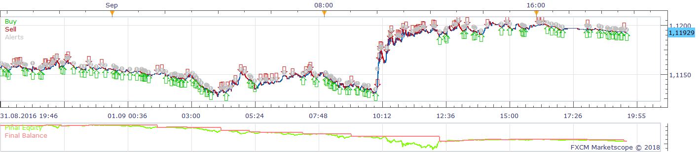
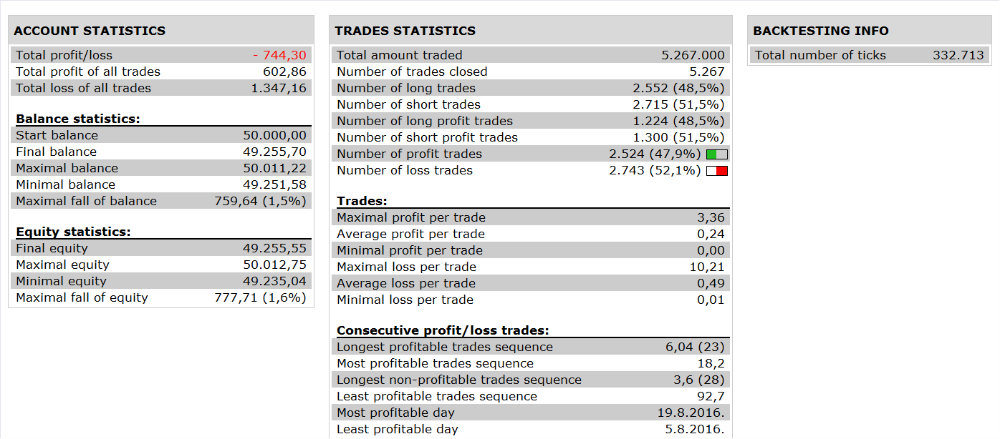

# Bill Williams Profitunity system

> Source: https://fxcodebase.com/code/viewtopic.php?f=31&t=66412  
> Forum: 31 · Topic 66412 · 4 post(s)

---

## Bill Williams Profitunity system

**Apprentice** · Tue Jul 31, 2018 5:10 am

 

Based on request.
[viewtopic.php?f=29&t=66313](https://fxcodebase.com/code/viewtopic.php?f=29&t=66313)

The Bullish Divergent Bar is a bar in which its low is lower than the previous bar AND it closes in the upper half of the bar.
High of this bar is below William's Alligator indicator three lines.
The Bearish Divergent Bar is the exact opposite of above.

 [Bill Williams Profitunity system.lua](files/120237/Bill%20Williams%20Profitunity%20system.lua)

Support Indicator.
[posting.php?mode=reply&f=17&t=70995](https://fxcodebase.com/code/posting.php?mode=reply&f=17&t=70995)

---

## Re: Bill Williams Profitunity système

**bruno2017** · Mon Mar 08, 2021 4:25 am

hello
 can I have a signal on the graphic like this strategy.
thank you

---

## Re: Bill Williams Profitunity system

**Apprentice** · Mon Mar 08, 2021 4:55 am

Your request is added to the development list.
Development reference 260.

---

## Re: Bill Williams Profitunity system

**Apprentice** · Thu Mar 11, 2021 5:05 am

Support Indicator.
[posting.php?mode=reply&f=17&t=70995](https://fxcodebase.com/code/posting.php?mode=reply&f=17&t=70995)
