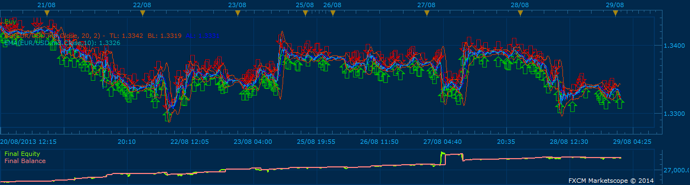

# Bollinger Band and EMA

> Source: https://fxcodebase.com/code/viewtopic.php?f=31&t=60195  
> Forum: 31 · Topic 60195 · 5 post(s)

---

## Bollinger Band and EMA

**moomoofx** · Mon Jan 13, 2014 3:32 am

As requested on: [viewtopic.php?f=27&t=60042](https://fxcodebase.com/code/viewtopic.php?f=27&t=60042)

 

Buy Condition
1. When previous bar's low crosses the Lower BollingerBand
2. AND current bar's open is above the Lower BollingerBand
3. AND current bar's open is equal to or above the previous bar's close
4. AND the current price is the configured number of pips or more difference below the EMA.

Exit Long Conditions:
1. Exit the long position when current price crosses the EMA.

Stop Loss:
1. Low of the previous bar + n pips (i.e. where n is the number of pips configured for the stop)

Sell conditions are reverse of the above.

The Strategy was revised and updated on December 10, 2018.

---

## Re: Bollinger Band and EMA

**val567** · Mon Jan 13, 2014 8:28 pm

What settings / strategy parameters are you using in that picture there?

Time frame / EMA period / BB period / BB deviation / EMA difference / Limits? Stops? Etc.

---

## Re: Bollinger Band and EMA

**moomoofx** · Tue Jan 14, 2014 3:10 am

EURUSD
Both directions.
Allow Multiple
No stop order

The rest default I believe. Let me know if you cannot get similar results.

---

## Re: Bollinger Band and EMA

**moomoofx** · Tue Jan 14, 2014 11:00 pm

It turns out the lovely equity curve I achieve in the screenshot I posted above is due to the fact that I'm using an Active Trader account with much lower spreads.

A strategy like this is essentially scalping and spreads become a big factor of course so keep this in mind.

Apologies for the confusion.

---

## Re: Bollinger Band and EMA

**Apprentice** · Sun Dec 11, 2016 5:07 am

Strategy was revised and updated.
