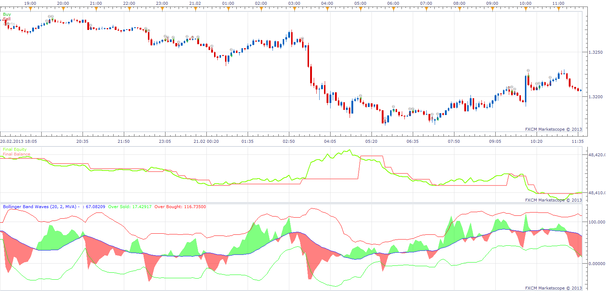

# Bollinger Band Waves Indicator Strategy

> Source: https://fxcodebase.com/code/viewtopic.php?f=31&t=33740  
> Forum: 31 · Topic 33740 · 2 post(s)

---

## Bollinger Band Waves Indicator Strategy

**Apprentice** · Sat Mar 23, 2013 6:26 am

Open Long
BBW Cental Line Pozitiv Slope
Open Short
BBW Cental Line Negativ Slope

 [BBW Indicator Strategy.lua](files/57257/BBW%20Indicator%20Strategy.lua)

These indicators are needed for this strategy.

Bollinger Band Waves
[viewtopic.php?f=17&t=1373&p=57254#p57254](https://fxcodebase.com/code/viewtopic.php?f=17&t=1373&p=57254#p57254)
Bollinger Band - Percentages
[viewtopic.php?f=17&t=226&hilit=Bandwidth](https://fxcodebase.com/code/viewtopic.php?f=17&t=226&hilit=Bandwidth)

The Strategy was revised and updated on December 10, 2018.

---

## Re: Bollinger Band Waves Indicator Strategy

**Apprentice** · Fri Dec 09, 2016 5:39 am

Strategy was revised and updated.
