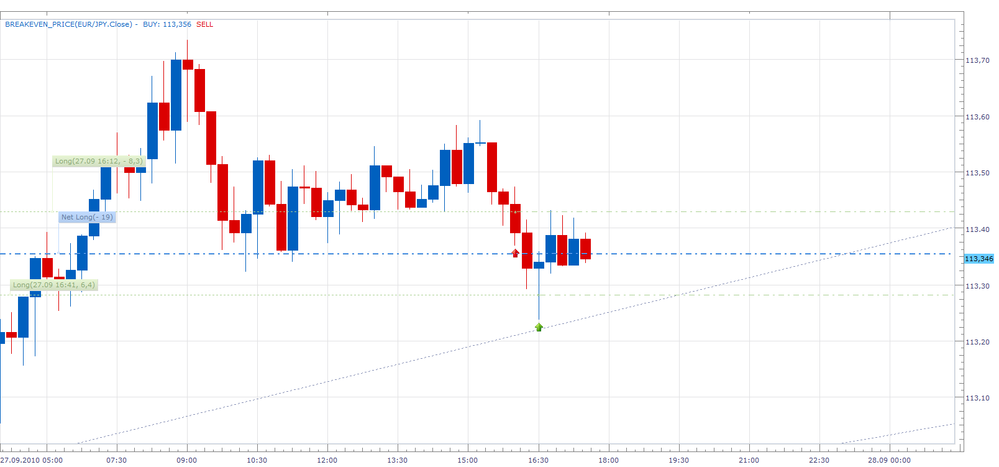

# Breakeven_Price Strategy

> Source: https://fxcodebase.com/code/viewtopic.php?f=31&t=2280  
> Forum: 31 · Topic 2280 · 29 post(s)

---

## Breakeven_Price Strategy

**Apprentice** · Mon Sep 27, 2010 5:02 pm

This strategy will not ever open any position.

This strategy closes all Long positions if the closing price falls below Breakeven Price for all Long Positions.

This strategy closes all Short positions if the closing price rises above Breakeven Price for all Short Positions.

The role of this strategy is not to make profit. But to reduce or eliminate the risk for open positions.

 [Breakeven_Price Strategy.lua](files/4834/Breakeven_Price%20Strategy.lua)

To work please install BREAKEVEN_PRICE Indicator.
 [viewtopic.php?f=17&t=2236](https://fxcodebase.com/code/viewtopic.php?f=17&t=2236)

---

## Re: Breakeven_Price Strategy

**Apprentice** · Tue Sep 28, 2010 2:26 am

Update.

Added ability to select,
Closes only the Long or Short position.

---

## Re: Breakeven_Price Strategy

**Apprentice** · Fri Oct 15, 2010 9:03 am

Update

---

## Re: Breakeven_Price Strategy

**sho-me-pips** · Sat Feb 26, 2011 8:40 am

Could you modify this strategy to work on FIFO, individual pairs, and close a selected amount of pips beyond break even, or is there an existing strategy that will fulfill my request.

Thanks in advance

---

## Re: Breakeven_Price Strategy

**Apprentice** · Sun Feb 27, 2011 5:51 am

Added to developmental cue.

---

## Re: Breakeven_Price Strategy

**fabfxcm** · Mon Oct 10, 2011 12:45 pm

Could anyone explain me why break even strategy doesn't work? It says "string53 please dowload and install trend lord indicator". I disinstalled and istalled many time both, trend lord indicator and break even strategy, but it still doesn't work. What can I do?

---

## Re: Breakeven_Price Strategy

**sunshine** · Tue Oct 11, 2011 5:29 am

Looks like you have not installed the BREAKEVEN_PRICE Indicator.
Please download the indicator here and install in Marketscope:
[viewtopic.php?f=17&t=2236](https://fxcodebase.com/code/viewtopic.php?f=17&t=2236)
Make sure that the indicator is in the list in the Add Indicator dialog box.

---

## Re: Breakeven_Price Strategy

**PipGrabber** · Wed Nov 30, 2011 11:58 pm

Hi sunshine,

Can you please update this strategy to work again. It doesn't seem to work anymore as the breakeven price indicator not working too. Thanks.

---

## Re: Breakeven_Price Strategy

**Apprentice** · Thu Dec 01, 2011 9:59 am

Thank you for reporting the problem.
Someone will test indicator, this should fix the problem.

---

## Re: Breakeven_Price Strategy

**PipGrabber** · Thu Dec 01, 2011 6:26 pm

Your welcome! Thanks too. Looking forward to it.

---

## Re: Breakeven_Price Strategy

**Apprentice** · Sat Dec 03, 2016 7:47 am

Bump up.

---

## Re: Breakeven_Price Strategy

**albertparis** · Wed Aug 30, 2017 4:42 am

Hello,

can you add :

Custom identifier

Thank you in advance for your work

---

## Re: Breakeven_Price Strategy

**Apprentice** · Fri Sep 29, 2017 7:21 am

Your request is added to the development list under Id Number 3905

---

## Re: Breakeven_Price Strategy

**albertparis** · Sat Sep 30, 2017 9:34 am

> **Apprentice wrote:**
> Your request is added to the development list under Id Number 3905

Thank you for your future work

---

## Re: Breakeven_Price Strategy

**Apprentice** · Mon Oct 02, 2017 4:09 am

Try it now.

---

## Re: Breakeven_Price Strategy

**albertparis** · Mon Oct 02, 2017 9:02 am

> **Apprentice wrote:**
> Try it now.

Hello, Breakeven_Price Strategy, the stop does not trigger after the closing

---

## Re: Breakeven_Price Strategy

**Apprentice** · Thu Oct 12, 2017 3:57 am

Thank you for your report.
Will revise it.

---

## Re: Breakeven_Price Strategy

**albertparis** · Fri Oct 13, 2017 2:30 am

> **Apprentice wrote:**
> Thank you for your report.
> Will revise it.

thank you

---

## Re: Breakeven_Price Strategy

**albertparis** · Sat Oct 21, 2017 7:52 am

> **Apprentice wrote:**
> Thank you for your report.
> Will revise it.

> **Apprentice wrote:**
> Thank you for your report.
> Will revise it.

Hello
When you modify, can you put the indicator parameters in option
Trading_commands:
Hedge your position
Or
close all long positions if the closing price falls below the break-even point for all long positions
thank you for your future work

---

## Re: Breakeven_Price Strategy

**albertparis** · Sun Oct 29, 2017 7:25 am

> **albertparis wrote:**
>
>
> > **Apprentice wrote:**
> > Thank you for your report.
> > Will revise it.
>
>
>
> thank you

Hello
did you have the teps to correct the indicator, to know if it works?

---

## Re: Breakeven_Price Strategy

**Apprentice** · Sat Mar 17, 2018 8:15 am

Breakeven_Price Strategy.lua Fixed.

---

## Re: Breakeven_Price Strategy

**albertparis** · Thu Mar 22, 2018 8:04 am

> **Apprentice wrote:**
> Breakeven_Price Strategy.lua Fixed.

thank you very much
It works perfectly.

---

## Re: Breakeven_Price Strategy

**albertparis** · Mon Apr 02, 2018 6:07 am

> **Apprentice wrote:**
> Breakeven_Price Strategy.lua Fixed.

Hello
The "Custom Identifier" does not work.
All positions intersect
cordially

---

## Re: Breakeven_Price Strategy

**Apprentice** · Mon Apr 23, 2018 5:22 am

Your request is added to the development list under Id Number 4119

---

## Re: Breakeven_Price Strategy

**Victor.Tereschenko** · Tue Apr 24, 2018 4:35 am

> **albertparis wrote:**
>
>
> > **Apprentice wrote:**
> > Breakeven_Price Strategy.lua Fixed.
>
>
>
> Hello
> The "Custom Identifier" does not work.
> All positions intersect
> cordially

How do you expect it should work? It is designed to close all positions. That is the idea behind it.

---

## Re: Breakeven_Price Strategy

**albertparis** · Fri Aug 31, 2018 4:16 pm

> **albertparis wrote:**
>
>
> > **albertparis wrote:**
> >
> >
> > > **Apprentice wrote:**
> > > Thank you for your report.
> > > Will revise it.
> >
> >
> >
> > thank you
>
>
> Hello
> did you have the teps to correct the indicator, to know if it works?

Hello
Can you put a stop when the strategy takes a hedge?

A fractal stop
Put a stop to the last bearish fractal on a unit of time chosen fractal example M30 on a bullish hedge
Put a stop at the last bullish fractal on a unit of time chosen fractal example M30 on a bear hedge
The stop must be put immediately the position taken and not wait for the closing of the candle
Thank you for your future work

---

## Re: Breakeven_Price Strategy

**albertparis** · Sat Sep 01, 2018 3:50 am

Hello
I forgot this request
Can we do a BREAKEVEN
- X pip
thank you

---

## Re: Breakeven_Price Strategy

**Apprentice** · Thu Sep 27, 2018 2:59 am

Your request is added to the development list under Id Number 4261

---

## Re: Breakeven_Price Strategy

**Apprentice** · Sat Oct 06, 2018 10:25 am

Try this version.
[viewtopic.php?f=31&t=66699](https://fxcodebase.com/code/viewtopic.php?f=31&t=66699)
