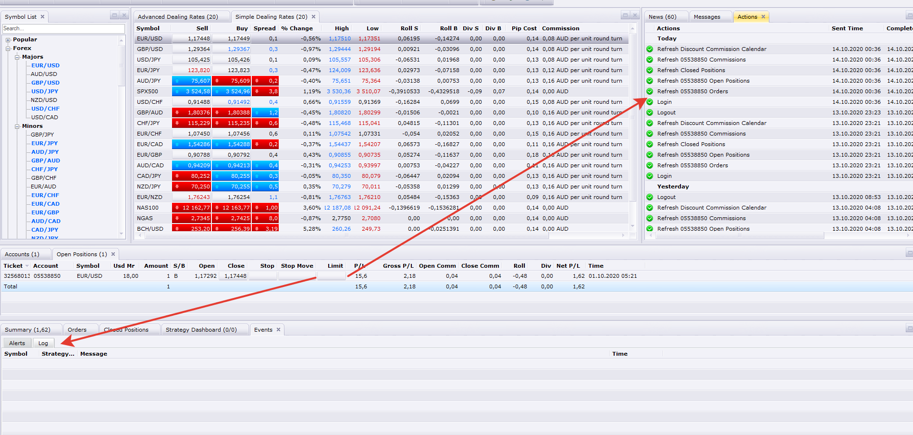

# Breakeven Trailing Stop Strategy

> Source: https://fxcodebase.com/code/viewtopic.php?f=31&t=69371  
> Forum: 31 · Topic 69371 · 15 post(s)

---

## Breakeven Trailing Stop Strategy

**Apprentice** · Mon Feb 03, 2020 6:50 am

Based on request.
[viewtopic.php?f=27&t=69359](https://fxcodebase.com/code/viewtopic.php?f=27&t=69359)

 [Breakeven Trailing Stop Strategy.lua](files/131049/Breakeven%20Trailing%20Stop%20Strategy.lua)

---

## Re: Breakeven Trailing Stop Strategy

**chai88888** · Mon Oct 05, 2020 9:33 am

may i ask i tried this on us30 live account it seems dosent work?

---

## Re: Breakeven Trailing Stop Strategy

**chai88888** · Mon Oct 05, 2020 9:15 pm

why is that when am testing this on simulation it runs perfectly but on demo and live it does not work.
i put the same settings on all.

hope you can help thanks

---

## Re: Breakeven Trailing Stop Strategy

**chai88888** · Wed Oct 07, 2020 7:11 pm

can anyone help me out

because it really not running on demo or live but in simulation it runs good as setting input

thanks

---

## Re: Breakeven Trailing Stop Strategy

**chai88888** · Mon Oct 12, 2020 3:19 am

why is that this strategy works on simulation only. when i test it on demo and live the stops dosent move to it breakeven value. i just use the same value on the simulation..

hope you can help me out

thanks

---

## Re: Breakeven Trailing Stop Strategy

**Apprentice** · Tue Oct 13, 2020 6:10 am

Your request is added to the development list.
Development reference 2185.

---

## Re: Breakeven Trailing Stop Strategy

**chai88888** · Tue Oct 13, 2020 9:25 pm

heres a image of my settings of the BE trailing on a demo you can see it already exceed my pip activation but still my stop did not move

---

## Re: Breakeven Trailing Stop Strategy

**Apprentice** · Wed Oct 14, 2020 2:09 am

Your request is added to the development list.
Development reference 2189.

---

## Re: Breakeven Trailing Stop Strategy

**Apprentice** · Wed Oct 14, 2020 2:39 am

Do you have any errors in the log?

---

## Re: Breakeven Trailing Stop Strategy

**chai88888** · Wed Oct 14, 2020 4:38 am

here what i notice in the breakeven.

if i select do not change it moves the stop to the pip i want
but if i select set trailing my stop do not move at all

---

## Re: Breakeven Trailing Stop Strategy

**Apprentice** · Fri Oct 16, 2020 6:12 am

You are using an incorrect value for the breakeven. Broker refuses to move the stop to the value you chose.

---

## Re: Breakeven Trailing Stop Strategy

**chai88888** · Fri Oct 16, 2020 10:34 am

What do you mean by incorrect? Too low or for negative -1

Beacause in the simulation mode if i put positive value on the breakeven it will put under stop unlike if i put negative value it will move above my stop making me positive breakeven.

---

## Re: Breakeven Trailing Stop Strategy

**chai88888** · Mon Oct 19, 2020 8:43 pm

is there a way to to use my settings? broker is limiting the trailing in pips to min 10...

i want to set my trailing just to 5..

i think it is possible because the in bb threshold strategy the breakeven trailing there works in min 10...

thanks

---

## Re: Breakeven Trailing Stop Strategy

**chai88888** · Sun Oct 25, 2020 9:25 pm

hi there can i request for trailing just 5pips trailing

thanks

---

## Re: Breakeven Trailing Stop Strategy

**Apprentice** · Thu Oct 29, 2020 11:50 am

The minimal value we can use is a given by the broker.
