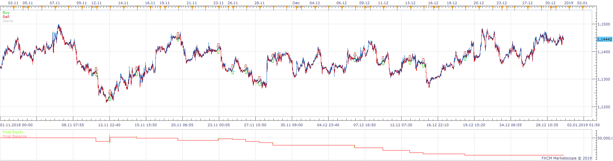
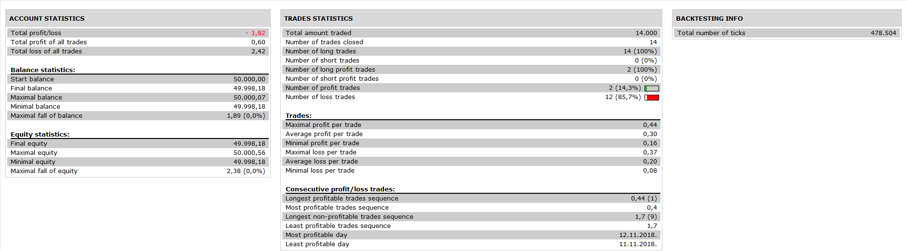

# Breakout_ProfitMatrix_TSI

> Source: https://fxcodebase.com/code/viewtopic.php?f=31&t=69168  
> Forum: 31 · Topic 69168 · 15 post(s)

---

## Breakout_ProfitMatrix_TSI

**Apprentice** · Thu Nov 28, 2019 7:26 am

 

Based on request.
[viewtopic.php?f=31&p=129971#p129971](https://fxcodebase.com/code/viewtopic.php?f=31&p=129971#p129971)

 [Breakout_ProfitMatrix_TSI.lua](files/129982/Breakout_ProfitMatrix_TSI.lua)

Breakout indicator: [viewtopic.php?f=17&t=966&hilit=breakout](https://fxcodebase.com/code/viewtopic.php?f=17&t=966&hilit=breakout) (breakout.lua)

ProfitMatrix : [viewtopic.php?f=17&t=66586&p=129819&hilit=profit+matrix#p129819](https://fxcodebase.com/code/viewtopic.php?f=17&t=66586&p=129819&hilit=profit+matrix#p129819)
(ProfitMatrix.lua)

---

## Re: Breakout_ProfitMatrix_TSI

**Infime** · Thu Nov 28, 2019 4:33 pm

Hi,

Sorry but there is something wrong... I link you a picture who each position (sell or buy) should be open. It's when the current course breaks the top or bot line of breakout indicator (like the picure) and "Open position in buy when the profitmatrix is green..." or "Open position in sell when the profitmatrix is red..."

And can you change the TSI by the CMO indicator ? Close the position when the current line of the CMO touches the level 0 of the CMO indicator. It will more simple for you ! (check the fushia on the picture).

Thank you, I hope it will work this time...

---

## Re: Breakout_ProfitMatrix_TSI

**Apprentice** · Thu Nov 28, 2019 7:49 pm

Your request is added to the development list.
Development reference 371.

---

## Re: Breakout_ProfitMatrix_TSI

**Apprentice** · Fri Nov 29, 2019 4:44 am

Unclear requirements.
Exit condition: when TSI is reversed. Reversed to what?
I've included TSI into the entry and exiting on the opposite direction of TSI in comparison to entry TSI rule. But it looks like that there shouldn't be TSi in the entry, but it's unclear what is the opposite TSI in that case

---

## Re: Breakout_ProfitMatrix_TSI

**Infime** · Fri Nov 29, 2019 6:32 am

Yes, I said that it will more simple for you if you delete TSI and remplace it by a CMO indicator.

So, exit condition : When the the current line of the CMO touches the level 0 of the CMO indicator.
Entry condition : when the current course breaks the top (to buy) or bot (to sell) line of breakout indicator if the Profitmatrix is green (to buy) or red (to sell).

Like the picture linked on the last post.

---

## Re: Breakout_ProfitMatrix_TSI

**Apprentice** · Thu Dec 05, 2019 6:56 am

[Breakout_ProfitMatrix_CMO.lua](files/130084/Breakout_ProfitMatrix_CMO.lua)

Try this version.

---

## Re: Breakout_ProfitMatrix_TSI

**Infime** · Thu Dec 05, 2019 6:15 pm

Hi Apprentice,

I'm boring but everything is not right...
Closing position is OK.
But Open position it's not exactly that. Some positions are good but not all. Many positions don't wait to break the top or bot line of breakout to open position. So...
I link you 2 pictures.
First ; It shows you ONLY ALL positions that must be open to buy. Because the current course increase, breaks the top line of breakout and the profitmatrix is green.
Second : It shows you ONLY ALL positions that must be open to sell. Because the current course decrease, breaks the bot line of breakout and the profitmatrix is red.

So the strategy can open many positions before to close the position. (Option can be add or is it added ?)
It's all...

Thank you for your response.

---

## Re: Breakout_ProfitMatrix_TSI

**Apprentice** · Mon Dec 09, 2019 9:00 am

[Breakout_ProfitMatrix_CMO.lua](files/130158/Breakout_ProfitMatrix_CMO.lua)

This is exactly how it coded. I've added advanced logging which can be turned on in the parameters. The strategy will print all decisions: why it opened or not opened the position.

---

## Re: Breakout_ProfitMatrix_TSI

**Infime** · Wed Dec 11, 2019 5:22 am

Thank you Apprentice !
I think it's the breakout indicator that fail the strategy (it open just one position by day and doesn't open where it must to be open). Even I change the all parameters.
But don't worry it's good like this ! Many thanks.

---

## Re: Breakout_ProfitMatrix_TSI

**Infime** · Thu Dec 12, 2019 7:51 am

Considering that the strategy failed with the breakout indicator, could you please delete this indicator and replace it by the "daily range" indicator ([viewtopic.php?f=27&t=3981&p=123409&hilit=daily+range#p123409](https://fxcodebase.com/code/viewtopic.php?f=27&t=3981&p=123409&hilit=daily+range#p123409)).
It will be very thanksfull...
Use the same condition to close positions (When the CMO touches his level 0) and almost the same conditions to open.
To open positions :
1) Buy : When the current course breaks the daily range indicator in increase and the profitmatrix is green.
2) Sell : When the current course breaks the daily range indicator in decrease and the profitmatrix is red.
Many positions can be open in the same time, alterable time frame for daily range/CMO indicators and let the breakeven.

Thank you Apprentice, hope it will work with this...

---

## Re: Breakout_ProfitMatrix_TSI

**Apprentice** · Thu Dec 19, 2019 11:36 am

Your request is added to the development list.
Development reference 456.

---

## Re: Breakout_ProfitMatrix_TSI

**Apprentice** · Fri Dec 20, 2019 9:19 am

[Daily_Range_ProfitMatrix_CMO.lua](files/130363/Daily_Range_ProfitMatrix_CMO.lua)

Try this version.

---

## Re: Breakout_ProfitMatrix_TSI

**Infime** · Thu Dec 26, 2019 11:20 am

Hi,

Yes, it's this ! Thanks a lot but the CMO indicator doesn't work properly...
Can you delete the CMO indicator and replace it by the "Leavitt Conv Slope" indicator please ? [viewtopic.php?f=17&t=69262](https://fxcodebase.com/code/viewtopic.php?f=17&t=69262) (by Apprentice » Mon Dec 23, 2019 12:14 pm)
So, to close positions : If it's a buy position, close when the L.C.S indicator down (become red). And if it's a sell position, close when the L.C.S indicator up (become green).

Thank you and happy new year to the team !

---

## Re: Breakout_ProfitMatrix_TSI

**Apprentice** · Tue Jan 07, 2020 8:39 am

Your request is added to the development list.
Development reference 531.

---

## Re: Breakout_ProfitMatrix_TSI

**Apprentice** · Wed Jan 08, 2020 6:55 am

[Daily_Range_ProfitMatrix_LCS.lua](files/130628/Daily_Range_ProfitMatrix_LCS.lua)

Try this version.
