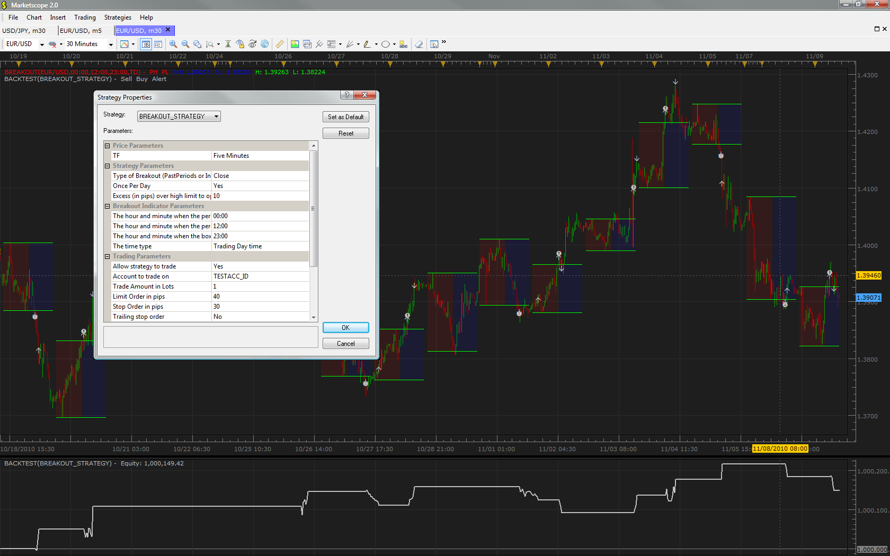
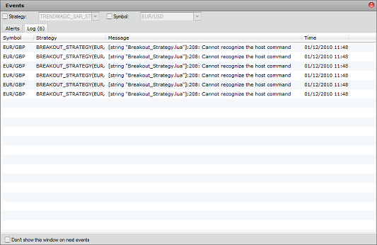
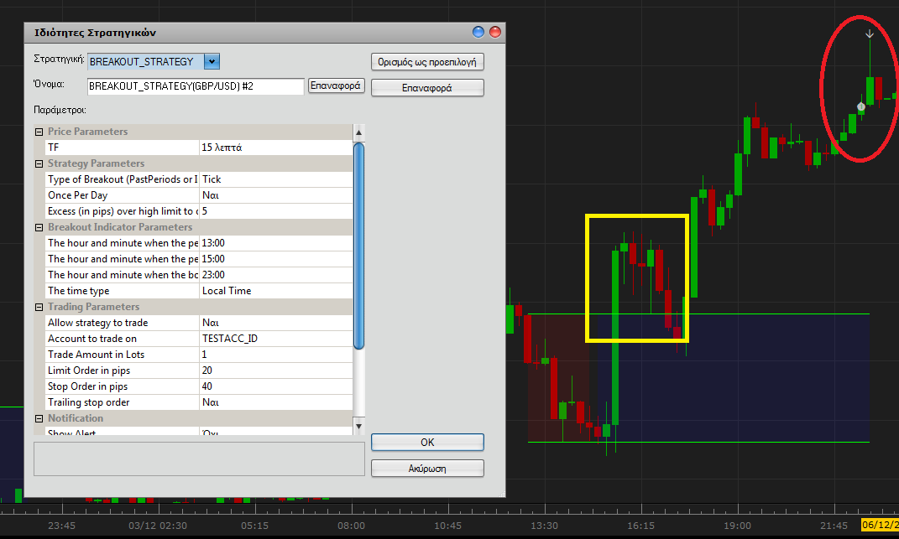
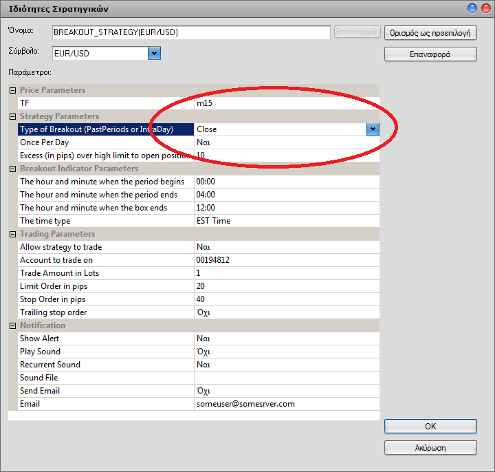
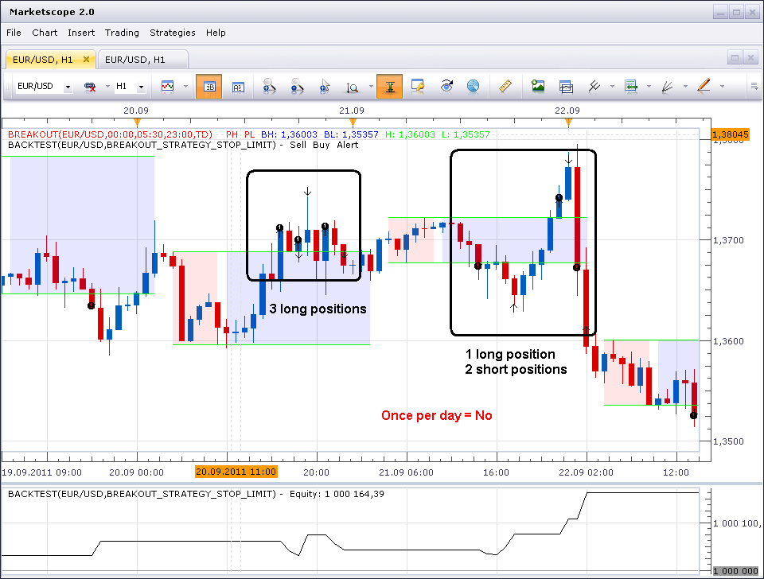
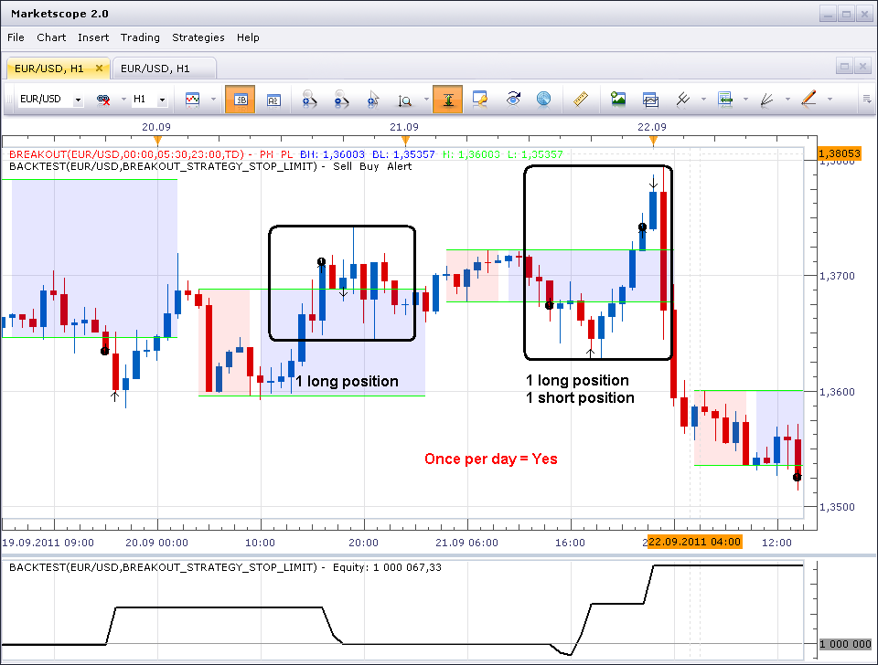
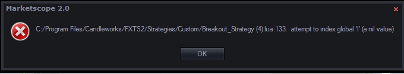

# Breakout Strategy

> Source: https://fxcodebase.com/code/viewtopic.php?f=31&t=2639  
> Forum: 31 · Topic 2639 · 168 post(s)

---

## Breakout Strategy

**vstrelnikov** · Tue Nov 09, 2010 11:08 am

Strategy based on [breakout indicator](https://fxcodebase.com/code/viewtopic.php?f=17&t=966). Please download and install it, before using strategy.
Besides indicator parameters itself (period interval and box interval) there are several parameters
for strategy tuning. See parameters description below:

 - **Type of breakout** - Open position after candle closes above high level, or open position immediately if incoming tick price is above high level.
 - **Once per day** - Is strategy allowed to open positions several time during trading day.
 - **Excess (in pips)** - Additional gap between high/low values and open price. 0 by default.

**Note:** Strategy don't have any 'exit' criteria except Stop/Limit orders, therefore Stop/Limit parameters are required for this strategy.

You can play with all above parameters to make the strategy most profitable.

 



 [Breakout_Strategy.lua](files/5951/Breakout_Strategy.lua)

Please share any suggestions or comments here.

Breakout Strategy with GMMACD Filter
Take only breakouts which have been confirmed with GMMACD

 [Breakout_Strategy with GMMACD Filter.lua](files/5951/Breakout_Strategy%20with%20GMMACD%20Filter.lua)

You must have both GMMA and GMMACD installed in order to use this strategy.
[viewtopic.php?f=17&t=412&hilit=GMMACD](https://fxcodebase.com/code/viewtopic.php?f=17&t=412&hilit=GMMACD)

MT4/MQ4 version, MT5/MQ5 version.
[viewtopic.php?f=38&t=70742](https://fxcodebase.com/code/viewtopic.php?f=38&t=70742)

---

## Re: Breakout Strategy

**borsaty** · Tue Nov 09, 2010 5:00 pm

Thanks

---

## Re: Breakout Strategy

**borsaty** · Tue Nov 09, 2010 5:31 pm

Thanks for helping us
does this strategy can hit both buy and sell if the stop loss of the first order not filled ,
if not what the ability to do that as hedging .
also what is the ability to add parameter for buy or sell or both
and also filter parameter like moving average

---

## Re: Breakout Strategy

**borsaty** · Tue Nov 09, 2010 9:46 pm

hi
can we make this indicator to put buy entry and sell entry instead of market order at the plce of breakout
thanks

---

## Re: Breakout Strategy

**Ancient** · Thu Nov 18, 2010 8:29 am

Hi, could someone please help to clarify whether Both Indicator and Strategy require to have the Same Time Settings? Or does the Indicator just have to be loaded on a chart?

Thank You

---

## Re: Breakout Strategy

**Apprentice** · Thu Nov 18, 2010 8:42 am

The indicator must be installed so that strategy could work.
But you do not need to added it to the chart.
They are independent.

---

## Re: Breakout Strategy

**Ancient** · Thu Nov 18, 2010 8:09 pm

Two Issues:

1) It would be good for Strategies to be De-Activated AUTO when Logging Out. This so as to prevent them from running immediately when logging back in.

2) Would be good to have an option to activate or de-activate all Strategies with ONE BUTTON.
(Start All) - (Stop All)

3) For those trading more than ONE account, to be able to select accounts to be traded with a selected Strategy, instead of having to load the same Strategy for each account.

4) Should 3 above require premium support, please inform me.

Thank You Apprentice!

---

## Re: Breakout Strategy

**alepan72** · Wed Dec 01, 2010 4:51 am

Hi all,
You do good work, excellent!!!
I have a prob with this strategy. I get tried to eyrgbp pair. When I setup the strategy, return me an historical message every sec. that say:

[string breakout_strategy.lua]: 208: Cannot recognize the host command.

Where did I go wrong...?

 



---

## Re:Breakout

**borsaty** · Wed Dec 01, 2010 6:01 am

the strategy can't fill all orders
in this case only EURUSD and USDCAD but the strategy fail to fill EURJPY and GBPJPY
......... look at the image

---

## Re: Breakout Strategy

**vstrelnikov** · Wed Dec 01, 2010 9:39 am

> **alepan72 wrote:**
> [string breakout_strategy.lua]: 208: Cannot recognize the host command.
> Where did I go wrong...?

Do you have [Autotrading patch](https://fxcodebase.com/code/viewtopic.php?f=31&t=2337) installed?

---

## Re: Breakout Strategy

**alepan72** · Fri Dec 03, 2010 4:20 am

> **vstrelnikov wrote:**
>
>
> > **alepan72 wrote:**
> > [string breakout_strategy.lua]: 208: Cannot recognize the host command.
> > Where did I go wrong...?
>
>
> Do you have [Autotrading patch](https://fxcodebase.com/code/viewtopic.php?f=31&t=2337) installed?

Goodmorning from Greece!
I have the Trading station console and Marketscope 2.0, also I use some strategies with the "allow trade" ON. Is it OK or I must have the autotrading patch for this strategy?
THANX for your time!

---

## Re: Breakout Strategy

**costock** · Sun Dec 05, 2010 1:21 pm

Hi

I've installed the Breakout indicator and strategy and both seem to work fine, but when I backtested the autotrading option against either G/J or G/U pairs, I cannot get the entry strategy to co-incide with breakout of the pair. It is usually a matter of a 2 or more hours out when on a 60minute timeframe and despite fiddling with different time frames. I'm running off local time, GMT - not sure if that has anything to do with it. Also the pip offset is set to zero.

Any ideas greatly appreciated.

thanks

---

## Re: Breakout Strategy

**alepan72** · Mon Dec 06, 2010 11:15 am

> **costock wrote:**
> Hi
>
> I've installed the Breakout indicator and strategy and both seem to work fine, but when I backtested the autotrading option against either G/J or G/U pairs, I cannot get the entry strategy to co-incide with breakout of the pair. It is usually a matter of a 2 or more hours out when on a 60minute timeframe and despite fiddling with different time frames. I'm running off local time, GMT - not sure if that has anything to do with it. Also the pip offset is set to zero.
>
> Any ideas greatly appreciated.
>
> thanks

Hi all!!!
I install the "autotrading patch" and all seems to be OK.
But... I have the same problem with costock. The time that breakout take place must be at 15.30, but the backtesting give me a sing at 22.30.
 (see the screenshot below)

 



---

## Re: Breakout Strategy

**borsaty** · Tue Dec 07, 2010 3:13 am

Dear
First of all thanks for your big effort
The strategy working fine except some pairs doesn't trigger like GBPJPY and EURJPY
Also can make some modification i try to list it
1- strategy deal only with its order not with any other order with the same pair from another strategy
2- the strategy doesn't close the opposite order i.e hedging ( my account allow hedging) so can catch to order buy and sell at the same time
3- the ability to change the number of order 1, 2, 3, ... or any other number ( now either one or all )
sorry about my language
Thanks so much........

---

## Re: Breakout Strategy

**alepan72** · Fri Dec 10, 2010 4:50 am

[/quote]

But... I have the same problem with costock. The time that breakout take place must be at 15.30, but the backtesting give me a sing at 22.30.

[/quote]

Well, I think that problem is on time settings. Strategy does n't recognize the time zone (EST, GMT, LOCAL). Trades are synchronize with EST time zone only.

e.g. If I setup the strategy from 10.00 to 15.00 local time (GMT +2), trades take place from 10.00 to 15.00 EST time (means 17.00 - 22.00 local time).

Best regards for your services. Kisses from Greece

---

## Re: Breakout Strategy

**GBitaly** · Wed Dec 22, 2010 5:36 am

I would know if the problem on time setting have been correct
I have applied this strategy to Eur/usd but I have problem of entry time.
If I put the same setting on the indicator on the strategie the backtest make different entries.
I believe that it doesn't recognize the "local time setting" on strategy.
I have also set the parameter "once a day" YES but the strategies makes two operations in one day
Can you fix it ?
 if works I would add incremental and decremental order,if it's possible .

thanks in advance
guido

---

## Re: Breakout Strategy

**adekoyagbemi** · Thu Dec 23, 2010 9:56 am

Each time i try to add the breakout strategy, i get an error 'string breakout.lua' :126 : indicator with id BREkOUT not found. Kindly assist to resolve this problem

---

## Re: Breakout Strategy

**Apprentice** · Thu Dec 23, 2010 10:27 am

Just Install Breakout indicator.

You can find it here.
[viewtopic.php?f=17&t=966](https://fxcodebase.com/code/viewtopic.php?f=17&t=966)

---

## Re: Breakout Strategy

**adekoyagbemi** · Thu Dec 23, 2010 10:57 am

I have installed it, still having the error message

---

## Re: Breakout Strategy

**Blackcat2** · Thu Dec 23, 2010 7:19 pm

Could you please have the option of trailing stop?

---

## Re: Breakout Strategy

**hawk31003** · Wed Dec 29, 2010 4:10 am

edit: is there any way possible to make the stop and limit work with fifo??

---

## Re: Breakout Strategy

**GBitaly** · Sat Jan 01, 2011 3:31 am

The problem of "time type" is not fixet.Instead of LOCAL TIME I use TRADING DAY TIME adding 1 hour !! I ask,if it is possible, two think more. The chanche to limit to only 1 operation a day REMOVING the reverse.Connect the value of stop and profit to a % of ATR.For example using 15min I would set Stop 25% of ATR(200) and Profit 50% of ATR(200)
thanks in advance
guido

---

## Re: Breakout Strategy

**hawk31003** · Sun Jan 02, 2011 1:50 am

sounds good. if it works out the way i think it should with all the right parameters plugged in, you will be driving in your complimentary gift ferrari within 3 years from now lol. im looking forward to it

---

## Re: Breakout Strategy

**Building** · Mon Jan 10, 2011 6:03 pm

I like this strategy but feel it could be improved if the following change was made - instead of setting a stop in number of pips, let the user choose the stop to be the breakout level (minus the spread). That way, if the price breaks out upwards by 100 pips and the candle closes, reverses 50 pips then keeps heading up you don't get stopped out if you had a 40 pip stop. The alternative would be to have entry based on tick and not close but that is obviously more risky and implies you are using the strategy on a tick timeframe and not M15 or H1.

The advantage of having the stop as the breakeven is highlighted with an example of the opposite described above: if price breaks out upwards by 10 pips then falls back 30 pips and price heads downwards you are stopped out with an unncessary 30 pip loss. If it breaks out again then simply re enter the trade again by choosing multiple times a day.

---

## Re: Breakout Strategy

**Building** · Fri Jan 14, 2011 12:12 pm

I have been testing what I wrote in the above post on **live data** by using a combination of the breakout strategy and the breakeven price strategy. I think now that what I said was wrong. If the position is closed after falling to the breakeven breakout level then that stop is effectively too aggressive. Either you choose to enter positions only after the candlestick has closed, which leads to the problem of the candlestick leaving a large shadow but nonetheless moving in the direction of the breakout (leading you to having closed too early) or you enter based on tick data which can get your potential profits eaten up by the spread.

I still think entering on candlestick closes is the right way to go but such a strategy relies on the small losses you make on spreads to be more than made up for by the profits you gain on capturing good breakouts. Perhaps something more like 20 pip stop, 60 pip limit. However, being able to set the stop and limit in terms of the ATR would be ideal for this.

---

## Re: Breakout Strategy

**taroblaro** · Tue Feb 01, 2011 8:07 pm

Forgive me if this is posted to the wrong board. The breakout strategy is close to what I would like to have, but I have no programming ability. Even the lua programming manual is way out of my league.

What I would like to have is a strategy in which entry is based on the open price. There is a range above and below the open set by a predetermined number of pips. Buy when the ask crosses above the range. Sell when the bid crosses below the range.

Optionally, sell at the close of the bar. This would be more useful on a longer time frame--daily, or even weekly (maybe shorter). Closing the trade at the close is my preference since that protects from gaps in the wrong direction.

Also, a trailing stop might help on those bars when there's movement but the open and close are close together.

Is any of this possible with this strategy?

---

## Re: Breakout Strategy

**Apprentice** · Wed Feb 02, 2011 4:58 am

It is possible. The person who will work on the problem may ask you a few questions.

---

## Re: Breakout Strategy

**lucky777** · Thu Feb 03, 2011 10:38 am

Hi,
Could you please explain when I down load break out strategy Why Err is coming. Am I doinig some thing wrong. Other indicator are working fine.
Thanks
Lucky777

---

## Re: Breakout Strategy

**Apprentice** · Thu Feb 03, 2011 11:08 am

We discovered a bug.

Developers already fixed this issue, and the fix will be submitted in
the next release.

Actually, there is a way to resolve the problem right now. The users
should just restart the Trading Station. After this, the error
shouldn't appear.

---

## Re: Breakout Strategy

**lucky777** · Thu Feb 17, 2011 10:12 am

Thanks for the help Apprentic
Lucky777

---

## Re: Breakout Strategy

**lucky777** · Sun Feb 27, 2011 10:16 pm

Hi,
Can you please add or write the function like this
 Price went up 1.70 (.30 up) Just want to see up.30) time 9.00am
 Starting time price 1.40 EUR/USD 8.am( just want to see (price1.40)
Price came down Price 1.20 (just want to see( Down.20)

Certain time of day price only move .10 .15 points up or down. That is the reason I would like to be precise or very close to it for the price up or down.
It would be much appreciated.
Thanks
Lucky 777
Going to look like this for one hour or what ever time I choose
Up.30
1.40 price
Down .20

---

## Re: Breakout Strategy

**chinnoman** · Tue Mar 01, 2011 1:39 pm

Hi I would like some help with this strategy but I don't have a clue about programming. I love this break out strategy and i have been trading it manually for months now so to find an automated version was joy. What I would love is when the 15min candle breaks out and closes outside the range the trade does not enter at the close of that candle but rather on a break of the break out candle.
Can any one assist with this programme.

Thanks.

Chinnoman

---

## Re: Breakout Strategy

**alepan72** · Tue Mar 01, 2011 3:55 pm

> **chinnoman wrote:**
> ................
> What I would love is when the 15min candle breaks out and closes outside the range the trade does not enter at the close of that candle but rather on a break of the break out candle.
> ..........................
>
> Chinnoman

If I 'm right you want to open a trade not on close candle but on tick the price breakout.
In the check box (red) have two options. Close or tick. You have to check the TICK option.
I wish help you!

 



---

## Re: Breakout Strategy

**mfoste1** · Wed Mar 02, 2011 4:23 pm

hi, when the strategy triggers my order, it wont set the limit or stop....is there something wrong with it? how can i get it to set the stop and limit automatically?

thanks

---

## Re: Breakout Strategy

**chinnoman** · Wed Mar 02, 2011 5:31 pm

> **alepan72 wrote:**
>
>
> > **chinnoman wrote:**
> > ................
> > What I would love is when the 15min candle breaks out and closes outside the range the trade does not enter at the close of that candle but rather on a break of the break out candle.
> > ..........................
> >
> > Chinnoman
>
>
>
> If I 'm right you want to open a trade not on close candle but on tick the price breakout.
> In the check box (red) have two options. Close or tick. You have to check the TICK option.
> I wish help you!
>
>
> break.png

Alepan72,

Thanks for your response. No I do not want to trade on the tick when the price breakout. I want to trade on the tick of the break out candle. For eg. If I am on a 15m chart and there is a 15m candle that breaks out of the range and closes, I do not want to trade on the close of that candle but I would rather trade on the next candle that breaks the high of that 15m candle if it is breaks out to the upside or the low of the 15m candle if it breaks out to the down side. The reason why I want to do this is to prevent getting caught in false break outs.

Chinnoman

---

## Re: Breakout Strategy

**mfoste1** · Mon Mar 07, 2011 9:11 pm

could you please modify this strategy to only allow a long position or short position(trend filter)if specified? It would be greatly appreciated

---

## Re: Breakout Strategy

**mfoste1** · Mon Mar 14, 2011 1:17 pm

nobody out there that can do this?

---

## Re: Breakout Strategy

**Apprentice** · Mon Mar 14, 2011 4:58 pm

Your request has been added to developmental cue.

---

## Re: Breakout Strategy

**lucky777** · Tue Mar 15, 2011 9:41 am

Hi,
Can you please add or write the function like this
Starting time price 1.40 EUR/USD 8.am( just want to see (price1.40) EST
Price went up 1.70 (.30 up) Just want to see up.30) time 9.00am EST
or
Price came down Price 1.20 (just want to see( Down.20) 9.00Am EST
Up.30
1.40 price
Down .20

 It would be appreciated.
Thanks
Lucky 777

---

## Re: Breakout Strategy

**mfoste1** · Wed Mar 16, 2011 2:08 pm

hey lucky,

the price box defines the ranges(these numbers are indicated by numbers in the left hand corner of ur chart) , so when price goes outside of a box then reverses, all you have to do is pull out a ruler and measure how much it moved back. I doubt any programmer could add that for an option, given that all you have to do is look at a chart to determine the amount and time of the move.

---

## Re: Breakout Strategy

**cyanidez** · Thu Mar 17, 2011 8:52 am

> **mfoste1 wrote:**
> could you please modify this strategy to only allow a long position or short position(trend filter)if specified?

I agree! That would turn this into a super strategy, because you if you have a general idea where the currency pair is going, your % successful trades should skyrocket.

Awesome suggestion, I hope you can do it for us vstrelnikov?

---

## Re: Breakout Strategy

**cyanidez** · Thu Mar 17, 2011 9:12 am

Hi vstrelnikov,

Can you please add the functionality to test if the ADX is increasing before entering a trade?

I've done backtesting, and it increases profitable trades and decreases false breakouts.

So, if the breakout candle's ADX is rising, enter the trade, otherwise not.

Thanks man, you're doing a great job!
Cyanidez

---

## Re: Breakout Strategy

**Apprentice** · Thu Mar 17, 2011 5:51 pm

Your request has been added to developmental cue.

---

## Re: Breakout Strategy

**mfoste1** · Mon Mar 28, 2011 10:18 am

anybody try to revise this with the trend filter yet lol?

---

## Re: Breakout Strategy

**lucky777** · Tue Mar 29, 2011 10:23 am

Hi mfostal,
Thanks for the snap short and explanation for the breakout stragey. What you are saying is correct but If I want to do the trading 8.Am usa time to 9.am USA time then Stragey box will start and number will not come on the left hand side of my chart. They only come when doing for the full day. If the news come market moves very fast and It will be difficult to measure it up the move because this move last only few second. If the function or adaption is written then automatically price will be come under the box say 8.am and when going up or down it will be automatically show how much the price movement is.
I hope you understood what i wanted to see.
Price came down Price 1.20 (just want to see( Down.20) 9.00Am EST
Up.30
1.40 price 8.am
Down .20
Thanks in advance.
Regards.
Lucky777

---

## Re: Breakout Strategy

**chinnoman** · Wed Mar 30, 2011 5:19 pm

Requesting that this strategy be able to set stops and limits.

Thanks.

Chinnoman

---

## Re: Breakout Strategy

**Apprentice** · Thu Mar 31, 2011 2:13 am

As far as I know, this strategy has this ability.
Are you using U.S. account?

---

## Re: Breakout Strategy

**chinnoman** · Thu Mar 31, 2011 10:26 pm

> **Apprentice wrote:**
> As far as I know, this strategy has this ability.
> Are you using U.S. account?

No I am not using a U.S account. In the strategies property there is a box that allows you to set limit and stop orders in pips. But when your trade is entered the stop and limit orders are not entered on the trade. I have to manually set the limits and stops.
Can you help me with this

---

## Re: Breakout Strategy

**mfoste1** · Mon Apr 04, 2011 5:18 pm

i am also having trouble with the stop and limit orders being set as soon as a position is opened. i am using a US account(which now permit stop and limit orders).

---

## Re: Breakout Strategy

**mfoste1** · Tue Apr 12, 2011 11:12 am

could someone please see why this will not set stops/limits when a position is opened? US accounts now allow stops and limits.

also a trend filter would perfect this

---

## Re: Breakout Strategy

**chinnoman** · Wed Apr 13, 2011 8:17 am

I am also still waiting on a response as to why this strategy will not set stops and limits automatically when a trade is entered.

---

## Re: Breakout Strategy

**mfoste1** · Mon Apr 18, 2011 9:03 pm

yea chinno, i dunno why no one is interested in fixing this algo so it sets stops and limits and has a trend filter ive been all through this site and tested every single strategy and indicator and I can honestly say this is by FAR the most profitable algo or indi on this site. Why no one would want to fix this is beyond me....ah such a shame. Ive tried to fix it three times but to no avail because im not that familiar with the language, and Im at work for most of the day so I dont really have much free time to mess around with the code. I think a decent programmer could fix this in less than 20 min though.

---

## Re: Breakout Strategy

**sunshine** · Wed Apr 20, 2011 8:00 am

Please find the version with support of Stop/Limit for US-based accounts in the attachment.
I've just tested it on the history, not on real market. So please let me know if any issues appear.

---

## Re: Breakout Strategy

**chinnoman** · Thu Apr 21, 2011 5:12 pm

Thanks Sunshine. I will let you know.

---

## Re: Breakout Strategy

**chinnoman** · Mon Apr 25, 2011 8:41 pm

Sunshine, the strategy works ok, stops and limits are set automatically when the order is triggered.
Thanks again.

Chinnoman

---

## Re: Breakout Strategy

**mfoste1** · Sat Apr 30, 2011 9:44 am

excellent finished product! Id like to thank all that put hard work into this, it is most graciously appreciated

---

## Re: Breakout Strategy

**mfoste1** · Thu May 12, 2011 9:36 am

sorry 2 more things that I forgot for this strategy , i promise . In trending markets, where you will hold trades due to interest rate arbitrage(carry trades), it would greatly increase profits if an **"allow multiple positions in the same direction"**parameter was added to this. Also if a stage type trailing stops could be added, where if a trade gets to X amount of profit the stop will be moved to breakeven. This would be very very helpful to reduce risk and appreciated as always

---

## Re: Breakout Strategy

**mfoste1** · Mon May 23, 2011 12:54 pm

> **mfoste1 wrote:**
> sorry 2 more things that I forgot for this strategy , i promise . In trending markets, where you will hold trades due to interest rate arbitrage(carry trades), it would greatly increase profits if an **"allow multiple positions in the same direction"**parameter was added to this. Also if a stage type trailing stops could be added, where if a trade gets to X amount of profit the stop will be moved to breakeven. This would be very very helpful to reduce risk and appreciated as always

just wondering if anyone has tried to add these options yet ? I did some backtesting and optimization with this strategy over the past 2 weeks and it seems that if an "allow multiple positions in the same direction" and "stage trailing stop" option parameters were added it would eliminate many intraday losing trades and allow for a larger positions to be built over time for traders who hold positions overnight.

---

## Re: Breakout Strategy

**RJH501** · Tue Jun 07, 2011 9:16 am

First let me say that this is an interesting and helpfull strategy - thank you for your work!

While working with the parameters I noticed that the parameter that allows you to set a single breakout Yes or No doesn't seem to work. Either setting allows multiple trade indications in a day.

Am I setting something incorrectly or is there an issue?

Regards and thank you!

RJH

---

## Re: Breakout Strategy

**fskliris** · Wed Jun 15, 2011 12:19 pm

I have study your strategy and I have an idea for fix it a little bit better.
First we want a channel with the top and low of candles . That will be from a certain hour to a certain hour let say from 00.00 to 04.00 GMT. Then we want a certain time frame lets say 1 hour . Then we want a certain hour by the end of it, every position that is open during the day will close let’s say 18.00 . And finally we want to open a position long or short with the break and close out side the channel.
 The perfect system . Can you fix it working like a robot? Thanks.

---

## Re: Breakout Strategy

**fskliris** · Wed Jun 15, 2011 12:34 pm

Of course I forgot the stoploss that is the other side of the channel + the spread. This is a new position of course. The take profit is the pips that we take by the end of the certain time that we have put from the start of the system.

---

## Re: Breakout Strategy

**Gregopat** · Sat Jul 16, 2011 9:39 pm

hello
 You can add the parameter count of bar in the breakout strategy.
 thank you.

---

## Re: Breakout Strategy

**Apprentice** · Sun Jul 17, 2011 4:01 am

Can you give more information on how this parameter affects the behavior of the strategy.
If ... then .... else ...

For example, ignore breakout occurs in the first n periods.

---

## Re: Breakout Strategy

**Gregopat** · Sun Jul 17, 2011 1:06 pm

hello
 THIS IS of the order used in coral strategy that allows an order issued after 1,2,5 or 10 candles.
 here it is: strategy.parameters: addgroup ("Strategy Parameters");
 strategy.parameters: addInteger ("N", "Count of bars", "Count of bars", 3, 1, 100);

 if you need more do not hesitate to ask me, thank you for your time

---

## Re: Breakout Strategy

**Apprentice** · Mon Jul 18, 2011 6:45 am

Everything is clear now.

---

## Re: Breakout Strategy

**BlueBloodedTrader** · Tue Aug 02, 2011 7:40 am

**STRATEGY UPDATE REQUEST**

This strategy is really quite good but could be improved further with minimal work.

FIRST IMPROVEMENT

The **trailing stop limit**is useful. What is needed now is the addition of a **trailing profit limit**. This would work in exactly the same way as the trailing stop limit but simply in reverse. It would be useful where a market doesn't breakout cleanly but instead oscilates around the breakout level. In essence, where a market is undecided about direction it is far better to have a mechanism that tightens both the stop and profit limits in order to improve chances of success.

The trailing profit will have no impact on the clean breakouts which will still max out.

This will improve the win ratio enormously.

Would you kindly add this to the strategy?

SECOND IMPROVEMENT

This strategy works very well for hard trending markets but very badly for rangebound markets that don't "breakout" very well. In fact, for such markets, this strategy consistently loses money, which presents a fantastic opportunity.

If you are able to introduce a user preference in the strategy that allows the strategy to be "reversed" then the strategy could be applied to range bound markets profitably.

So if the "reverse" preference is elected by the user, the strategy would enter a buy trade on the break of the lower channel (instead of a sell trade) and it would enter a sell trade on the break of the upper channel (instead of a buy trade). The profit and loss limits would also need to be reversed accordingly.

The trailing profit described above would then function exactly as the trailing stop now functions....but creating lots of small winners every time there is a failed breakout in a rangebound market.

Thank you for your help with this.

---

## Re: Breakout Strategy

**SystemTrader** · Mon Aug 22, 2011 8:20 am

Hello. Am very interested in this strategy but have a question (apologies in advance if it is stupid..) The strategy backtest report that the system generates seems "light" for my purposes, as it does not contain detailed info in relation to each trade. What I need ideally is the dates and entry and exit levels for each trade - is there a way to get that level of detail out of the system? Thank you in advance.

---

## Re: Breakout Strategy

**RJH501** · Tue Sep 20, 2011 4:30 pm

Apprentise, what is the parameter, Trade once per day, supposed to do.

In all of mt testing it seems to do nothing at all. Yes or No it will trade as many times as price breaks the borders.

Your thoughts would be most appreciated,

Richard

---

## Re: Breakout Strategy

**sunshine** · Thu Sep 22, 2011 4:34 am

> **SystemTrader wrote:**
> Hello. Am very interested in this strategy but have a question (apologies in advance if it is stupid..) The strategy backtest report that the system generates seems "light" for my purposes, as it does not contain detailed info in relation to each trade. What I need ideally is the dates and entry and exit levels for each trade - is there a way to get that level of detail out of the system? Thank you in advance.

The next release will include the improved backtester. It will provide more detailed report and tick log with details for each trade.
For now you can use Indicore SDK to view the tick log which provides info about all trading operations. For details please see [Backtesting of strategy in Indicore SDK](http://www.fxcodebase.com/wiki/index.php/Backtesting_Strategy)

---

## Re: Breakout Strategy

**sunshine** · Thu Sep 22, 2011 4:40 am

> **RJH501 wrote:**
> Apprentise, what is the parameter, Trade once per day, supposed to do.
>
> In all of mt testing it seems to do nothing at all. Yes or No it will trade as many times as price breaks the borders.
>
> Your thoughts would be most appreciated,
>
> Richard

Looks like if the parameter is set to Yes, only one short and one long position is allowed per day.
Compare the backtest results with "Once per day" set to No (the first image) and set to Yes (the second image).

 



 



Apprentice, please correct me if I'm wrong.

---

## Re: Breakout Strategy

**RJH501** · Thu Sep 22, 2011 12:09 pm

Thank you!

Richard

---

## Re: Breakout Strategy

**Apprentice** · Thu Sep 22, 2011 3:15 pm

You're right, this option allows you to open multiple positions.

---

## Re: Breakout Strategy

**mfoste1** · Tue Oct 04, 2011 7:57 pm

Hello all

I am having some issues with this strategy right now. I have parameters turned on correctly, however it is showing up in my event log window as "strategy started", and no trades are being triggered. A popup box should come up that says "price breaks high:BUY" or " price breaks low:SELL" then the trade is entered. This is not happening. Could someone please help me out in getting this strategy to work correctly. Thanks

---

## Re: Breakout Strategy

**sunshine** · Wed Oct 05, 2011 5:55 am

Please make sure that "Allow strategy to trade" parameter is set to "Yes".
If this won't help, please check the Log tab in the Events window. Does it contain a error message?

---

## Re: Breakout Strategy

**ronald3rg** · Fri Oct 21, 2011 8:11 am

i set the strategy up for my tradiing preferences and it is working fine on the backtest but it is not setting the limit orders i placed on the parameters so it only exits positions on the next alert which is on the other side of a breakout. ANY SUGGESTIONS or FIX in CODE

---

## Re: Breakout Strategy

**ronald3rg** · Mon Oct 24, 2011 1:01 pm

FOUND PREVIOUS POST WITH CORRECT SCRIPT FOR US BASED ACCOUNTS. WORKING PERFECTLY NOW. THE OPTION TO CHOOSE TO REVERSE THE ENTRY TYPE FOR A CURRENCY PAIR WOULD BE NICE UNDER THE PARAMETERS SO I WONT HAVE TO GO INTO SCRIPT AND CHANGE IT. FOR EXAMPLE GBP/CHF WHEN CROSSES THE TOP LINE I SET IT TO SELL INSTEAD OF BUY BECAUSE IT ALWAYS REVERSES

---

## Re: Breakout Strategy

**ronald3rg** · Wed Oct 26, 2011 1:56 pm

The onyl thing missing is break out confirmation. by candle or by some kind of indicator. like the ma cross strategy confirms by number of candles after cross

---

## Re: Breakout Strategy

**napitt** · Sun Oct 30, 2011 1:34 pm

I would like to be able to sample a 24 hour period and then enter on a break out of that range. Don't seem to be able to do it with this strategy ( only can do intra day).
Got any suggestions or heard of a strategy that does a beakout of previouse 24 hours?

Thanks sooo much !!

---

## Re: Breakout Strategy

**taypot** · Sat Nov 12, 2011 9:50 am

I have put the breakout.lua indicator on my chart and the breakout signal but when i try to add the breakout strategy I get the message that breakout.lua type is unknown. I am using marketscope 2.

---

## Re: Breakout Strategy

**mfoste1** · Sun Nov 13, 2011 10:18 am

Greetings ,

I have a request that could make this strategy better. It should be pretty easy to fix. Instead of having "allow multiple positions" as yes or no, have it "allow X number of positions", X being what ever number the user specifies. This would make a good strategy for traders that like to play larger swings in the market on higher TFs and they could essentially build a large position over the course of a couple days in the direction of the trend. Thanks

---

## Re: Breakout Strategy

**Apprentice** · Mon Nov 14, 2011 11:41 am

Your request is added to the development queue

---

## Re: Breakout Strategy

**Xander Moss** · Fri Nov 25, 2011 8:01 am

Hello traders!
I think breakout strategies are the only way to profitability.
I have a problem with it.It works fine with Currencies but it doesnt open positions with indices.
I want to use it in DAX and UK100 because they are less volatile.
If its easy, please tell me what to change in the .lua editor or something else.

Thanks for your time

---

## Re: Breakout Strategy

**ignacio_mella** · Wed Nov 30, 2011 11:12 pm

I have the same problem as Xander Moss. I want to trade XAU/USD, but for some reason the BO strategy doesn't work here.

I've tried it on the EUR/USD with no problems.

I would greately appreaciate your help.

Thanks

---

## Re: Breakout Strategy

**lucky777** · Thu Dec 01, 2011 1:37 am

Hi Nikolay,
> Could you please be able to add or adjustment on the breakout
> indicator the price on the screen. For example I want to trade
> 17.00 EST to 18.00 EST time. Price 17.00EST is eur/usd 134.20 and
> finish 18.00 EST price is 134.45 That mean price is gone up by .25
> It shall indicate that .25 price is gone up. if the price is gone
> down to 134.05 that means it will show .15 down.
>
> -------134.45-----------
> --up .25----------------
>
>
> ____134.20_____
>
>
>
> Down.15
>
>
> ---134.05-----
>
> Your help will be very much appreciated.
> Thanks in advance
> Lucky 777

---

## Re: Breakout Strategy

**Apprentice** · Thu Dec 01, 2011 10:02 am

Thank you for reporting the problem.
Someone will test indicator, this should fix the problem.

Your request is added to the developmental queue.

---

## Re: Breakout Strategy

**arindam89** · Tue Jan 17, 2012 6:10 am

> **BlueBloodedTrader wrote:**
> **STRATEGY UPDATE REQUEST**
>
> This strategy is really quite good but could be improved further with minimal work.
>
> FIRST IMPROVEMENT
>
> The **trailing stop limit**is useful. What is needed now is the addition of a **trailing profit limit**. This would work in exactly the same way as the trailing stop limit but simply in reverse. It would be useful where a market doesn't breakout cleanly but instead oscilates around the breakout level. In essence, where a market is undecided about direction it is far better to have a mechanism that tightens both the stop and profit limits in order to improve chances of success.
>
> The trailing profit will have no impact on the clean breakouts which will still max out.
>
> This will improve the win ratio enormously.
>
> Would you kindly add this to the strategy?
>
> SECOND IMPROVEMENT
>
> This strategy works very well for hard trending markets but very badly for rangebound markets that don't "breakout" very well. In fact, for such markets, this strategy consistently loses money, which presents a fantastic opportunity.
>
> If you are able to introduce a user preference in the strategy that allows the strategy to be "reversed" then the strategy could be applied to range bound markets profitably.
>
> So if the "reverse" preference is elected by the user, the strategy would enter a buy trade on the break of the lower channel (instead of a sell trade) and it would enter a sell trade on the break of the upper channel (instead of a buy trade). The profit and loss limits would also need to be reversed accordingly.
>
> The trailing profit described above would then function exactly as the trailing stop now functions....but creating lots of small winners every time there is a failed breakout in a rangebound market.
>
> Thank you for your help with this.

hi
does anything like trailing profit limit exits

---

## Re: Breakout Strategy

**automan** · Tue Jan 17, 2012 5:26 pm

and if possible an option to optimize time

the time when the box should start and when it should end

---

## Re: Breakout Strategy

**Apprentice** · Wed Jan 18, 2012 3:29 am

Your request is added to the developmental queue.

---

## Re: Breakout Strategy

**waelsaleem** · Sat Jan 21, 2012 2:26 pm

Hello,

I have a request to make this strategy even better: Breakout-GMMACD Strategy:
This would be identical to the breakout strategy. The only difference is that the trade is triggered only if it is confirmed by the GMMACD indicator histogram. if the histogram (GMMACD value) is in the same direction of the trade, then the trade is triggered. Exit strategies are identical to the original strategy. This will likely prevent many losing trades triggered against the overal trend. Let me know what you think.

Great job as always.

---

## Re: Breakout Strategy

**mfoste1** · Sun Jan 22, 2012 1:54 pm

i really find it amazing how my requests are added to the "development que" months ago for this strategy and yet they never get attended to, yet there have been many requests for other new strategies since then that have been finished. Can someone please work on my request that i proposed weeks ago?

its very simple that will take no more than 15 minutes of work to the most recent code for this algo

1. allow N number of positions

so that a trader can hold and build a position over the development of a trend instead of having to just hold one position and not being allowed to add to it in the same direction

---

## Re: Breakout Strategy

**jrevhard** · Wed Jan 25, 2012 2:17 pm

hi, i cant seem to get this strategy to trade for me? i see it in the log as being started but not putting on any trades. ive attached a pic of the parameters. maybe i need to modify my parameters. any help would be appreciated.

thanks

jr

---

## Re: Breakout Strategy

**waelsaleem** · Sat Jan 28, 2012 12:37 pm

Hello,

I have a request to make this strategy even better: Breakout-GMMACD Strategy:
This would be identical to the breakout strategy. The only difference is that the trade is triggered only if it is confirmed by the GMMACD indicator histogram. if the histogram (GMMACD value) is in the same direction of the trade, then the trade is triggered. Exit strategies are identical to the original strategy.

Note the diagram attached. The improved strategy would prevent the 2 potentially losing triggers that would have been otherwise triggered by the standard strategy.

This will likely prevent many losing trades triggered against the overal trend. Let me know what you think.

Great job as always.

---

## Re: Breakout Strategy

**Apprentice** · Sun Jan 29, 2012 1:50 pm

Your request is added to the developmental cue.
A small request.
Do not put a your requirements in more places within the forum.
One is enough.

---

## Re: Breakout Strategy

**waelsaleem** · Sun Jan 29, 2012 4:09 pm

Thank you, and sorry, I was not sure of which forum would be most relevant to my request. I hope you liked the illustration, did it explain my request? do you think it will work?

---

## Re: Breakout Strategy

**Apprentice** · Mon Jan 30, 2012 9:16 am

The request is understandable.
It is possible to write it.
Will it be a successful strategy, it is difficult to say, in advance.

---

## Re: Breakout Strategy

**Hug Coder** · Mon Jan 30, 2012 10:00 am

This strategy has a flaw in the programming.
When you call "ExtSubscribe" you use instance.parameters.Type == "Bid" to determine if it should be a Bid or Ask price. But you use instance.parameters.Type for "The time type". So it will never be == "Bid" (true), which means that you will always use Ask prices (false).

Is this really intentional?
If you want just Ask price I think you should be clear and just change it to false instead of that equivalence test. People who want to learn programming will get confused by such things.

---

## Re: Breakout Strategy

**Apprentice** · Mon Jan 30, 2012 10:43 am

That's not true.
ExtSubscribe forward the information via Boolean variables.

If we have
instance.parameters.Type == "Bid"
And instance.parameters.Type is equivalent to "Bid"
We have true Boolean transmitted.
Use Bid Price Stream.
In any other case you have false.
Use Ask Price Stream.

---

## Re: Breakout Strategy

**Hug Coder** · Tue Jan 31, 2012 7:16 am

> **Apprentice wrote:**
> That's not true.
> ExtSubscribe forward the information via Boolean variables.
>
> If we have
> instance.parameters.Type == "Bid"
> And instance.parameters.Type is equivalent to "Bid"
> We have true Boolean transmitted.
> Use Bid Price Stream.
> In any other case you have false.
> Use Ask Price Stream.

I know that, but look at the parameter instance.parameters.Type!
strategy.parameters:addString("Type", "The time type", "", "TD");
strategy.parameters:addStringAlternative("Type", "Local Time", "", "LT");
strategy.parameters:addStringAlternative("Type", "EST Time", "", "EST");
strategy.parameters:addStringAlternative("Type", "GMT Time", "", "GMT");
strategy.parameters:addStringAlternative("Type", "Trading Day time", "", "TD");

Where do you see Bid or Ask?
It will never be == "Bid" => Always false ==> Always Ask price.

---

## Re: Breakout Strategy

**Apprentice** · Wed Feb 01, 2012 3:04 am

In my example you would have something traba this line.
 strategy.parameters: add ("Price");
 strategy.parameters: addString ("Type", "Price Type", "", "Bid");
 strategy.parameters: addStringAlternative ("Type", "Bid", "", "Bid");
 strategy.parameters: addStringAlternative ("Type", "Ask", "", "Ask");

Each code is unique.
You can not compare the variables of the same name in different code examples.

---

## Re: Breakout Strategy

**Hug Coder** · Wed Feb 01, 2012 8:05 am

> **Apprentice wrote:**
> In my example you would have something traba this line.
> strategy.parameters: add ("Price");
> strategy.parameters: addString ("Type", "Price Type", "", "Bid");
> strategy.parameters: addStringAlternative ("Type", "Bid", "", "Bid");
> strategy.parameters: addStringAlternative ("Type", "Ask", "", "Ask");
>
> Each code is unique.
> You can not compare the variables of the same name in different code examples.

I know this. I have no idea why you keep making these misunderstandings. Have you looked at the code for Breakout Strategy? That's the code I'm talking about, no other code.

If you look at the code (Breakout_Strategy.lua) you will see:

```lua
...
    strategy.parameters:addString("Type", "The time type", "", "TD");
    strategy.parameters:addStringAlternative("Type", "Local Time", "", "LT");
    strategy.parameters:addStringAlternative("Type", "EST Time", "", "EST");
    strategy.parameters:addStringAlternative("Type", "GMT Time", "", "GMT");
    strategy.parameters:addStringAlternative("Type", "Trading Day time", "", "TD");
...

gSource = ExtSubscribe(2, nil, instance.parameters.TF, instance.parameters.Type == "Bid", "bar");
...
```

I don't understand how I can be more clear about my point.

---

## Re: Breakout Strategy

**Apprentice** · Wed Feb 01, 2012 8:15 am

You're right, i hav not looked at the original version.
My post was theoretical.
In this version have fix this bug.
I also fix all subsequent versions.
Had no doubt about the accuracy of the original.
Experienced developers have overlooked this bug.

 [Breakout_Strategy.lua](files/24846/Breakout_Strategy.lua)

---

## Re: Breakout Strategy

**Apprentice** · Wed Feb 01, 2012 9:01 am

Breakout Strategy with GMMACD Filter added to topmost post.

---

## Re: Breakout Strategy

**mfoste1** · Wed Feb 01, 2012 9:35 am

> **Apprentice wrote:**
> Breakout Strategy with GMMACD Filter added to topmost post.

WHY WILL NO ONE ATTEND MY SIMPLE REQUEST?!?!

THIS IS UNBELIEVABLE

this website needs proper management, because it is very poorly controlled. Most requests get skipped over or just ignored(as in my case with two requests that i have made in the past two months). These would have taken ten to 15 minutes to finish altering the code and yet they are skipped over? why? do i need to pay someone to do this?

---

## Re: Breakout Strategy

**ronald3rg** · Wed Feb 01, 2012 9:56 am

foste,

you really need to take into consideration that the coders are doing this for free. This is not a right it is a privilege for us the users. The way you seem to get upset and your post seem out of line I would not create your request either.

I'm just saying. You should apologize and try to ask again.

---

## Re: Breakout Strategy

**waelsaleem** · Wed Feb 01, 2012 2:12 pm

Thank you so much for the strategy. I will let you know how it works.

---

## Re: Breakout Strategy

**mfoste1** · Wed Feb 01, 2012 7:35 pm

> **ronald3rg wrote:**
> foste,
>
> you really need to take into consideration that the coders are doing this for free. This is not a right it is a privilege for us the users. The way you seem to get upset and your post seem out of line I would not create your request either.
>
> I'm just saying. You should apologize and try to ask again.

I've had requests up for MONTHS that have been repeatedly ignored. This would certainly generate a degree of frustration, which might be misconstrued by you as "out of line". I would ask again, but my request would most likely be ignored as the previous have been. I never said it was a "right" of mine to get my strategy requests serviced. Moreover, it was stated by the coders that strategy requests would be worked on in the order they were received in the "development cue". They have failed to heed to their own M.O. It's as simple as that. If they want to operate on requests at will or whichever they please, then they need to stop telling people that requests will be "added to the development cue". They should just say "We will work on whatever we want, whenever its convenient for us." This way there would be no discussion that we're having right now. Very simple....

---

## Re: Breakout Strategy

**BabyCoder** · Fri Feb 10, 2012 7:39 pm

Hi,

I am quite interested in the breakout strategy with the GMMACD filter. I have discovered that this was created on the 1st page of this thread. Is it possible to code this filter to the updated version of the breakout strategy?

Keep up the good work

---

## Re: Breakout Strategy

**Hug Coder** · Sat Feb 11, 2012 10:21 am

mfoste1:
I took some time to fill in your request. I think it is what you meant, please confirm that it works as intended before any live trading is done.

I added a maximum trade limit, if you have OncePerDay == false, i.e. you allow Multiple trades. You can specify maximum trades in the parameters. 0 == unlimited trades.

I also updated the tradesCount function so it actually counts number of S or B trades, not returns 0 or 1.

BabyCoder:
The strategy posted on first page is the latest. Unless you want my version which is just modified with allowing multiple trades and maximum trades.

Previous code had "bugs" by the way. Why would you write:

For buy:
...
and tradesCount('B') == 0
...
For sell:
...
and tradesCount('S') == 0
...

When you already cover that with:
and (Multiple or (not todayBuy))
...
and (Multiple or (not todaySell))

If Multiple == false it won't open another trade anyway.
Together with
function enter(BuySell)
...
if tradesCount(BuySell) > 0 then
 return true;
end
...

You double and triple check things.

This means it will only take a position if there isn't one already == never multiple trades. But I guess that was what you intended though. But if you had a breakout one day and next too and the first didn't reach it's limit yet, it wouldn't act on the second breakout.

Edit:
**Important notice:**If you set "Once Per Day" to **True**, you have to set "Max open positions (0 == unlimited)" to **1** if you don't want more than 1 position open in the same direction! This was limited to 1 position in previous versions, so be aware of this difference!

---

## Re: Breakout Strategy

**waelsaleem** · Sun Feb 12, 2012 4:59 pm

Hello team,

Thank you for coding the GMMACD filter I suggested. It certainly helped eliminate some false breakouts. But I still struggled with finding the optimal level to set the trade trigger and the take profit level, despite of extensive backtesting. The problem is that the box hight is different each day depending on the market condition. I then remembered that the common factor that does not change is the Fibonacci levels. So I started plotting them in the box range, and the results are eye opening. Take a look at the attached graph. Plotting the stop loss levels, and take profit levels based on Fib levels appears more universal, and by looking at several charts, it appears more bullet proof than using fixed pip numbers. It also apprears more consistent from day to day.

So, I am kindly requesting an new improved strategy: Breakout-GMMACD strategy with Fibo-tracing:
*** The strategy would measure the box hight, and determine all the possible Fibo levels.
*** In the field for (excess over high limit to open position), it would become a drop-down menue of different fib level (instead of pips) that the user would choose.
*** in the field for take profit, and stop loss, it also changes to fib levels instead of pips.
*** The user would still have the option for trailing the stop level, and the option of not placing a take profit level.

All the above options can be potentially optimized by backtesting for each pair. I am optimistic that this strategy will deliver.

Please let me know what you think.
Thanks again for a great job.

---

## Re: Breakout Strategy

**Apprentice** · Mon Feb 13, 2012 5:51 am

Your request is added to development list.

---

## Re: Breakout Strategy

**waelsaleem** · Mon Feb 13, 2012 9:39 pm

Dear Apprentice,

I have a request for an indicator: AATR (x-y) (Average Average True Range (periods-days))
As I have been reviewing the breakout strategy, I noticed that another key element is to position the period zone in an optimal location where the price is flat. I think this may be represented best by the ATR indicator being at its lowest. Since there is some day to day variation. I wanted to have an indicator where the ATR is represented as a histogram, and each bar is Y days average of the ATR(x) in that specific time period in the chart. So, if I choose AATR(14,30), this would be calculated based on the ATR(14), where each histogram bar represents the 30 days average of each time period. This would help me optimize the position of the Breakout indicator to yield the best exposure to market movement.

Please let me know if there is another indicator out there that would do the same job.
Thanks again for your help.

---

## Re: Breakout Strategy

**Apprentice** · Tue Feb 14, 2012 7:16 am

Your request is added to the development list.

---

## Re: Breakout Strategy

**Trader1336** · Tue Feb 14, 2012 9:01 pm

Hello everyone,

I have a request to make, I would like to see if anyone has this breakout strategy written for strategy trader or metatrader. I believe that would be and fxd or mql4 file. And if not how I could go about acquiring it written in one of those languages. I have tested this strategy in marketscope and its amazing. Thank you for your help.

---

## Re: Breakout Strategy

**Apprentice** · Wed Feb 15, 2012 7:03 am

As you know this forum does not provide support for these platforms.
Try to contact our team premium.
[viewforum.php?f=32](https://fxcodebase.com/code/viewforum.php?f=32)
They can help you.
If not send me a message.
Maybe I can find programmers for this job.

---

## Re: Breakout Strategy

**BabyCoder** · Wed Feb 29, 2012 7:53 am

Hi,

I have installed the Breakout Strategy with the GMMACD filter however I would appreciate it if a couple of things be explained to me.

1. If a filter is applied to a strategy, should there be an option to select it or not and also test both options during optimization?

2. How exactly does the GMMACD work, so that from a visual point of looking at it on the chart, one can see where a trade would have triggered if the conditions were met.

3. Could an indicator version of the strategy be created with arrows showing buy , sell and neutral. This would help in either placing trades manually or at least historically seeing where trades would have been triggered.

Thanks and keep up all the good work.

---

## Re: Breakout Strategy

**Apprentice** · Thu Mar 01, 2012 4:37 am

1.
You're right, this kind of functionality would be useful.
Unfortunately it was not added.

Sometimes, users must provide accurate specifications.
Developers can add thousands of functions, and lose a lot of time.
It is not their job.
2.
More about GMMACD you can find here.
[viewtopic.php?f=17&t=412&p=4138&hilit=GMMACD#p4138](https://fxcodebase.com/code/viewtopic.php?f=17&t=412&p=4138&hilit=GMMACD#p4138)
3.
Yes, Someone will write this one.

---

## Re: Breakout Strategy

**Apprentice** · Thu Mar 01, 2012 10:54 am

Average Average True Range You can find here.
[viewtopic.php?f=17&t=14414](https://fxcodebase.com/code/viewtopic.php?f=17&t=14414)

---

## Re: Breakout Strategy

**rose123** · Wed May 09, 2012 11:48 am

dear programmers,

while setting sound alert in this strategy sound file is not able to browsed. sound file location has to be typed in the space near to sound alert in strategy.. can you help me to overcome this .

thank you.

---

## Re: Breakout Strategy

**Apprentice** · Fri May 11, 2012 3:07 am

I have fix Top Most Post Strategys.

---

## Re: Breakout Strategy

**holod86** · Sun May 13, 2012 2:13 pm

hi.
can you please add parameter to close position on end of box(day)?

thenks.

---

## Re: Breakout Strategy

**Apprentice** · Mon May 14, 2012 1:57 pm

Your request is added to the development list.

---

## Re: Breakout Strategy

**mjf1288** · Wed Aug 15, 2012 2:35 pm

Hello,

I though that another parameter should be added to this strategy, which should be quite easy to do.

There should be a parameter for a direct or reverse signal. So for example, if the price breaks below the lower box line, the natural or direct signal is to SELL. The reverse signal should be to BUY when price break below the lower box line. I would appreciate this amendment very much. Thank you.

---

## Re: Breakout Strategy

**Apprentice** · Thu Aug 16, 2012 11:40 am

Your request is added to the development list.

---

## Re: Breakout Strategy

**arindam89** · Tue Sep 04, 2012 8:03 pm

> **waelsaleem wrote:**
> Hello,
>
> I have a request to make this strategy even better: Breakout-GMMACD Strategy:
> This would be identical to the breakout strategy. The only difference is that the trade is triggered only if it is confirmed by the GMMACD indicator histogram. if the histogram (GMMACD value) is in the same direction of the trade, then the trade is triggered. Exit strategies are identical to the original strategy.
>
> Note the diagram attached. The improved strategy would prevent the 2 potentially losing triggers that would have been otherwise triggered by the standard strategy.
>
> This will likely prevent many losing trades triggered against the overal trend. Let me know what you think.
>
> Great job as always.

boss great idea
but does this strategy really work?
i am getting buy signal s when the gmmacd histogram in below zero line????
can you solve it
otherwise great strategy

---

## Re: Breakout Strategy

**arindam89** · Wed Sep 05, 2012 7:50 am

> **vstrelnikov wrote:**
> Strategy based on [breakout indicator](https://fxcodebase.com/code/viewtopic.php?f=17&t=966). Please download and install it, before using strategy.
> Besides indicator parameters itself (period interval and box interval) there are several parameters
> for strategy tuning. See parameters description below:
>
> - **Type of breakout** - Open position after candle closes above high level, or open position immediately if incoming tick price is above high level.
> - **Once per day** - Is strategy allowed to open positions several time during trading day.
> - **Excess (in pips)** - Additional gap between high/low values and open price. 0 by default.
>
> **Note:** Strategy don't have any 'exit' criteria except Stop/Limit orders, therefore Stop/Limit parameters are required for this strategy.
>
> You can play with all above parameters to make the strategy most profitable.
>
>
>
> Breakout_Strategy.png
>
>
>
>
>
> Breakout_Strategy.lua
>
>
>
> Please share any suggestions or comments here.
>
> Breakout Strategy with GMMACD Filter
> Take only breakouts which have been confirmed with GMMACD
>
>
> Breakout_Strategy with GMMACD Filter.lua
>
>
> You must have both GMMA and GMMACD installed in order to use this strategy.
> [viewtopic.php?f=17&t=412&hilit=GMMACD](https://fxcodebase.com/code/viewtopic.php?f=17&t=412&hilit=GMMACD)

boss Breakout_Strategy with GMMACD Filter.lua
is seriously not working good concept but strategy not working

---

## Re: Breakout Strategy

**myrialys** · Thu Sep 06, 2012 8:40 am

Hi, great strategy which works...
I do have developped quiet the same in MT4 but with some differences. Maybe some of them
would be fun to add.

Btw, awsome work done...

Here are some suggestions :
1. keep indicator's parameters (end and begin periods,...) instead of specirying same for both. Then
 the indicator should be loaded in order to have the strategy able to trade.
2. place STOP orders directly at the end of the period, one sell stop at low leverl, and one buy stop
 at high level, and delete the opposite when on of them has been triggered.
3. opportunity to move automatically SL to TP level as soon as TP has been reached, and then
 trail the profit by x pips steps.
4. opportunity to close half of position and move automatically SL of remaining position to B/E.

Questions :
- what does exactly the trailing stop order parameter ? does it really move SL ? if yes, probably we
 probably have to specify 0 pips as limit order.

Thanks a lot for your hard work.

---

## Re: Breakout Strategy

**mjf1288** · Thu Sep 06, 2012 2:09 pm

> **mjf1288 wrote:**
> Hello,
>
> I though that another parameter should be added to this strategy, which should be quite easy to do.
>
> There should be a parameter for a direct or reverse signal. So for example, if the price breaks below the lower box line, the natural or direct signal is to SELL. The reverse signal should be to BUY when price break below the lower box line. I would appreciate this amendment very much. Thank you.

could someone try to do this please?

---

## Re: Breakout Strategy

**PSenior** · Tue Sep 25, 2012 5:45 pm

Hi, I'm experiencing problems loading the Breakout Strategy without a problem. I then tried installing the GMMA and GMMACD and experienced errors when attempting to load the files, any assistance would be appreciated.
Error Message:
131 The indicator with id BREAKOUT is not found

---

## Re: Breakout Strategy

**Apprentice** · Wed Sep 26, 2012 4:25 am

Strategy is based on [breakout indicator](https://fxcodebase.com/code/viewtopic.php?f=17&t=966). Please download and install it, before using strategy.

---

## Re: Breakout Strategy

**arstechnica** · Thu Nov 01, 2012 4:00 am

I would a breakout strategy for congestion phace that enter as follow:

For Long positions:
After the firts breakout it wait the price will go under a second level (to be selected) on the second breakout it will trade long

Short the opposite.

A second and more automated version could identify the congestions as the high and low of last n candle stay inside a range and will use that leves as levels for breakout.

Regards

---

## Re: Breakout Strategy

**arstechnica** · Sat Nov 10, 2012 1:28 pm

I did several backtest on this startegy but there is a problem.

When you set the pips to exceed the high to trade, it start the trade only id the condition is true in the first breakout. If the price come back and that has the breakout that meet the condition or meet the condition in the opposite direction, it doesn't trade.

In my opinion It would be very usefull if this condition is constant for any breakout, otherwise is not usefull the condition pips that exceed the breakout.

Please make this possible.

Regards

Salvatore

---

## Re: Breakout Strategy

**mjf1288** · Mon Dec 17, 2012 9:23 am

I need someone to help me fix this strategy. It should have the option to allow multiple positions on different days, so that you can add to a position the next day if you hold longer. It should also not close positions on the opposite signal, rather let stop and limit manage the position.

---

## Re: Breakout Strategy

**peterpap** · Sun Jun 02, 2013 5:02 pm

Excellent work!
I modified Breakout Strategy in order to achieve reverse behavior and according to my results i think that a reverse mode of this stradegy is identical in range conditions, especially for scalpers who looks for a quick and small profit.
keep up the good work!

---

## Re: Breakout Strategy

**imprimus** · Sun Jan 05, 2014 7:30 am

Hi Developer,

I want some changes in this strategy.

I have notice, this strategy works fine and gives lot of opportunity to earn but the losing position is at much higher rate/number.

I want to reduce that number.

I am aiming for GBP/JPY and EUR/JPY pairs as this pairs are giving good results. My expectation are around 500 pips from each currency per month.

So, i want you make few changes as follows.

1) Entry should be 10 pips away from the first break out as London session starts, from previous 4 hours price range. (This should be parametrized.)

2) As price move in the favor of the position opened (buy/sell). As it crosses 25 pips mark, stop loss should be moved to +1 pips. This is the necessary step to protect the funds. ( +1 pips should also be parametrized.)

3) Can you create a log of which states as how many pips price have made high in that momentum or in that day after the breakout. This will helps to calculate the average high particular is making to decide future TPs for every entry. This might also help to increase profit in long term. Log should also state the date. This log should be created when we are backtesting strategy.
e.g.:
2013/12/05 : buy : 55 pips
2013/12/06 : sell : 73 pips

Any other inputs are welcome. Hope this strategy work as per my expectation.

Highly appreciate your efforts you put to code.
Thank you in advance.

Regards,
Imprimus.

---

## Re: Breakout Strategy

**Apprentice** · Mon Jan 06, 2014 3:13 am

Your request is added to the development list.

---

## Re: Breakout Strategy

**yeders** · Sun Mar 02, 2014 5:10 am

Hi guys/ladies,

I'm having trouble running: BREAKOUT_STRATEGY WITH GMMACD FILTER
When I go to ''OK'' it, I get the error "116: Please download and install GMMACD.LUA indicator" but I have already downloaded and installed: CGMMACD and CGMMA as they are both in the ''manage extensions' part of marketscope.

I've restarted market scope, but it doesn't seem to help.

Thanks

---

## Re: Breakout Strategy

**Apprentice** · Thu Mar 06, 2014 3:01 am

Once again, please redownload and reinstall both.
[viewtopic.php?f=17&t=412&hilit=GMMACD](https://fxcodebase.com/code/viewtopic.php?f=17&t=412&hilit=GMMACD)
Make sure not to change their name.
Restart the TS is this not work.

---

## Re: Breakout Strategy

**Taskryr** · Tue May 06, 2014 4:08 pm

hello. I like this strategy except that using a standard number for pips for Stops or Limits ignores the expansion and contraction of daily ranges.

Is it possible to make the Entry and Stop loss equal to the Period spread +/- pip spread

Also, is it possible to make the limit based on the period spread?

Example. If today's box spread is 20 pips, then entry would be top/bottom of box + x pips (to cover spread or false breakouts) and then to set the limit at, say 2x the spread, at 40 pips.

Then tomorrow, when the box spread changes to 35. Set limit would recognize this and set the 2x spread to a limit of 70?

---

## Re: Breakout Strategy

**Apprentice** · Wed May 07, 2014 2:53 am

Your request is added to the development list.

---

## Re: Breakout Strategy

**surfandturf** · Fri Feb 06, 2015 11:07 am

Dear Developer,
the problem with the BO Stratgey is that the order will be executed way too late and therefore one experiences usually a quite large slippage. I suspect that in the code there is a market order programmed instead of an entry order. An entry order would not lead to such large slippage. Since ticks are not allowed, there is also no way around this problem.

- Could you change the code in a way that there will be entry orders created at the end of the specified periode. (Max. and Min. of the range). Ideally ask prices for the long trade and bid prices for the short trade.
- Could you also add the option OCO order.
- It would be great, if the max. and min. value of the range could be visible on the chart and the number of pips (dynamically). As for the stop and limit, it would be great to specify the stop and limit as a percentage of the range, e.g. 50% for the stop and 100% for the limit, which would be a RR Ratio of 1:2.
- It would be great, if you could add a money management feature which allows to enter the percentage of the account which should be invested in that specific trade.

Thanks

---

## Re: Breakout Strategy

**Alexander.Gettinger** · Fri Jun 12, 2015 1:53 pm

A slightly modified version of the strategy.

1. If position is [ProfitLevel] pips in profit, move Stop to open price,
2. For long position, initial Stop at lower end of range
3. For short position, initial Stop at higher end of range.

Download strategy:

 [Breakout_Strategy2.lua](files/100924/Breakout_Strategy2.lua)

---

## Re: Breakout Strategy

**paololuigi** · Thu Jun 25, 2015 6:20 am

> **Alexander.Gettinger wrote:**
> A slightly modified version of the strategy.
>
> 1. If position is [ProfitLevel] pips in profit, move Stop to open price,
> 2. For long position, initial Stop at lower end of range
> 3. For short position, initial Stop at higher end of range.
>
> Download strategy:
>
>
> Breakout_Strategy2.lua

Hi Alexander,
in your Strategy Breakout 2 there are a field called "minChange", that is not defined from any formula or calculation... could you define it please
many thanks

---

## Re: Breakout Strategy

**Alexander.Gettinger** · Thu Jun 25, 2015 11:47 am

> **paololuigi wrote:**
>
>
> > **Alexander.Gettinger wrote:**
> > Hi Alexander,
> > in your Strategy Breakout 2 there are a field called "minChange", that is not defined from any formula or calculation... could you define it please
> > many thanks

It was an error. Now it is fixed.

---

## Re: Breakout Strategy

**agentpipen** · Mon Jul 06, 2015 5:13 pm

Can Daily Open be added on this strategy please?

Example: As a filter, when upper box channel breaks upward, it has to be above the daily open or if the daily open is slightly above the upper breakout box wait until the price passes past the daily open line before opening a buy order.

Same for Sell orders.

By the way, I have FIFO and the Stop order is not being adjusted to the otherside of the box and I cannot set a stop order, although there's a field to do so, by setting a stop, it does nothing.

---

## Re: Breakout Strategy

**quant007** · Wed Jul 08, 2015 3:54 am

Hi Alexander.

> **Alexander.Gettinger wrote:**
> A slightly modified version of the strategy.
>
> 1. If position is [ProfitLevel] pips in profit, move Stop to open price,
> 2. For long position, initial Stop at lower end of range
> 3. For short position, initial Stop at higher end of range.
>
> Download strategy:
>
>
> Breakout_Strategy2.lua

#

Used it a couple of days. Worked quite well (with some minor problems - more on this in a later post).

BUT: Now I ran in some strange problems.

I have configured two (live) accounts in TS. Using the second one for the local strategies (only Breakout_Strategy2 - enabled for multiple instruments - at this time). The strategies are configured to trade on this account.

The main account for longer term positions and FXCM Mirror Trader.

Now - with open positions in the main account - the strategy started mangling with the stops in this account on every tick/second. On _every_ instrument - not only on the ones with the strategy enabled in the other account. The TS gets slow or freezes, the logfile grows to insane amounts.

First thought of a somehow corrupted setup. But the same problem after a clean install on a new machine.

Any ideas.

/quant007

---

## Re: Breakout Strategy

**fjasonfx** · Fri Aug 28, 2015 8:25 am

Hi,
I agree with AgentPipen. I have a FIFO account and the stops and limits are not being set when a trade is made with the Breakout strategy 2. Just wondering if this could be looked into? Thanks.

---

## Re: Breakout Strategy

**agentpipen** · Mon Nov 02, 2015 2:15 am

please add reverse function
thanks

---

## Re: Breakout Strategy

**Apprentice** · Wed Nov 04, 2015 8:42 am

Your request is added to the development list.

---

## Re: Breakout Strategy

**toscapane** · Mon Dec 28, 2015 8:16 am



Apprentice please can you help me?
when i set strategy and push "ok" i have this message on attached image.

---

## Re: Breakout Strategy

**Apprentice** · Wed Dec 30, 2015 4:57 am

Can you provide download link or indicator file?

---

## Re: Breakout Strategy

**toscapane** · Tue Jan 05, 2016 2:21 am

[breakout.lua](files/104127/breakout.lua)

and this is the link [viewtopic.php?t=2639&f=31](https://fxcodebase.com/code/viewtopic.php?t=2639&f=31) for breakout_strategy.lua

thanks Apprentice.

---

## Re: Breakout Strategy

**Apprentice** · Sun Jan 10, 2016 6:54 am

Can you please post the exact strategy version?
I was not able to reproduce.
Do you have breakout.lua installed on your TS?

---

## Re: Breakout Strategy

**toscapane** · Mon Jan 25, 2016 5:58 pm

[https://imageshack.com/i/pbJhu7ZVp](https://imageshack.com/i/pbJhu7ZVp)

i don't understand this error,
Can you help me

breakout_strategy.lua

---

## Re: Breakout Strategy

**toscapane** · Tue Jan 26, 2016 3:29 am

Error above i link to this information:
I have last TSII. and i have installed breakout.lua indicator
file breakout_strategy.lua is this: [http://fxcodebase.com/code/download/file.php?id=2259](https://fxcodebase.com/code/download/file.php?id=2259)

---

## Re: Breakout Strategy

**Apprentice** · Wed Jan 27, 2016 8:19 am

I was not able to reproduce this issue.

---

## Re: Breakout Strategy

**toscapane** · Wed Jan 27, 2016 8:45 am

Dear Apprentice, what kind of problem is this, when i click ok , pop up this message. I changed all value but nothing. i dont understand .

Thank you.

---

## Re: Breakout Strategy

**Apprentice** · Wed Dec 14, 2016 6:24 am

Strategy was revised and updated.

---

## Re: Breakout Strategy

**spinemaligna** · Tue Jan 31, 2017 2:54 pm

Dear Apprentice,

I have loaded the indicator from the front page and the strategy with GMMACD filter. I believe they have installed correctly. However when I try to test the strategy or use in live trading the filter function does not work. It will open buy positions even though the MACD is negative.
Can this be fixed so that I can optimise the strategy.

Also is it possible to have the option to use SAR in place of the GMMACD as a filter. If this requires a new strategy can you let me know so that I can initiate a request.

Thanks in advance

Ross

---

## Re: Breakout Strategy

**Apprentice** · Thu Feb 02, 2017 3:31 pm

Your request is added to the development list, Under Id Number 3733
 If someone is interested to do this task, please contact me.

---

## Re: Breakout Strategy

**MC. Trend Trader** · Thu Mar 09, 2017 8:16 am

Hello,

If opposite Signal is given, the Strategy close position and don`t open new Order.

Can you please add Close on Opposite and Custom ID ?

Best regards

CM Trend Trader

---

## Re: Breakout Strategy

**Apprentice** · Fri Mar 17, 2017 4:57 am

Your request is added to the development list, Under Id Number 3767
 If someone is interested to do this task, please contact me.

---

## Re: Breakout Strategy

**Apprentice** · Tue Apr 18, 2017 11:34 am

[Breakout_Strategy.lua](files/112043/Breakout_Strategy.lua)

 [Breakout_Strategy with GMMACD Filter.lua](files/112043/Breakout_Strategy%20with%20GMMACD%20Filter.lua)

Try this versions.

---

## Re: Breakout Strategy

**jaminjermaine** · Tue Aug 21, 2018 7:21 am

The range of the "Trade amount in lots" is between 0 and 100. Is it possible to take the cap off?

---

## Re: Breakout Strategy

**Apprentice** · Wed Aug 29, 2018 4:12 am

Fixed for Tue Apr 18, 2017 6:34 pm post.

---

## Re: Breakout Strategy

**Alexander.Gettinger** · Wed Mar 20, 2019 7:23 pm

> **Trader1336 wrote:**
> Hello everyone,
>
> I have a request to make, I would like to see if anyone has this breakout strategy written for strategy trader or metatrader. I believe that would be and fxd or mql4 file. And if not how I could go about acquiring it written in one of those languages. I have tested this strategy in marketscope and its amazing. Thank you for your help.

Please try this strategy:

 [Breakout_Str.mq4](files/124828/Breakout_Str.mq4)

---

## Re: Breakout Strategy

**hadrak** · Thu Dec 17, 2020 1:09 pm

hi,
is possible to make this strategy for mt5?
thanks

---

## Re: Breakout Strategy

**Apprentice** · Fri Dec 18, 2020 5:21 am

Your request is added to the development list.
Development reference 2494.

---

## Re: Breakout Strategy

**Apprentice** · Mon Dec 21, 2020 2:46 am

[Breakout_Str.mq5](files/139718/Breakout_Str.mq5)

Try this version.
